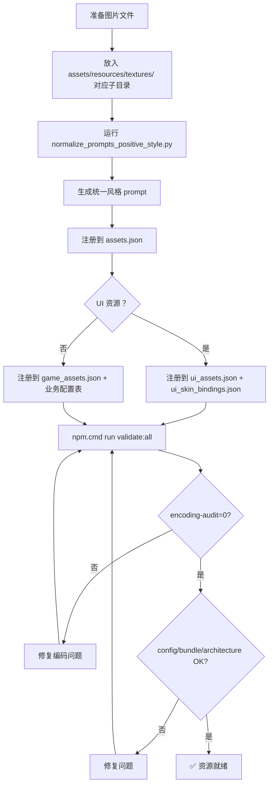

# 美术资源规则集

> 项目专属美术资源规则文件
> 最后更新：2026-07-08 17:30
> 适用范围：所有与 `assets/resources/textures/`、`prompts.json`、`art_source/` 相关的操作

---

## 一、美术风格总纲

### 1.1 当前风格

**主线风格**：明亮卡通动物冒险 + 温暖手绘动画感 + 森林宝石一体化 UI

```
Unified visual direction: bright cheerful cartoon animal adventure,
warm hand-painted animation look, rounded friendly shapes, soft forest light,
clean toy-like materials, saturated natural colors, gentle highlights,
clear mobile readability, cozy family-safe fantasy mood, consistent with the
integrated forest-and-gem interface style used by the current game.
```

- **禁止风格**：pixel art, dark fantasy, chunky pixels, low resolution, hard sci-fi, realistic horror
- **安全主题词**：flowers, leaves, mushrooms, crystals, coins, lanterns, books, tents, tools, clouds, stars, paw marks, soft magic sparkles, friendly animal shapes, clean adventure props, warm camp details

### 1.2 正向描述规则（2026-07-08 起强制）

所有 prompt **必须使用纯正向描述**，禁止出现以下负向/危险词：

```
❌ no / do not / avoid / without / forbidden / negative
❌ blood / skull / skeleton / bone / corpse / organ / anatomical / heart
❌ horror / grimdark / gore / wound / injury
❌ english / letters / words / watermark / signature / pseudo / fake / checkerboard
```

危险词只允许放在脚本本地 `riskFilter` / `lint-prompts` 中做检测，**不发送给 AI 生图 API**。

### 1.3 Prompt 通用结构

```
[STYLE_CORE]       统一视觉方向
[QUALITY_CORE]     发布质量标准
[SAFE_COPY_CORE]   运行时文字规则
[SAFE_WORLD_CORE]  安全主题词
[dimensions_clause] 画布尺寸
[format_clause]     格式说明
[specific]          分类/资源专属描述
[consistency]       风格一致性声明
[production_note]   制作说明
```

---

## 二、Pipeline 与 Skill 调用规则

### 2.1 MANDATORY: art-pipeline Skill

**任何**涉及 `assets/resources/textures/` 的操作必须通过 `Skill({ skill: "art-pipeline" })` 调用。

触发条件：
- 生成新图片
- 替换旧图片
- 裁切/压缩/导入/修复
- AI 文生图（已合并原 agnes-image-gen）

### 2.2 MANDATORY: encoding-pipeline-guard Skill

创建/编辑 **任何源文件**（TS / Python / JSON / MD）前必须通过 `Skill({ skill: "encoding-pipeline-guard" })` 调用。

四阶段流程：文件生成/修改 → 手动 UTF-8 写入 → 编码审计 → 修复

### 2.3 12 步生成管线

```
Step  1: 确认规格（尺寸/格式/分类/安全边界）
Step  2: 确定生成方式（程序化 或 AI 生图）
Step  3: 生成母版到 art_source/textures_review/master/
Step  4: 用户视觉审查
Step  5: 导出运行时候选到 runtime_candidates/
Step  6: 技术检测（尺寸/格式/Alpha/体积）
Step  7: 备份旧文件到 backup/（禁止放 .bak 到工程目录）
Step  8: 导入到 assets/resources/textures/
Step  9: 更新配置注册表（assets.json / ui_assets.json / game_assets.json）
Step 10: npm.cmd run validate:all
Step 11: 用户最终确认
Step 12: 标记完结
```

### 2.4 生成准入条件

API 调用前必须全部满足：
1. targetPath 不存在或未通过技术门禁
2. promptHash 不同或上次被标记为 rejected_regenerate
3. 非程序化可生成类型
4. prompt 风险扫描通过
5. 命令明确指定分类（如 `--category ui/create`）
6. 不超本批次预算（如 `--limit 10` 或 `--max-api-calls 20`）
7. 同一资源连续失败 2 次后 → 进入 `blocked_prompt_risk`，先改 prompt，不继续烧 API

---

## 三、格式与规格

### 3.1 文件格式

| 资源类型 | 运行时格式 | 色彩模式 |
|----------|-----------|---------|
| 透明小图 | PNG | RGBA（强制） |
| 全屏不透明背景 | JPG | RGB |
| UI 面板/按钮/卡片 | PNG | RGBA |
| 角色/怪物/Boss/特效 | PNG | RGBA |
| 图标 | PNG | RGBA |
| Tile | PNG | RGBA 或 RGB |

**禁止**：
- PNG P 模式 / palette indexed color
- PNG LA / L / CMYK / 16-bit PNG
- 直接 `img.save(dst)` 不转换色彩模式
- JPG 用于透明资源

### 3.2 推荐运行尺寸

| 资源类型 | 推荐尺寸 |
|----------|---------|
| 全屏背景 | 1920x1080 |
| UI 面板底板 | 128x128（9-slice） |
| 按钮 | 256x80（9-slice 优先） |
| UI 图标 | 192x192 |
| 角色单帧 | 256x256 |
| 角色序列帧 | 256x1024（4 帧竖排，旧管线，2026-07-10 起逐步废弃） |
| 角色部件 | 160x160/128x128/96x128...（按部件类型，见 docs/角色.txt §2.2） |
| 普通怪物 | 192x192 |
| Boss 单帧 | 384x384 |
| Boss 序列帧 | 384xN |
| Tile | 96x96 |
| 特效序列帧 | 256x1024（4 帧竖排） |

### 3.3 Bundle 映射

| 类型 | Bundle 名称 |
|------|------------|
| UI | `core_ui` |
| Tile | `core_ui` |
| Effects | `core_ui` |
| Icons | `core_ui` |
| Characters | `characters_basic` |
| 角色部件（部件化动画） | `characters_basic`（与 Characters 同包） |
| Monsters | `zone_{zone}` |
| Backgrounds | `zone_{zone}` |
| Bosses | `bosses` |

### 3.4 9-Slice 边距标准

| 类型 | left | right | top | bottom | 中心要求 |
|------|:----:|:-----:|:---:|:------:|---------|
| 小按钮 | 32 | 32 | 18 | 18 | 低对比纯净底色 |
| 主按钮 | 44 | 44 | 22 | 22 | 中心 70% 留给 Label |
| 长条卡片 | 44 | 44 | 18 | 18 | 羊皮纸或浅色内容区 |
| 大面板 | 64 | 64 | 64 | 64 | 柔和内容区，不能纯白 |

适用于：btn, button, panel, card, frame, slot, strip, input 类 UI 资源。

---

## 四、资源注册规则

### 4.1 三态定义

| 状态 | 含义 | 数据源 |
|------|------|--------|
| **文件存在** | 文件在 `assets/resources/textures/` 目录下 | 文件系统 |
| **有映射** | `assets.json` 中有该资源条目 | `assets.json` |
| **画面已接入** | 运行时代码实际显示该资源 | 代码审计 |

**不得**宣称资源"全部接入"——仅当前已接入的可视资源才算。

### 4.2 注册链路

```
UI 资源：
  textures/*  →  assets.json（文件↔bundle/type映射）
  assets.json  →  ui_assets.json（路径↔语义key，含 9-slice / sprite / background / icon）
  ui_assets.json  →  ui_skin_bindings.json（语义key↔场景节点路径）
  UISkinSceneApplier.applyScene()  →  实际绑定到 Cocos 节点

非 UI 资源：
  textures/*  →  assets.json
  assets.json  →  game_assets.json（assetId + type + frameWidth/Height + frames + layout）
  game_assets.json  →  业务配置表(monsters.json 等)  →  Runtime Service
```

### 4.3 运行时装配规则

- 禁止在业务代码中直接使用 `resources.load('textures/xxx/spriteFrame', SpriteFrame, ...)`
- 仅允许 `ConfigService` 和 `AssetBundleService` 使用 `resources.load`
- 资源加载通过 `AssetBundleService.instance.loadSpriteFrame()` 或 `RenderAssetService`
- 禁止手动在 Cocos 编辑器中绑定 SpriteFrame 作为主要生产路径

---

## 五、Prompt 生成脚本

### 5.1 权威 prompt 生成脚本

路径：`E:/game/tools/normalize_prompts_positive_style.py`

职责：
- 从 `assets/resources/textures/` 反扫所有资源文件
- 按分类（ui/backgrounds/characters/monsters/bosses/effects/icons/tiles）生成统一风格 prompt
- 输出到 `E:/game/assets/resources/config/prompts.json`
- 自动备份旧文件

新增资源后的标准操作流程：
```powershell
# 1. 将新图片放入 assets/resources/textures/ 对应子目录
# 2. 运行 prompt 生成
python E:/game/tools/normalize_prompts_positive_style.py
# 3. 运行验证
cd E:/game/回到地面
npm.cmd run validate:all
```

### 5.2 核心描述映射表

脚本内置的分类映射：

| 表名 | 作用 |
|------|------|
| `ZONE_MAP` | 6 个区域的场景描述（forest/swamp/tundra/volcano/abyss/catacombs） |
| `CHARACTER_MAP` | 5 个角色职业描述（warrior/archer/assassin/mage/berserker） |
| `ACTION_MAP` | 7 种动作描述（idle/attack/walk/hurt/death/skill/phasechange） |
| `UI_MODULE_MAP` | 16 个 UI 模块的场景描述（splash/main/login/create/character/area/shop/...） |
| `UI_OBJECT_MAP` | 10 种 UI 元素类型描述（bg/btn/panel/card/slot/icon/badge/bar/input/strip） |
| `ICON_SAFE_MAP` | 16 种已知图标的安全描述（key/coin/soulstone/heal/dash/etc.） |
| `EFFECT_MAP` | 16 种已知特效的描述（burn/freeze/conduct/melt/radiance/shatter/etc.） |
| `HIGH_RISK_TOKEN_REPLACEMENTS` | 路径 token 中危险词的自动替换（death→journey summary, skull→paw gem） |

### 5.3 旧脚本（归档）

- `tools/sync_prompts_from_textures.py` — 已合并到 `normalize_prompts_positive_style.py` 的功能中
- `tools/update_prompts_for_taptap_quality.py` — 未创建（prompts 已由正向风格脚本覆盖）

---

## 六、命名规则

- 小写英文 + 数字 + 下划线
- 格式：`{category}_{subject}_{action}.png`（如 `warrior_attack.png`）
- **禁止**：中文、空格、特殊符号
- 路径和 `assets.json` 中的 assetId 严格一致

高风险路径 token 的自动替换（脚本层处理）：
| 源 token | 替换为 |
|----------|--------|
| death | journey summary |
| revive | continue run |
| boss | major encounter |
| blood | vitality |
| heart | vitality crystal |
| skull | paw gem |
| skeleton/skeletonlord/... | stone guardian |
| bone | wood trim |
| frenzy | courage energy |
| berserker | brave vanguard |
| lifesteal | vitality aura |
| critical | star impact |

---

## 七、安全与审核规则

### 7.1 微信小游戏提审红线（WeChat 版——严格模式，历史参考）

> 本项目当前目标平台为 **TapTap（安卓原生游戏）**，微信小游戏严格模式仅作历史参考保留；实际审核以 §7.2 TapTap 宽松模式为准。

| 红线 | 要求 |
|------|------|
| 无血腥 | 不得出现红色血液/溅射；受击统一闪白+火花 |
| 无恐怖 | 写实骷髅/逼真鬼怪必须卡通化 |
| 无尸体 | 死亡动画统一化光消散 |
| 无体液 | 无黏液/脓包/腐烂/毒瘤 |
| 无断肢 | 无斩首/肢解/穿刺 |
| 无敏感词 | 禁止"血/杀/死/尸/亡/骷髅/恶魔/地狱" |

命名安全替代：
- 可用：骨兵/炎魔/暗影/翠毒/冰晶/爆裂
- 禁止：骷髅/恶魔/死亡/亡灵/地狱/腐烂/吸血/自爆/食尸

### 7.2 TapTap 提审红线（TapTap 版——宽松模式）

TapTap 对卡通风格游戏的审核比微信小游戏宽松，以下规则针对 TapTap 正式上线：

| 规则 | 说明 |
|------|------|
| 无真实血腥 | 卡通风格战斗特效可含红色闪光/火花/粒子，但不得有写实血液、内脏或器官 |
| 无真实恐怖 | 骷髅/怪物可使用但必须保持卡通风格（非写实逼真） |
| 无尸体刻画 | 击败动画可用消散/闪白/化为光点，也可用卡通倒地（不刻画细节） |
| 敏感词放宽 | 可使用"骷髅/死亡/恶魔"等主题词，但 prompt 中仍禁止做正向描述（避免 AI 生成写实风格） |
| 与微信版的关系 | WeChat 版使用 7.1 严格模式；TapTap 版不受此约束 |

### 7.3 Prompt 安全规则

| 红线 | 要求 |
|------|------|
| 无血腥 | 不得出现红色血液/溅射；受击统一闪白+火花 |
| 无恐怖 | 写实骷髅/逼真鬼怪必须卡通化 |
| 无尸体 | 死亡动画统一化光消散 |
| 无体液 | 无黏液/脓包/腐烂/毒瘤 |
| 无断肢 | 无斩首/肢解/穿刺 |
| 无敏感词 | 禁止"血/杀/死/尸/亡/骷髅/恶魔/地狱" |

命名安全替代：
- 可用：骨兵/炎魔/暗影/翠毒/冰晶/爆裂
- 禁止：骷髅/恶魔/死亡/亡灵/地狱/腐烂/吸血/自爆/食尸

### 7.2 Prompt 安全规则

- 正向 prompt 中**不要出现** blood/skull/bone/heart/death/horror 等可能诱导 AI 的词
- 危险词只放在脚本本地 `riskFilter`/`lint-prompts` 中，不发给 API
- `death` 文件名 → 正向文案改为 `journey summary` / `magical sparkle dissolve`
- 审核门禁优先级高于体积/性能

### 7.3 提审材料清单

- 软著证书（或受理通知书）
- 自审报告
- 游戏介绍文案（<200 字）
- 游戏截图（5 张，核心玩法+非暴力场景）
- 启动屏截图、用户协议页面截图

---

## 八、编码与验证规则

### 8.1 强制 UTF-8

所有源文件（TS/Python/JSON/MD）必须使用 UTF-8 编码。

```python
# 正确（显式 UTF-8）：
open(path, "r", encoding="utf-8")
open(path, "w", encoding="utf-8", newline="")
Path(path).read_text(encoding="utf-8")
Path(path).write_text(text, encoding="utf-8")

# 禁止（默认编码）：
open(path, "r")
open(path, "w")
```

### 8.2 验证门禁

资源更改后的必做流程：
```powershell
cd E:/game/回到地面
npm.cmd run validate:all
```

4 个主门禁全部通过才能继续：
| 门禁 | 命令 | 通过条件 |
|------|------|---------|
| 配置校验 | `validate:all` 内置 | 无错误 |
| 包体预算 | `validate:all` 内置 | 无 hard fail（已有 warning 可保留） |
| 编码审计 | `python tools/encoding_audit.py --ci` | issues=0, p0=0 |
| 架构门禁 | `validate:all` 内置 | 仅 SceneFlowService.ts 可调用 director.loadScene() |

### 8.3 验证检查项

1. JSON 可解析
2. 资源数量与 textures 目录一致
3. 所有 key 未变化
4. 无 U+FFFD 乱码
5. 无危险正向词
6. 背景和 UI 无要求嵌入文字
7. encoding-audit 通过
8. architecture gate 通过

---

## 九、体积与性能策略

> **目标平台**：TapTap（Android）
> 以下预算值针对 TapTap 正式版设定。当前开发过程中的文件是微信小游戏阶段遗留（体积较小），
> TapTap 正式资源生成时应按此标准制作。实际文件向此标准靠拢，而非反之。

### 9.1 自动判定优先级（TapTap 正式版）

```
安全违规 → fail
尺寸错误 → fail
透明错误 → fail
路径错误 → fail
sprite sheet 帧数错误 → fail
严重模糊 → fail
9-slice 边缘错误 → fail
─────────────────────────
体积超过推荐值 → warning
体积超过人工确认上限 → manual_review
体积大但视觉优秀 → 可批准入库
```

### 9.2 分类体积参考（非硬上限）

| 类型 | 推荐范围 | 可接受 | 人工确认上限 |
|------|:-------:|:------:|:-----------:|
| 全屏背景 JPG | 300-800KB | 800KB-1.2MB | 1.5MB |
| 战斗背景 JPG | 250-600KB | 600KB-1MB | 1.2MB |
| UI 大面板 PNG | 80-250KB | 250-500KB | 800KB |
| UI 小按钮 PNG | 20-100KB | 100-180KB | 250KB |
| 角色 sprite sheet | 150-500KB | 500-900KB | 1.2MB |
| Boss sprite sheet | 400KB-1.2MB | 1.2-1.8MB | 2.5MB |
| 普通怪物 PNG | 100-350KB | 350-600KB | 900KB |
| 特效 sprite sheet | 80-250KB | 250-450KB | 700KB |
| 图标 PNG | 15-60KB | 60-120KB | 180KB |
| Tile PNG | 5-40KB | 40-80KB | 120KB |

> **背景双路径规则（权威）**：全屏背景须同时产出 **PNG 母版**（`art_source/textures_review/master/`，源分辨率 ≥1920×1080）与 **JPG 运行时**（`assets/resources/textures/backgrounds/`，RGB，体积按本表 `全屏背景 JPG` 300–800KB 推荐范围）。JPG 体积以本表为准；任何文档/脚本写死的 `≤250KB` / `≤350KB` 等更严上限一律以本节为准（遵循 §14.1 单一权威来源）。背景尺寸以 §3.2 `全屏背景 1920×1080` 为准；`1280×720` 等更小规模属越权，须对齐本节。

---

## 十、文件与目录结构

### 10.1 正式资源目录

```
assets/resources/textures/
├── backgrounds/   JPG, 1000x666, RGB
├── bosses/        PNG RGBA, sprite/sprite_sheet
├── characters/    PNG RGBA, sprite_sheet
│   └── {profession}/parts/  PNG RGBA, 部件化动画（2026-07-10 起）
├── effects/       PNG RGBA, sprite_sheet
├── icons/         PNG RGBA
├── monsters/      PNG RGBA
├── tiles/         PNG RGBA/RGB
└── ui/            PNG RGBA（按模块细分：area/character/create/equipment/event/...）
```

### 10.2 工作目录

```
art_source/
├── textures_review/
│   ├── master/             -- 高清母版
│   ├── runtime_candidates/ -- 压缩后运行时候选
│   ├── rejected/           -- 失败/违规资源
│   └── contact_sheets/     -- 批量验收图
├── textures_export/
│   ├── runtime_replace/    -- 准备替换到正式目录
│   ├── runtime_low/mid/high/ -- 多档资源
│   └── textures_backup/    -- 替换前备份
└── output/                 -- 工具输出（报告、中间产物）
```

### 10.3 关键路径

| 文件 | 用途 |
|------|------|
| `E:/game/assets/resources/config/prompts.json` | AI 提示词（499 条，全量覆盖） |
| `E:/game/assets/resources/config/assets.json` | 资源注册（499 条，Texture2D/SpriteFrame） |
| `E:/game/assets/resources/config/ui_assets.json` | UI 语义注册表（104 条语义 key） |
| `E:/game/assets/resources/config/ui_skin_bindings.json` | 场景节点绑定映射 |
| `E:/game/assets/resources/config/game_assets.json` | 非 UI 美术注册表 |
| `E:/game/tools/normalize_prompts_positive_style.py` | prompt 生成脚本（权威，入口） |
| `E:/game/回到地面/tools/encoding_audit.py` | 编码审计工具 |
| `E:/game/回到地面/tools/check_assets_registry.py` | 资源注册检查 |
| `E:/game/回到地面/tools/check_game_assets_registry.py` | 非 UI 资源注册检查 |
| `E:/game/回到地面/tools/config_pipeline/check_all.py` | validate:all 的 config 检查 |

---

## 十一、额外处理规则（art_pipeline.py 实现级）

### 11.1 装饰框类（ORNAMENT_TYPES）

| 类别 | 规则 |
|------|------|
| 受影响的类别 | `ui`, `icons` |
| 生成方式 | 生成画布 = 目标尺寸 × **1.8** (OVERSCAN_FACTOR)，给 AI 物理留边余量 |
| 验证要求 | Alpha 硬切边检查强制开启：必须存在 0<v<255 的过渡像素 |
| 原理 | 装饰框（边框/卡片/ badge）需要四周留白，AI 生成时扩大画布避免主体溢出 |

### 11.2 UI Kit 默认尺寸

当 prompts.json 中无法提取尺寸时，按以下默认值回退：

| 组件类型 | 默认尺寸 |
|---------|:--------:|
| 按钮 (btn_) | 240 × 80 |
| 卡片 (card_) | 260 × 96 |
| 面板 (panel_) | 360 × 200 |
| 输入框 (input_/name_) | 260 × 44 |
| 槽位 (slot_) | 92 × 92 |

### 11.3 UI 资源生成方式（2D→3D 升级：AI 出图）

`ui/` 目录下全部资源（`btn_/button_/panel_/card_/frame_/slot_/input_/name_/badge/icon_*` 等）**统一由 AI 出图（Agnes）生成**，对应条目在 `assets/resources/config/prompts.json` 的 `ui/...` 键下（现有 173 条）。

- 不再使用程序化生成：历史 `KIND_PROCEDURAL_UI` 正则与 `tools/ui_kit_generator.py` 程序化路径已弃用（保留作回滚兜底，当前不被任何 UI 资源调用）。
- 生成方式判定见 `tools/art_pipeline.py` 的 `classify_resource()`：`is_procedural` 仅当 `category in PROCEDURAL_CATEGORIES`（当前为空集）时为真，UI 一律走 AI。
- UI 资源须满足 §3 / §9.2 的 PNG/RGBA、体积、9-slice 边距规范；9-slice 边框须保证四角完全透明以便运行时拉伸。
- AI 提示词模板与差异化变量见 `docs/资源提示词设计策略.md` §5.3。

---

## 十二、新增资源的标准操作流程



---

## 十三、文档索引

| 文档 | 核心内容 |
|------|---------|
| `docs/美术资源生成与入库规范.md` | 总规范：风格/格式/尺寸/命名/目录/9-slice/流程/验收 |
| `docs/TapTap美术资源体积放宽与prompts更新方案.md` | TapTap 平台体积放宽策略 |
| `docs/AI美术资源高清替换方案.md` | 高清替换策略、分级、多档资源、PNG 模式规则 |
| `docs/正式上线运行时装配方案.md` | 启动链路、场景节点契约、资源加载规范 |
| `docs/UI资源自动绑定实施方案.md` | ui_skin_bindings.json + UISkinSceneApplier 三层绑定 |
| `docs/非UI美术资源配置化治理方案.md` | 非 UI 资源注册链路 |
| `docs/资源配置化治理全量实施计划.md` | 底座完工清单 + Phase0~Phase3 实施计划 |
| `docs/美术资源图片内文字处理补充方案.md` | 图片内文字的审核/本地化/维护风险 |
| `docs/美术资源生成与入库规范.md`（含 9-Slice） | 9-slice 生成规范、Cocos 使用规范、分辨率自适应 |
| `docs/一体化界面资源重做清单.md` | 一体化界面资源重做清单（手写 prompt 参考，已由正向脚本覆盖） |

---

## 十四、文档一致性与防冲突规则

### 14.1 单一权威来源原则

每条可量化规则/数值必须有**且只有一个权威来源**，其他文档/脚本只能引用（读取/导入）而非复制。

| 数据项 | 权威来源 | 禁止行为 |
|--------|---------|---------|
| 体积预算 | 本文 9.2 节 | 脚本内重复定义预算值（应动态读取本文表格） |
| 背景尺寸 / 双路径 / 体积 | 本文 §3.2（1920×1080）、§9.2（300–800KB 推荐）、§9.2 注（PNG 母版 + JPG 运行时） | 其他文档写死 `1280×720` / `≤250KB` / `≤350KB` 等冲突数值（须引用本节而非复制） |
| 资源分类规则 | 本文各节 | 脚本内硬编码分类参数 |
| Prompt 正向生成 | `tools/normalize_prompts_positive_style.py` | Skill 中重复描述 prompt 生成逻辑 |
| Prompt 逆向生成（AI 生图） | `art-pipeline` Skill | 本文中重复描述正向 API 调用细节 |

### 14.2 修改时的联动检查

修改以下任一文件时，**必须同步检查关联文件是否需更新**：

| 被修改的文件 | 必须检查的关联文件 |
|-------------|------------------|
| 本文 (`ART_RESOURCE_RULES.md`) | `tools/art_pipeline.py`（预算解析逻辑）, `art-pipeline` Skill（引用更新） |
| `tools/art_pipeline.py` | 本文（规则是否一致）, `art-pipeline` Skill（描述更新） |
| `art-pipeline` Skill | 本文（调用规则是否一致） |
| `docs/美术资源生成与入库规范.md` | 本文（引用是否断裂） |

### 14.3 自动化检测

修改后必须通过以下验证门禁：

```bash
# 文档一致性检查
python tools/check_doc_consistency.py
```

该脚本会检查：
- 体积预算：`ART_RESOURCE_RULES.md` 表格数据 vs `art_pipeline.py` 实际读取值
- 分类列表：`prompts.json` 中的分类是否在 `DETAIL_ANCHORS` 中有对应定义
- 引用断裂：`art-pipeline` Skill 中引用的配置文件路径是否有效

### 14.4 资源进度追踪唯一权威来源

**定义**：`docs/progress/resource_status.md` 是本项目中追踪和记录所有美术资源生成、入库、审核进度的 **唯一权威来源文件**。

**用途**：
- 记录每个资源（共 499 个）的母版路径、母版状态、生成时间、人工确认状态、入库路径、入库状态、入库时间。
- 提供按类别的总览统计（Monsters/Icons/Tiles/Backgrounds/Characters/Bosses/UI/Effects）。
- 作为项目进展的阶段性基线快照。

**禁止行为**：
- ❌ 其他文档、脚本、内存文件不得重复定义或维护同类的逐资源进度信息。
- ❌ `MEMORY.md`、`topics/*.md`、`CHANGELOG.md` 中仅允许记录**变更摘要**（如"今日完成了 Icons 67 个的生成与入库"），不得逐条列出资源状态明细。
- ❌ `art_pipeline_progress.json` 是 pipeline 运行时中间状态文件，仅供 `art_pipeline.py` 使用，**不是**人工可读的资源进度权威来源。

**更新规则**：
- 每次完成一批资源的生成/入库/审核后，应重新生成 `resource_status.md` 以反映最新状态。
- 生成命令：`python tools/generate_resource_status.py`（由 `E:/game/.workbuddy/tmp_resource_status.py` 固化而来，待正式纳入 tools/ 目录）。
- 受本规则约束，不得在其他位置维护重复的进度追踪信息。

## 十五、Pipeline 实现参数（art_pipeline.py 读取）

> 本节的 JSON 结构数据由 `tools/art_pipeline.py` 启动时自动解析加载，作为所有管线参数的权威来源。
> 编辑此节后，必须运行 `npm.cmd run validate:all` 验证脚本端解析一致。

```json
{
  "_version": 2,
  "_note": "以下参数由 art_pipeline.py 启动时读取，禁止在脚本中硬编码重复定义",
  "_changelog": "v2 (2026-07-13): 移除 character_parts 死键（detail_anchors/transparent_categories/matte_categories/min_opaque_ratio/palette_retry_steps/recommended_sizes 共 6 处）。理由：2D 角色已改走 §16.2 单母版切割方案，character_parts 类别不再由 art_pipeline 独立生成，且 prompts.json 无此前缀会导致 doc_consistency Check 2 恒 FAIL。characters 类别保留不变。",

  "style_anchor": "Bright colorful cartoon game style, clean shapes, saturated colors, soft highlights, consistent cute cartoon visual identity, suitable for mobile game asset collection.",

  "safety_block": "CRITICAL: ABSOLUTELY NO TEXT, NO WATERMARK, NO SIGNATURE, NO WRITING OF ANY KIND. Clean fantasy symbols only. Absolutely no blood, no gore, no splatter, no organs, no realistic body parts, no skull, no horror face, no impalement, no wound, no corpse. Safe cartoon fantasy style throughout.",

  "detail_anchors": {
    "bosses": "Full-body cartoon boss sprite, large readable silhouette, simple exaggerated shapes, clear head-body-limb separation, bright material colors, 12 percent transparent margin, same design language as friendly arcade adventure enemies.",
    "monsters": "Small full-body cartoon enemy sprite, readable at 128px, simple pose, one creature only, chunky outline, clear attack-facing silhouette, friendly arcade adventure proportions.",
    "effects": "Clean cartoon animal VFX, bold center shape per frame, simple particle clusters, limited color count, high readability over gameplay, no gritty smoke texture.",
    "icons": "Standalone cartoon item icon, one object only, thick outline, simple inner highlights, recognizable at 64px, centered with transparent margin, no badge label.",
    "tiles": "Seamless ground tile texture at 96px, natural ground crack patterns, stone grain marks, and soil texture variations distributed evenly, tileable edges, consistent natural ground color per region, pure ground material only.",
    "ui": "Reusable cartoon animal UI piece, clean beveled shape, soft highlight, simple border, empty content area where needed, consistent blue-gray violet gold adventure UI palette.",
    "backgrounds": "Full opaque rectangular scene filling the entire canvas; no transparency, single complete painted scene background, no isolated cutout, no empty border. Keep a clean readable center area for gameplay.",
    "characters": "Full-body character animation sprite sheet with multiple frames stacked vertically, each frame on plain solid background, clean transparent edges, centered, consistent pose and proportion across all frames."
  },

  "transparent_categories": ["effects", "icons", "ui", "monsters", "bosses", "characters"],

  "matte_categories": ["icons", "ui", "monsters", "bosses", "characters"],

  "procedural_categories": [],

  "ornament_types": ["ui", "icons"],

  "overscan_factor": 1.8,

  "min_opaque_ratio": {
    "icons": 0.15,
    "ui": 0.02,
    "monsters": 0.08,
    "bosses": 0.05,
    "characters": 0.08,
    "effects": 0.02
  },

  "palette_retry_steps": {
    "effects": [64, 48, 32],
    "icons": [128, 96, 64, 48],
    "ui": [128, 96, 64, 48],
    "monsters": [128, 96, 64],
    "characters": [256, 192, 128],
    "bosses": [256, 192, 128]
  },

  "ui_kit_default_dims": {
    "btn": [240, 80],
    "card": [260, 96],
    "panel": [360, 200],
    "input": [260, 44],
    "slot": [92, 92]
  },

  "recommended_sizes": {
    "backgrounds": [1920, 1080],
    "ui": [192, 192],
    "icons": [192, 192],
    "characters": [256, 1024],
    "monsters": [192, 192],
    "bosses": [384, 384],
    "effects": [256, 1024],
    "tiles": [96, 96]
  }
}
```

### 2D 角色部件化（母版切割，2026-07-11 起生效）

> 取代本文件中 `character_parts` / `characters` 旧式「独立生成部件 / sprite sheet」思路。2D 角色现在走**单母版切割**方案：

- **母版**：每个职业 1 张 `768x768` PNG RGBA，标准站姿，路径 `art_source/textures_review/master/characters/{character}/reference/{character}_rig_master.png`。
- **切割 spec**：`art_source/textures_review/master/characters/{character}/cut_specs/{character}_part_cut_spec.json`（人工标注 rect/pivot/socket/z/outputSize，不靠脚本自动猜）。
- **切割脚本**：`tools/cut_character_parts.py`（默认不 tight-crop，保留 pivot 关系；PIL 可选）。
- **拼装预览**：`tools/preview_character_rig.py` → `parts_preview/{character}_rig_preview.png`。
- **标注图**：`tools/draw_character_cut_marks.py` → `reference/{character}_rig_master_marked.png`。
- **配置校验**：`tools/check_character_parts.py`（配置声明部件必须存在；不因为缺 quiver/cape 等非必需件判失败）。
- **统一入口**（art_pipeline.py 新增子命令）：
  - `python tools/art_pipeline.py cut-parts --character archer`
  - `python tools/art_pipeline.py preview-rig --character archer`
  - `python tools/art_pipeline.py validate-parts --character archer`
- **配置表**：`assets/resources/config/character_parts.json` / `character_rigs.json` / `character_part_animations.json`（5 职业：warrior/archer/assassin/mage/berserker）。
- **正式资源**：`assets/resources/textures/characters/{character}/parts/*.png`。
- **禁止**：独立 AI 生成各部件 / `arm_r` 与 `bow` 拆分 / 不同部件来自不同母版。

### Skill 索引

| Skill | 级别 | 触发条件 | 调用方式 |
|-------|------|---------|---------|
| `art-pipeline` | MANDATORY | 任何美术资源操作 + AI 文生图 | `Skill({ skill: "art-pipeline" })` |
| `encoding-pipeline-guard` | MANDATORY | 任何源文件创建/编辑 | `Skill({ skill: "encoding-pipeline-guard" })` |

---

## §16 3D 资源规则（权威源）

> 本章为 3D 资源（角色 / 怪物 / Boss / 特效 / Tile）的**唯一权威定义**。任何工具（`art_pipeline.py`、`gen_art_spec.py`、`tools/asset_validate.py`）均从本章 + `art_quality_budget.json` 的 `rules3d` 段读取 3D 命名 / 预算 / LOD / 依赖规则，**禁止各自硬编码**（遵循 §14.1 单一权威来源）。
> 对齐：`../docs/2D转3D全面升级方案.md` v3 第 3/4/5 章、`docs/美术资源制作参数总表_3D.md` v6。

### §16.1 3D 资源范围与类别
- **3D 化类别**：characters（5 英雄）、monsters（36）、bosses（42：12 终 Boss + 30 小 Boss）、effects（27 VFX）、tiles（24 模块件）。
- **保留 2D（不走 3D 分支）**：icons（67）、ui（173）、backgrounds（17）。其规则仍见 §3 / §6。
- **可选 3D 背景叠加（ui3d_preview T4/T5）**：主菜单 / Splash 允许叠加 3D 背景模型（`BG_` 类，命名见 §16.2），作为 2D 背景之上的可选增强层；`assets/resources/config/ui3d.json` 中 `enabled=false` 时回退 2D 兜底（`ui.main.bg` / `ui.splash.bg`），不阻断上线。此叠加**不**改写"backgrounds 保留 2D"结论，仅新增一层可选 3D 装饰；其预算见 `rules3d.backdrop`。

### §16.2 命名规范（双轨）
- 2D-retained 继续用 §6 小写规则 `{category}_{subject}_{action}.png`。
- 3D 资产**强制**前缀 + PascalCase（对应 `art_quality_budget.json → rules3d.naming.pattern`）：
  - `CHR_{Hero}_A.glb`（角色，A/B/C… 为变体）
  - `MON_{Region}_{Name}.glb`（怪物）
  - `BOSS_{Name}_{NN}.glb`（Boss，NN=序号；终 Boss 名含 `Final`）
  - `FX_{Name}.prefab`（特效）
  - `TILE_{Region}_{Module}.glb`（地块，Module ∈ Floor/Wall/HighGround/Thorn/Corner/Edge/Slope/Ramp）
  - 地牢 `DNG_{Module}.glb`（地牢场景模块，预算见 `rules3d.dungeon`，与 3D 升级方案一致；原仅预算文件有、§16 未列，本次补列）
  - 背景 `BG_{Scene}.glb`（UI 全屏 3D 背景，ui3d_preview T4/T5；静态环境模型，可无骨骼动画）
  - 动画 clip：`{前缀}_{Token}_{Clip}`（如 `CHR_Warrior_Attack`）。
- 正则（权威，供 `asset_validate.py` 使用，须与 `art_quality_budget.json → rules3d.naming.pattern` 完全一致）：`^(CHR|MON|BOSS|FX|TILE|DNG|BG)_[A-Za-z0-9]+(_[A-Za-z0-9]+)?([.]glb|[.]prefab)?$`

### §16.3 预算（取自 `art_quality_budget.json → rules3d`）
- 角色：2000~3000 Tri / 20~30 骨 / 512² / ASTC 6×6 / LOD 100·60·30% / 最低 5 clip。
- 终 Boss：5000~9000 Tri（建议 7000）/ 40~80 骨 / 1024² / ASTC 8×8 / LOD 100·50·20% / 最低 8 clip。
- 小 Boss：4000~7000 Tri / 30~60 骨 / 512² / LOD 100·50%。
- 普通怪：1000~2500 Tri / 18~30 骨 / 512² / LOD 100·60·30% / 最低 5 clip。
- 普通特效：≤80 粒子 / ≤2 DrawCall / 256² / ≤1.5s。
- Boss 特效：≤300 粒子 / ≤4 DrawCall / 512² / ≤2s。
- Tile：2m×2m 模块 / 512² / LOD 100·50%。
- 地牢(3D)：800~3000 Tri / 0 骨（静态）/ 512² / ASTC 6×6 / LOD 100·50%（预算见 `rules3d.dungeon`）。
- 背景(3D)：≤6000 Tri（建议 4000）/ 0 骨（静态可）/ 1024²~2048² / ASTC 8×8 / LOD 100·50% / 可选 idle clip（环境微动）；manifest `colliders` 置 `["none"]` 以通过通用碰撞体校验（静态背景无物理碰撞需求）。预算见 `rules3d.backdrop`。
- **具体数值以 `rules3d` 段为准（工具读取，不在此硬编码）**。

### §16.4 目录与入库
- 3D 母版 / 候选 / 校验报告：`art_source/models_review/`（对应 2D 的 `textures_review`）。
- 运行资产：
  - `assets/resources/models/`：.glb 源（仅构建期，不进运行时 Bundle 直读）
  - `assets/resources/prefabs/`：3D 实体 Prefab
  - ASTC 贴图目录：`assets/resources/textures/astc/`（与 2D 贴图分离）
- 入库语义：.glb 源不入 runtime；经 Cocos 导入生成 Prefab → 登记 `assets.json`（3D 类型：Prefab/SkeletalAnimation/Material）→ 业务配置引用。

### §16.5 资源元数据（manifest）
每个 3D 资产导出时需附带 sidecar `.assetmeta.json`，含：
- `tri` / `bones` / `textureSize` / `lodLevels` / `animClips`
- `sockets[]`（§16.2 规定集）/ `colliders[]`
- `version` / `author` / `date` / `reviewer`
- `depends[]`（依赖 token：武器 / FX / 音频 / 子模型）
- `perfTier`（`low`/`medium`/`high`）
- `testScene`（验证场景）
- `lifecycle`（选秀 / 评审中 / 已批准 / 已弃用）
`asset_validate.py` 读取此 manifest 比对 §16.3 预算出报告。

### §16.6 生命周期与单源
- 状态机：选秀 → 评审中 → 已批准 → 已弃用。仅「已批准」可正式接入。
- 本章 + `rules3d` 为唯一权威；`gen_art_spec.py` 须改为读取本章而非自行硬编码（见审查报告 §6.4）。
