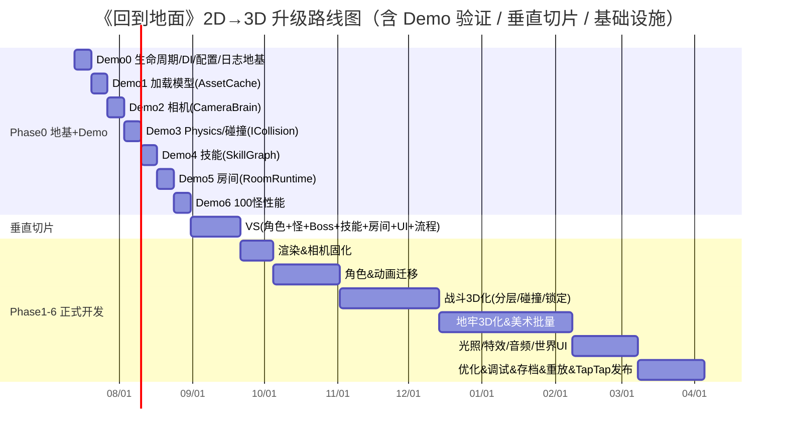

# 《回到地面》2D → 全 3D 全面升级改造方案（v3）

> **项目定位**：TapTap 发行的 **卡通动物风 · 肉鸽地牢 · ARPG** 游戏（Cocos Creator 3.8.8 工程）
> **方案目标**：在保留现有玩法逻辑、数值体系与项目架构骨架的前提下，将渲染表现、战斗空间、角色表现、美术资产、**工程架构**与**基础设施（生命周期 / 依赖注入 / 配置 / 日志 / 调试 / 重放 / 存档）**从 2D 全面升级为 3D，同时保证移动端（TapTap）性能与卡通动物风格的可读性。
> **版本说明**：
> - **v1**（9.1/10）：偏"表现层升级"，短板在 AI / 工程规范 / 战斗架构 / 资源管理。
> - **v2**（9.6/10）：补齐**工程架构升级**维度（战斗分层、碰撞抽象、地牢拆分、技能数据驱动、AI 行为树、资源缓存、组件化、事件分类、性能预算、Demo 验证、垂直切片），并附 v1 评审 15 点采纳表（附录 A）。
> - **v3**（本文）：补齐 v2 评审 15 点——**生命周期管理 LifecycleManager（★ 最关键）、依赖注入/ServiceLocator、统一配置系统、独立日志、调试框架（★★★★★）、存档+崩溃恢复、重放框架（★★★★★）、音频系统升级、CameraBrain、资产管线 Asset Pipeline、AI 控制器接口、自动化测试、版本迁移策略、整体架构总图（★★★★★）**。新增 **§5 工程架构与基础设施**、**§6 整体架构总图**、**附录 B（v2 评审 15 点采纳）**。目标：可作为中大型团队持续使用的架构圣经（Architecture Handbook）。
> **版本基线**：2026-07-10 调研结论（基于 `回到地面/` 工程现状）+ 两轮架构评审

---

## 0. 现状基线（改造前必须认清的事实）

| 维度 | 现状（2D） | 对升级的影响 |
|---|---|---|
| 引擎 | Cocos Creator 3.8.8，仅使用 2D 能力（`Sprite` + `Animation`） | 引擎本身支持 3D，无需换引擎，但需开启 3D 模块（物理、渲染管线、骨骼动画） |
| 移动 | `PlayerController` 离散 4 向**网格移动**（tween 每格），翻滚=双击；移动/动画/碰撞/攻击/状态**全挤在一个类里** | 需组件化拆分 + 3D 自由移动 + 3D 碰撞，并接入生命周期/Command |
| 碰撞 | **无物理引擎**，纯逻辑：`GridManager.isWalkable()` + `occupied` + 坐标距离 | 最大决策点：引入 3D 物理但**必须经抽象层 + ServiceLocator**，不直接依赖 `PhysicsSystem` |
| 技能 | `SkillSystem` 槽位/CD/事件驱动，效果靠 `switch(skillId)` 转发，无空间目标/抛射/命中 | 需拆层 + 数据驱动（`SkillGraph`）+ 统一配置，消除 `switch` |
| 战斗 | `BattleManager` 单点调度，职责持续膨胀 | 需拆为 CombatSystem / TargetSelector / HitResolver / DamageResolver / EffectExecutor / ProjectileSystem / LockOnManager，并纳入 Lifecycle |
| 地牢 | `DAGGenerator`（跑图元地图，保留）+ `GridManager`（**生成+寻路+可走+碰撞+房间+瓦片**一身兼任） | `GridManager` 必须拆；DAG 层保留 |
| 动画 | `SpriteAnimationService` 切 2D 图集帧，业务直接 `play("attack")` | 需 `AnimationController` 抽象 + 骨骼状态机 |
| 渲染 | `Sprite` + `RenderAssetService.applySpriteById` + `TileAssetService` | 替换为 `ModelComponent`/`SkinnedMeshRenderer` + Toon 材质 |
| 摄像机 | 默认 2D 正交；仅 `CombatEffectService` 用 `Camera` 做世界→屏幕投影 | 需 `CameraBrain`（Follow/LockOn/Boss/Cinematic/Shake/Zoom） |
| AI | `battle/entity/ai/*`（Charger/Ranged/Defender/Summoner/Suicider）——纯 2D 行为，无巡逻/搜索/迷失/回归 | 3D 化需 `IAIController`（BT/FSM/GOAP/Utility 可换）重做 |
| 资源 | `AssetBundleService` 加载，**无缓存/引用计数/预加载**，无生命周期 | 3D 模型（尤其 Boss）内存暴涨，需 `AssetCache` + 生命周期释放 |
| 日志/调试/存档/重放 | **完全缺失** | v3 核心新增：`Logger` / `DebugPanel` / `SaveManager` / `ReplayRecorder` |
| 美术 | ~499 张 2D（角色 35 / 怪物 36 / Boss 120 / 特效 27 / 图标 67 / 地块 24 / 背景 17 / UI ~150） | 角色/怪物/Boss/特效/地块换 3D；图标/UI 多数保留 |

**关键结论**：现有代码中**玩法逻辑、数值、`DAGGenerator`、`RunRng` 种子、`ConfigService`、`UiRouter`、面板业务逻辑**是引擎无关的，应**最大化保留**；真正要升级的是"表现层 + 空间层 + 工程架构层 + 基础设施层"。**不要一次升级整个项目**——先做垂直切片验证，再复制扩张。**所有新 System 一律注入、走生命周期、不直连引擎底层。**

---

## 1. 总体改造策略

### 1.1 三层分离 + 工程架构七原则

```
保留层（不动/极少改）：玩法逻辑 · 数值 · DAG · RunRng · ConfigService · UiRouter · 面板业务
适配层（改接口保语义）：AssetBundleService→含缓存的 AssetCache · GridManager→拆后的子模块 · CombatEffectService→3D 投影
替换层（重写/新增）：渲染 · 骨骼动画 · 相机 · 碰撞抽象 · 光照阴影 · 3D 美术 · 战斗分层 · AI · 资源缓存 · 组件化 · 基础设施
```

**工程架构七原则（v3 强化，贯穿全程）：**
1. **接口化**：业务只依赖接口（`ICollisionService` / `IAssetCache` / `IAnimationController` / `IAIController`），具体实现可替换。
2. **组件化 / ECS 思想**：节点由多个 `Component` 组成，单一职责，避免 `PlayerController` 式大杂烩。
3. **数据驱动**：技能/AI/特效/配置配置化，策划改 JSON 不碰代码；杜绝 `switch(id)`。
4. **垂直切片先行**：先做出"一个角色 + 一怪 + 一 Boss + 一技能 + 一房间 + 完整 UI + 完整流程"可玩闭环，再复制扩张。
5. **生命周期统一管理**（★ v3 新增）：每个 System 实现 `ILifecycle`，由 `LifecycleManager` 统一 `initialize/enter/exit/pause/resume/destroy`，杜绝事件泄漏/资源泄漏/AI 幽灵。
6. **依赖注入 / ServiceLocator**（v3 新增）：服务由 `GameContext` 创建并注入，业务**禁止 `new`**，只 `ctx.get(Token)`，便于替换/测试/模拟。
7. **可观测 / 可回放**（v3 新增）：统一 `Logger` + `DebugPanel` + `ReplayRecorder` + `SaveManager`，让几十个 System 可调试、可复现、可恢复。

### 1.2 三个关键架构决策（Phase 0 锁定）
- **决策 A — 移动/相机**：3D 自由移动（运动学 Kinematic）+ 倾斜透视相机（俯角 35°–50°）。保留双击翻滚手感与 i-frame。
- **决策 B — 物理/碰撞**：引入 `PhysicsSystem` 能力，但业务**禁止直接依赖 `PhysicsSystem`**，统一走 `ICollisionService`（注册于 `GameContext`）。仅 Kinematic + 重叠/射线，不用动力学推挤，保肉鸽种子确定性。
- **决策 C — 寻路**：**第一阶段继续用 Grid 寻路**（`NavigationGrid`），**NavMesh 推迟到 Phase 4 之后**；`NavigationGrid` 与未来 `NavMeshNavigation` 实现同一 `INavigation` 接口，上层无感。

### 1.3 三个新增治理决策（v3）
- **决策 D — 生命周期强制**：所有 `BattleRuntime`/`RoomRuntime`/`CombatSystem`/`LockOnManager`/`AIController`/`CameraBrain`/`AssetCache`/`AudioSystem` 必须实现 `ILifecycle`，否则 CI 静态检查拦截。
- **决策 E — 配置单一入口**：所有 `Skill/Monster/Boss/Effect/AI/Camera/Audio` 配置经 `ConfigDatabase` 统一加载，System 不得自行 `load`。
- **决策 F — 分支与迁移**：`master` 长稳，功能按 `feature/3d-*` 分支开发，垂直切片通过后再冻结 2D，Phase 6 末删除 2D 代码（见 §5.13）。

---

## 2. 功能设计层面改造

### 2.1 ARPG 战斗系统（拆层，而非继续胖 `BattleManager`）
现状链路：`SkillSystem → BattleManager → CombatEffectService`（单点膨胀）。
目标链路（分层、单向依赖、全部注入 + 走生命周期）：
```
SkillSystem（只管 CD/槽位/解锁）
    ↓ BattleCommand
CombatSystem（调度：解析指令、编排时序）
    ↓
TargetSelector（选目标：锁定/范围/视线）
    ↓
HitResolver（命中判定：重叠/射线/扇形）
    ↓
DamageResolver（算伤害：DEF/暴击/减伤/元素）
    ↓
EffectExecutor（放特效 + 抛射 + 状态）
    ↓
ProjectileSystem（飞行物生命周期）
```
- **技能释放空间化**：`BattleCommand { casterPos, facingDir, targetEntity?, aimPoint?, skillId }`。
- **碰撞检测**：见 §3.3（`ICollisionService`）。
- **锁定机制（3D 新增）**：`LockOnManager` 选敌、相机取景、reticle 跟随、环绕移动（strafe）。

### 2.2 肉鸽地牢随机生成（DAG 保留，GridManager 拆）
- **跑图 DAG**（`DAGGenerator`/`RoomFlowController`）：房间类型图，种子驱动，**基本不动**；仅补 3D 房间模板映射。
- **房间空间层**：`GridManager` 拆为 `DungeonGenerator → RoomBuilder → TileMap → NavigationGrid → RoomRuntime`（见 §3.7）。
- **种子/可重玩**（`RunRng`）：保留，3D 美术变体选择也接入同一种子；`ReplayRecorder` 复用该种子（见 §5.7）。

### 2.3 角色移动与交互
- 移动：`PlayerController` 拆为 `MovementComponent`（方向向量 × 速度，运动学）+ `MoveCommand`/`Execute`（联机预留，§5.7 重放也依赖此 Command 流）。
- 翻滚/冲刺：位移 + i-frame 保留，配翻滚动画。
- 交互：新增 `InteractionComponent` + `InteractionService`（3D 触发体：宝箱/门/NPC/商店）。

### 2.4 UI 适配 3D 场景
- **屏幕空间 HUD**（`UiRouter`/Canvas 面板）：基本保留，仅微调适配 3D 视角与安全区。
- **世界空间 UI（新增）**：敌人头顶血条（billboard）、伤害飘字（3D 投影）、锁定 reticle、技能范围指示圈、Boss 血条。
- **3D 内嵌 UI**：3D 角色选择展示、3D 主菜单背景、过场镜头（`CameraBrain` Cinematic 模式）。

### 2.5 AI 系统重做（v3：接口化，BT/FSM/GOAP/Utility 可换）
2D 行为过于简单（朝玩家走+攻击）。3D 需完整状态集：
```
巡逻 Patrol → 搜索 Search → 追逐 Chase → 攻击 Attack → 迷失 Lost → 回归 Return
                                   ↘ 闪避 Dodge / 技能 Skill / 电击（类） / 死亡 Death
```
- **架构选型（v3 升级）**：统一 `IAIController` 接口；落地实现可切换 **BehaviorTree（默认，Boss 多技能编排清晰）/ StateMachine（轻量怪）/ GOAP / Utility AI**。配置决定用哪种策略，敌人代码不变（见 §5.11）。
- **与战斗分层对接**：AI 只产出 `MoveCommand` / `SkillRequest`，由战斗子系统执行，AI 不直接改位置/扣血。
- **Boss 友好**：行为树/图叶子节点 = "释放某技能/位移/召唤"，数据驱动，新增 Boss 技能=加配置，不动框架。

### 2.6 网络同步前置（轻量，单机也受益）
当前 `PlayerController` 直接 `setPosition()`。封装：
```
MovementComponent → 产生 MoveCommand → 本地 Execute（单机）/ 网络层转发（未来联机）
```
今天不联机，但**按此结构写**，未来联机几乎不改业务；同时 `MoveCommand` 流是 Replay 的输入（§5.7）。所有"状态变更"走 Command，不直接改组件字段。

---

## 3. 代码实现层面改造

### 3.1 改造模块总表（优先级 + 依赖）

| 模块 | 现状文件 | 改造动作 | 优先级 | 依赖 |
|---|---|---|---|---|
| 生命周期 | （无） | 新增 `ILifecycle` + `LifecycleManager` + 各 System 接入 | **P0** | ServiceLocator |
| ServiceLocator/DI | （无） | `GameContext` + 服务注册/注入 | **P0** | —— |
| 战斗分层 | `BattleManager`/`CombatEffectService`/`AutoAttack` | 拆为 CombatSystem/TargetSelector/HitResolver/DamageResolver/EffectExecutor/ProjectileSystem | **P0** | 碰撞抽象、技能数据 |
| 碰撞抽象 | （无） | 新增 `ICollisionService` + `PhysicsCollisionImpl`（注册于 locator） | **P0** | —— |
| 技能数据驱动 | `SkillSystem`(switch) | `SkillData→SkillGraph→SkillExecutor`，去 switch | **P0** | 战斗分层、ConfigDatabase |
| 渲染管线 | `RenderAssetService`/`CharacterVisualService`/`TileAssetService` | Sprite→Model + Toon 材质；`ModelRenderService` | **P0** | 3D 资产、Toon |
| 资源加载缓存 | `AssetBundleService` | 升级 `AssetCache`（引用计数 + 预载/异步/释放队列 + 生命周期释放） | **P0** | ServiceLocator |
| 摄像机系统 | 场景相机 + `CombatEffectService` | `CameraBrain`（Follow/LockOn/Boss/Dialogue/Cinematic/Shake/Zoom） | **P0** | 渲染出图 |
| 动画抽象 | `SpriteAnimationService` | `AnimationController→StateMachine→AnimationGraph` | **P0** | 3D 模型+剪辑 |
| 地牢拆分 | `GridManager`/`DungeonManager` | 拆 DungeonGenerator/RoomBuilder/TileMap/NavigationGrid/RoomRuntime | **P1** | 渲染、碰撞 |
| AI 架构 | `entity/ai/*` | `IAIController`+BT/FSM/GOAP + `AIComponent` | **P1** | 战斗分层、移动 |
| 事件总线分类 | `eventBus` | BattleEvent/UIEvent/AudioEvent/SceneEvent/InputEvent/RuntimeEvent | **P1** | —— |
| 组件化/ECS | `PlayerController` | 拆 Movement/Animation/Combat/Stat/Target/Interaction Component | **P1** | —— |
| 物理接入 | （无） | `PhysicsSystem` 仅作 `ICollisionService` 实现 | **P1** | 碰撞抽象 |
| 锁定机制 | （新增） | `LockOnManager` | **P1** | 战斗分层 |
| 配置系统 | （分散 load） | `ConfigDatabase`（Skill/Monster/Boss/Effect/AI/Camera/Audio） | **P1** | AssetCache |
| 日志系统 | （无） | `Logger`（battle/ai/scene/physics/asset/ui/audio） | **P1** | —— |
| 调试框架 | （无） | `DebugPanel`（FPS/内存/DrawCall/AI/SkillCD/Collision/Nav/Anim/Camera/Seed/Events） | **P1** | Logger、Lifecycle |
| 存档/崩溃恢复 | （无） | `SaveManager` + 进房自动存档 | **P1** | RunRng、ConfigDatabase |
| 重放框架 | （无） | `ReplayRecorder` + `ReplayPlayer`（Input+Seed+Frame） | **P2** | MoveCommand、RunRng |
| 自动化测试 | （无） | Unit Test：Combat/Skill/AI/Seed/Dungeon | **P2** | —— |
| 光照阴影 | （新增） | `LightingService`：方向光+阴影+雾/天空盒 | **P2** | 渲染 |
| 音频系统 | （无/薄弱） | `AudioSystem`：BGM/SFX/3D Audio/Voice/Ambient/Snapshot | **P2** | ServiceLocator |
| 特效粒子 | `EffectService` | sprite strip → 粒子/Shader VFX | **P2** | 3D 粒子贴图 |
| 资产管线 | （无） | Blender→GLB→Validate→Import→AutoPrefab→Bundle→AssetCache | **P2** | AssetCache |
| 性能优化 | —— | Occlusion/Frustum Culling、GPU Instancing、Batching、Atlas、Mesh Combine、LOD | **P2** | 全量 3D |

### 3.2 渲染管线切换
- `Sprite` → `ModelComponent`/`SkinnedMeshRenderer`；地块/道具挂 `ModelComponent`。
- 材质：启用 **Toon/Cell 材质**（卡通动物风核心），自写 `.effect`（ramp + 描边）。
- `RenderAssetService`：`applySpriteById` → `applyModelById`（实例化 Prefab/模型 + 绑材质），语义 key 不变。
- 批量渲染：同区域共享材质/mesh，降 DrawCall。

### 3.3 碰撞/物理抽象：ICollisionService（核心，避免直接依赖 Physics）⭐
**原则**：业务（Skill/Enemy/Boss/Projectile）**禁止 `import PhysicsSystem`**，全部依赖接口，接口由 `GameContext` 注入。
```ts
interface ICollisionService {
  raycast(origin: Vec3, dir: Vec3, maxDist: number, mask?: number): RaycastHit | null;
  overlapSphere(center: Vec3, radius: number, mask?: number): Collider[];
  overlapCapsule(center: Vec3, radius: number, height: number, mask?: number): Collider[];
  checkGround(pos: Vec3, mask?: number): boolean; // 地面/可走判定
}
// 实现可替换：PhysicsCollisionImpl（Cocos PhysicsSystem）/ 未来 Bullet / 服务器模拟
class PhysicsCollisionImpl implements ICollisionService { /* delegate to PhysicsSystem */ }
```
- 移动用运动学（手动更新位置），碰撞用 `overlap*`/`raycast`；不用动力学推挤 → 确定性。
- `GridManager` 的 `isWalkable` 继续用于**逻辑/生成**；实时碰撞走 `ICollisionService`。
- **替换成本归零**：换 PhysX / 浩劫 / 服务器模拟，只改 `PhysicsCollisionImpl` 一个实现 + 注册处。

### 3.4 摄像机系统重构：CameraBrain ⭐（v3 升级）
- 新增 `CameraBrain`（挂主相机），由多个**相机模式策略**组成，切换不改控制器本体：
```
CameraBrain
  ├─ Follow      // 平滑跟随、lerp、俯角 35°–50° 透视
  ├─ LockOn      // 锁敌取景、轻微转向
  ├─ Boss        // Boss 战拉远/构图
  ├─ Dialogue    // 对话镜头
  ├─ Cinematic   // 过场/CG（3D 主菜单、Boss 登场）
  ├─ Shake       // 受击/爆发抖动
  └─ Zoom        // 房间过渡/聚焦
```
- `CombatEffectService.worldToScreen` 改用 3D 相机投影（接口不变）。
- 模式由事件驱动（`SceneEvent`/`BattleEvent`），如 Boss 登场 → `CameraBrain.setMode("Boss")`。

### 3.5 动画状态机抽象：AnimationController → StateMachine → AnimationGraph ⭐
- 弃用 `SpriteAnimationService` 切帧；新增 `AnimationController`（业务不直接 `play("attack")`）：
```
业务 → AnimationController.setState("Attack") / .play("SkillA")
        ↓
   StateMachine（状态/过渡/blend）
        ↓
   AnimationGraph（locomotion 按速度 blend、attack/skill/hit/dodge/death）
        ↓
   SkeletalAnimation（骨骼剪辑）+ AnimEvent（命中帧结算）
```
- 状态映射：原 `PlayerState.Idle/Moving/Dodging/Dead` → 状态机节点；新增 `Attacking/Casting/HitStun`。
- 组合技、打断、根运动（root motion）、取消后摇在状态机层统一处理。

### 3.6 资源加载与缓存系统：AssetCache（内存可控 + 生命周期释放）⭐
3D 后内存暴涨（尤其 Boss 模型），必须缓存 + 引用计数 + 队列 + 生命周期释放。
```
AssetCache（实现 IAssetCache，由 GameContext 注入）
  ├─ Reference Count（引用计数，0 时入释放队列）
  ├─ Preload Queue（进房/进 Boss 前预载）
  ├─ Async Queue（按需异步加载，避免卡帧）
  └─ Release Queue（引用归零后延迟释放，防抖动）
```
- `AssetBundleService` 升级为内部持有 `AssetCache`；业务统一 `AssetCache.load(id)` / `release(id)`。
- **生命周期联动**：`RoomRuntime.destroy()` 时批量 `AssetCache.release` 本房资源，防泄漏（见 §5.1）。

### 3.7 地牢生成拆分：GridManager 不再胖下去 ⭐
```
DungeonGenerator   // 按 seed+zone 生成房间布局（复用原 DAG 房间类型）
    ↓
RoomBuilder        // 按布局实例化 3D 模块件（地板/墙/装饰），产出房间数据
    ↓
TileMap            // 地块网格数据（可走/地形/占用）——逻辑层
    ↓
NavigationGrid     // 由 TileMap 导出，第一阶段 Grid 寻路；实现 INavigation 接口
    ↓
RoomRuntime        // 运行时实例：生命周期、资源装载/释放（挂 AssetCache）、实体管理
```
- 每个类单一职责；`NavigationGrid` 与未来 `NavMeshNavigation` 实现同一 `INavigation` 接口，上层无感（决策 C）。

### 3.8 战斗架构升级（核心章）⭐
**不要继续胖 `BattleManager`**。职责拆分如下（均挂战斗子系统，单向依赖，全部注入 + 走生命周期）：
| 子系统 | 职责 | 关键接口 | 生命周期要点 |
|---|---|---|---|
| `SkillSystem` | **只管 CD/槽位/解锁** | `castSkill(slot)` → `BattleCommand` | enter 时重置 CD |
| `CombatSystem` | 调度：解析指令、编排时序 | `dispatch(cmd)` | 全局单例，initialize 注册 |
| `TargetSelector` | 找目标：锁定/范围/视线 | `select(cmd)` | —— |
| `HitResolver` | 命中：重叠/射线/扇形 | `resolve(cmd)` | 依赖 `ICollisionService` |
| `DamageResolver` | 算伤害：DEF/暴击/减伤/元素 | `apply(raw, stats)` | 纯函数，易单测 |
| `EffectExecutor` | 放特效 + 状态 + 触发抛射 | `execute(effectDef)` | 依赖 `IAssetCache` |
| `ProjectileSystem` | 飞行物生命周期 | `spawn(def, from, to)` | enter/exit 清理在途抛射 |
| `LockOnManager` | 锁定：选敌/解除/相机取景 | `acquire()/release()` | exit 时强制 `release` |

- 扩展 Boss 技能只需在 `SkillGraph` 加节点，不动框架 → 可扩展性 9+。
- `BattleManager` 仅作**兼容壳**，最终删除（决策 F / §6.3 门禁）。

### 3.9 技能数据驱动：SkillData → SkillGraph → SkillExecutor ⭐
- **杜绝 `switch(skillId)`**。技能配置化（JSON，存于 `ConfigDatabase`）：
```json
{
  "id": "fireball",
  "projectile": { "speed": 12, "radius": 0.6, "duration": 3 },
  "onHit": { "damage": 30, "effect": "burn", "burn": { "dps": 5, "duration": 3 } },
  "sound": "sfx_fire", "anim": "SkillFire", "cooldown": 5
}
```
- 执行链：`SkillData → SkillGraph（节点：Projectile→Explosion→Burn）→ SkillExecutor`。
- 策划改 JSON 即可加技能/调参，几乎不碰代码。

### 3.10 AI 架构：IAIController（BT/FSM/GOAP/Utility 可换）⭐（v3 升级）
- `IAIController` 挂在怪物的 `AIComponent`；策略可配置切换：
```ts
interface IAIController {
  initialize(ctx: GameContext, owner: Entity): void;
  update(dt: number): void;            // 产出 MoveCommand / SkillRequest
  setStrategy(s: "BT" | "FSM" | "GOAP" | "Utility"): void;
  getDebugState(): AIDebugInfo;         // 供 DebugPanel（§5.5）
}
// 实现：BTAIController（默认） / FSMAIController / GOAPController / UtilityAIController
```
- 行为节点库：Patrol/Search/Chase/Attack/Lost/Return/Dodge/Skill/Die。
- Boss：行为树/图编排"阶段+技能组合"；小怪：轻量 FSM；`AIConfig` 决定用哪种。新增 Boss 行为=加配置。

### 3.11 事件总线分类 ⭐
`eventBus` 会变成垃圾桶——按域分类（仍为分类 emitter，但由 `GameContext` 注入）：
```
BattleEvent · UIEvent · AudioEvent · SceneEvent · InputEvent · RuntimeEvent
```
- 各域独立 emitter + 类型安全事件体；调试可单独开关某域日志。

### 3.12 组件化 / ECS 思想 ⭐
- `PlayerController` 拆：`MovementComponent · AnimationComponent · CombatComponent · StatComponent · TargetComponent · InteractionComponent`。
- 系统（System）遍历 Component；`MovementComponent` 产生 `MoveCommand` → `Execute`（联机/重放复用，§2.6/§5.7）。

### 3.13 性能优化扩展（移动端真正瓶颈是 DrawCall）⭐
- **LOD**：角色/Boss 的 LOD0/LOD1。
- **Occlusion Culling**：遮挡剔除（房间多墙，收益大）。
- **Frustum Culling**：视锥剔除（引擎默认，确认开启）。
- **GPU Instancing**：同屏大量相同怪/地块实例化。
- **Static/Dynamic Batching**：静态场景合批、动态物体合批。
- **Texture Atlas**：角色/Boss 贴图图集化。
- **Mesh Combine**：静态环境件合并。
- 验收以 **DrawCall < 预算（见 §8）** 为核心指标。

### 3.14 光照与阴影系统（从无到有）
- `LightingService`：每区域光照预设（方向光/环境光/雾/天空盒）。
- 阴影：`ShadowMap`（PCF）方向光投影；移动端 1024 分辨率，仅主角/Boss/大怪投射；静态地牢可 Lightmap 烘焙。

### 3.15 特效粒子
- `EffectService`：sprite strip → 粒子系统/Shader VFX；新增粒子贴图/flipbook（256²–512²）、软粒子、加色混合。

---

## 4. 美术资源层面改造

### 4.1 2D → 3D 替换清单
| 当前（2D） | 数量 | 3D 对应 | 处理 |
|---|---|---|---|
| characters | 35 | 3D 卡通动物模型（骨骼+动画） | 替换 |
| monsters | 36 | 3D 低模怪物 | 替换 |
| bosses | 120 | 3D Boss 模型（高预算） | 替换 |
| effects | 27 | 粒子系统 + VFX Shader + 粒子贴图 | 替换（不再用 strip） |
| tiles | 24 | 3D 模块件 + 材质 | 替换 |
| backgrounds | 17 | 3D 天空盒/环境 + 少量 UI 背景保留 | 大部分替换 |
| icons | 67 | 保持 2D（UI 图标仍是 2D） | 保留（风格复核） |
| UI | ~150 | 保持 2D 屏幕 UI | 保留（重制适配景深） |
| splash/login | 8 | 保持 2D UI | 保留 |

### 4.2 资源规格要求（TapTap 移动端 · 卡通动物风）
| 类型 | 面数 | 贴图 | 骨骼/动画 | 其他 |
|---|---|---|---|---|
| 玩家/动物角色 | 1.5k–3.5k | albedo 512²（或 1024² 图集） | 20–30 骨；idle/walk-run(blend)/attack×1–2/skill×1–2/hit/dodge/cast/death | 1–2 材质；LOD0/1 |
| 普通怪物 | 0.8k–2.5k | 512² | 15–25 骨；idle/walk/attack/hit/death | 共享材质模板 |
| Boss | 4k–8k（移动端上限） | 1024² | 30–50 骨；多套技能+阶段动画 | 可附属部件 |
| 特效 | 粒子忽略 | 粒子贴图 256²–512²（flipbook 512²） | 无骨骼；粒子/Shader | 软粒子、加色 |
| 地块/环境 | 地板 2 tri/墙 box | 共享 1024² 地形图集 | 无 | 模块化套件按区域换肤 |
| 道具 | 0.2k–0.8k | 256²–512² | 多数静态 | 低模 |

**通用**：ASTC 6×6/8×8 压缩；`.glb` 导入；30fps 导出、locomotion 无缝；脚底原点、Y-up、面向 +Z；动画命中帧打 AnimEvent。**资产管线（§5.10）在导入前自动校验这些规格**。

### 4.3 需补充的 3D 专属美术
骨骼绑定+动画剪辑、LOD 网格、3D 地牢环境套件（每区域）、3D 掉落物、粒子贴图/flipbook、天空盒、Toon ramp、光照/烘焙数据、世界空间 UI 3D 元素（reticle/飘字/范围圈/小地图标）、3D 角色展示场景。

### 4.4 卡通动物风适配
Toon/Cell 着色 + 描边；高饱和明快配色，动物特征强化辨识；混战靠轮廓色/光环区分；风格与现有 2D UI 色板协调。

---

## 5. 工程架构与基础设施升级（v3 核心新增章节）⭐⭐⭐

> 本章是 v2 评审 15 点的主要落点，目标是让方案从"能开发"升级为"**可持续维护、可调试、可复现、可恢复**"的架构圣经。所有设施均为**接口 + 注入 + 生命周期**三件套，不破坏 §3 的分层设计。

### 5.1 生命周期管理 LifecycleManager（★ 最关键）
**问题**：`AssetCache`/`BattleRuntime`/`AI`/`RoomRuntime`/`CameraBrain`/`LockOn`/`Animator` 各自有 初始化/进房/暂停/恢复/离房/销毁/重进，现文档无统一管理 → Boss 死亡、返回大厅、重新开始易出现**事件未注销、资源未释放、AI 还在跑、Camera 还在监听**。

**方案**：统一定义 `ILifecycle`，所有 System 实现它；`LifecycleManager` 持有全部 System，统一广播状态，销毁按**逆序**执行。
```ts
interface ILifecycle {
  initialize(ctx: GameContext): void;  // 创建即调用：注册服务/监听/读取配置
  enter(): void;                        // 进入房间/场景：激活、预热
  exit(): void;                         // 离开房间/场景：暂停逻辑、保留实例
  pause(): void;                        // 暂停（切后台/暂停菜单）：停更新
  resume(): void;                       // 恢复：继续更新
  destroy(): void;                      // 销毁：注销监听、释放资源、清空状态
  // 重进 = exit() + enter()（或显式 reset()）
}
class LifecycleManager {
  private systems: ILifecycle[];
  register(s: ILifecycle): void;
  enterAll(): void; exitAll(): void;
  pauseAll(): void; resumeAll(): void;
  destroyAll(): void;   // 逆序销毁，防依赖错乱
}
```
**层级串联**（明确归谁管）：
```
GameBootstrap
   └─ SceneFlowService（场景级生命周期）
        └─ RoomRuntime.enter()/exit()      // 房间级
             └─ BattleRuntime.enter()/exit()// 战斗级
                  ├─ CombatSystem / TargetSelector / HitResolver / DamageResolver
                  ├─ EffectExecutor / ProjectileSystem / LockOnManager
                  └─ AIController（每怪）
        └─ AssetCache.release(roomScope)    // 离房按 scope 释放
        └─ CameraBrain.setMode(...)         // 进/出 Boss 房切模式
```
**效果**：Boss 死亡 → `BattleRuntime.exit()` → `LockOnManager.release()` + `ProjectileSystem.clear()`；返回大厅 → `RoomRuntime.exit()` → `AssetCache` 释放本房；重开 → `RoomRuntime.destroy()` 清空后再 `initialize()`。**事件泄漏/AI 幽灵/相机监听泄漏在架构层被根除**。

### 5.2 依赖注入 / ServiceLocator（GameContext）
**问题**：虽然已接口化（`ICollisionService` 等），但**谁创建、谁管理、谁注入**文档没说；若到处 `new`，替换实现/测试/模拟都难。

**方案**：`GameContext` 在 `GameBootstrap` 创建，集中注册所有服务；业务只 `ctx.get(Token)`，禁止 `new`。
```ts
class GameContext {                 // 同时是 ServiceLocator
  private services = new Map<string, unknown>();
  register<T>(token: string, impl: T): void;
  get<T>(token: string): T;         // 未注册抛错（防漏注）
  onDestroy(): void;                // 反向销毁所有 service
}
// 服务令牌（示例）
ICollisionService / IAssetCache / IAnimationController / ILogger
IAudioService / IConfigDatabase / ISaveManager / IDebugService
ICameraBrain / IEventBus / IRuntimeState / IReplayRecorder
```
- 所有 System 的 `initialize(ctx)` 从 `ctx` 取依赖，**测试时注入 mock 实现**（如 `MockCollisionService` 固定返回命中）即可单测战斗逻辑。
- 以后换 PhysX / 服务器模拟 / 不同音频后端，**只改 `GameBootstrap` 的注册处**，业务零改。

### 5.3 统一配置系统 ConfigDatabase
**问题**：技能/AI/特效已数据驱动，但配置**无统一入口**——各 System 自己 load，易重复加载、版本错乱、热更困难。

**方案**：`ConfigDatabase` 由 `AssetCache` 经 `GameContext` 载入，提供类型化查询；**System 不得自行 load**。
```ts
class ConfigDatabase {
  loadAll(): Promise<void>;          // 启动时一次加载 + 校验
  getSkill(id): SkillConfig;         // 对应 §3.9 SkillData
  getMonster(id): MonsterConfig;
  getBoss(id): BossConfig;
  getEffect(id): EffectConfig;
  getAI(id): AIConfig;               // 含 strategy: BT|FSM|GOAP|Utility（§3.10）
  getCamera(id): CameraConfig;       // CameraBrain 各模式参数（§3.4）
  getAudio(id): AudioConfig;         // AudioSystem 参数（§5.8）
}
```
- `SkillExecutor`/`AIController`/`CameraBrain`/`AudioSystem` 均从 `ConfigDatabase` 取配置，策划改 JSON 即生效，无需碰代码。

### 5.4 独立日志系统 Logger
**问题**：事件已分类，但 `Logger` 没有，线上问题难排查。

**方案**：分类 Channel + 分级：
```ts
enum LogLevel { Debug, Info, Warn, Error }
class Logger {
  channel(name: "battle"|"ai"|"scene"|"physics"|"asset"|"ui"|"audio"): LogChannel;
}
// LogChannel.debug/info/warn/error(msg, meta?)
// 输出：[time][channel][level] msg {meta}
```
- 每 Channel 可独立设级别；Release 版默认 `Error` 级，Dev 版 `Debug` 全开；与 `DebugPanel`（§5.5）联动，可运行时切换级别。
- 所有 System 经 `ctx.get("ILogger")` 打日志，替代散落的 `console.log`。

### 5.5 调试框架 DebugPanel（★★★★★）
**问题**：几十个 System 没有调试工具会非常痛苦。

**方案**：按 **F8** 开/关（移动端：调试包三指长按 / 设置页入口）；仅 Dev/Debug 构建包含。窗口可停靠、可折叠，数据源为各 System 暴露的 debug 接口 + `Logger`：
```
┌─ DebugPanel (F8) ───────────────────────────┐
│ FPS / FrameTime(CPU+GPU) / Memory / DrawCall │
│ AI   : 当前状态 / Target / Distance / BT 节点 │
│ Skill: 各槽 CD 进度 / 在途 Projectile 数      │
│ Col  : overlapSphere 半径 gizmo / raycast 线  │
│ Nav  : Grid/NavMesh 可视化 / 当前路径          │
│ Anim : 当前状态机节点 / 当前 clip / 帧         │
│ Cam  : 当前模式 / pos / 俯角                   │
│ Seed : 当前 RunRng seed / 局内帧号             │
│ Evt  : 最近 eventBus 日志（按域过滤）          │
└──────────────────────────────────────────────┘
```
- 数据来源：`IAIController.getDebugState()` / `CombatSystem.getDebugState()` / `ICollisionService.debugDraw()` / `ICameraBrain.getDebugState()` / `IRuntimeState.getSeed()` / `ILogger` 缓冲。
- 开发效率极高：Boss 行为异常、碰撞误判、相机抖动、种子复现，一键定位。

### 5.6 存档 SaveGame 架构 + 崩溃恢复 Crash Recovery
**问题**：肉鸽必有 继续游戏 / 断点恢复 / 每日挑战 / 录像；移动端闪退需可恢复。

**方案**：`SaveManager`（经 `GameContext` 注入）管理分层状态：
```ts
interface SaveManager {
  saveRun(state: RunState): void;       // 局内：种子/层数/已获道具
  savePlayer(state: PlayerState): void; // 跨局：解锁/等级/设置
  saveDungeon(state: DungeonState): void;
  saveEnemy(state: EnemyState): void;
  saveSeed(seed: number): void;         // 与 RunRng 对齐（§2.2）
  loadRun(): RunState | null;
}
```
- **崩溃恢复**：每 `RoomRuntime.enter()` 自动 `SaveManager.saveRun` + `saveSeed`；下次启动检测到未完成的 run → 提示"继续/新游戏"。TapTap 评价更稳。
- 为 每日挑战（固定种子）、云存档、Replay（§5.7）共用同一套状态快照。

### 5.7 重放框架 Replay（★★★★★）
**问题**：Bug 难复现；你已有 `RunRng` 种子，Replay 成本极低却价值极高。

**方案**：确定性依赖 §2.6 的 `MoveCommand` 流 + §2.2 的 `RunRng` 种子。
```ts
class ReplayRecorder {
  header: { seed: number; version: number; configHash: string };
  record(frame: number, cmd: InputCommand): void;  // 仅记录输入+帧号
}
class ReplayPlayer {
  play(header, frames): void;   // 同种子 + 同输入流 → 确定性重演
}
```
- **存储**：环形缓冲，保留最近 N 局（每局仅存输入流，体积极小）。
- **价值**：线上 Bug 上报附带 Replay 文件 → 本地同种子重演即可复现，无需用户描述步骤；也支撑未来观战/录像分享。
- **前提**：所有非确定性来源（物理查询、随机）必须走 `ICollisionService` + `RunRng`，禁止业务内用 `Math.random()`（由 §8 架构门禁静态拦截）。

### 5.8 音频系统升级 AudioSystem
**问题**：v2 几乎没提声音；3D 后声音是沉浸感核心。

**方案**：`AudioSystem`（实现 `IAudioService`，注入于 `GameContext`）：
```
AudioSystem
  ├─ BGM        // 场景/战斗/Boss 分层 BGM
  ├─ SFX        // 技能/命中/受击/UI
  ├─ 3D Audio   // 位置音源 + 距离衰减（听者挂相机，发射体挂实体）
  ├─ Voice      // 角色语音/Boss 台词
  ├─ Ambient    // 环境氛围（风/火把/水滴）
  └─ Snapshot   // 混音快照：Boss 房混响、战斗强度动态混音
```
- 由 `AudioEvent` 驱动；`CameraConfig`/`AudioConfig` 提供参数；3D 音频依赖 `ICameraBrain` 的听者位置。

### 5.9 资产管线 Asset Pipeline（美术→引擎自动化）
**问题**：`AssetCache` 解决了运行时缓存，但**美术生产流程**未规范，手工导入易出错、难批量化。

**方案**：从 Blender 到 AssetCache 全链路自动化，导入前自动校验（§4.2 规格）：
```
Blender
  └─ Export GLB（脚本化，统一原点/朝向/30fps）
       └─ Validate（Python 脚本：面数≤预算/贴图≤尺寸/骨骼命名/AnimEvent 存在）
            └─ Import（Cocos 导入，ASTC 压缩）
                 └─ Auto Generate（生成 Prefab + 材质(Toon) + LOD + AnimEvent 绑定）
                      └─ Bundle（打 AssetBundle）
                           └─ AssetCache（运行时按 id 取）
```
- `Validate` 失败即阻断合并（接入 §5.13 分支门禁 + §8 资产门禁），美术返工成本前移。
- 与 §4.2 规格、§8 资产门禁共用同一份校验规则，单一事实来源。

### 5.10 AI 不写死 BehaviorTree：IAIController 可换策略（见 §3.10 细化）
- `IAIController` 接口归一；`AIConfig.strategy` 决定用 **BT / FSM / GOAP / Utility**。
- 同一敌人可先 FSM 上线、后期换 GOAP，业务代码不变；也便于 A/B 测试不同 AI 手感。

### 5.11 自动化测试
**问题**：改代码容易破功能；肉鸽确定性让单测性价比高。

**方案**：单元测试（框架：Cocos Test / jest-like，CI 门禁）：
```
Combat  : HitResolver 命中集合 / DamageResolver 暴击/减伤公式
Skill   : SkillGraph fireball→projectile→explosion→burn 伤害链校验
AI      : BT 节点产出 MoveCommand/SkillRequest 符合预期
Seed    : 同 seed 的 RunRng 序列一致（确定性）
Dungeon : DAGGenerator 布局满足连通性约束
```
- 配合 `MockCollisionService`/`MockConfigDatabase` 注入，无需引擎运行时即可跑逻辑单测。
- 每次 PR 跑测试 + §8 架构门禁，防止 `BattleManager` 重新变胖、`switch(id)` 回潮。

### 5.12 版本迁移策略（分支管理）
**问题**：多人并行开发 3D 功能，易冲突、易误删 2D、难回滚。

**方案**：
```
master（长稳，始终可运行 2D 版本）
 ├─ feature/3d-foundation   // §5.1–5.4 生命周期/DI/配置/日志
 ├─ feature/3d-render       // §3.2 渲染 / §3.4 CameraBrain
 ├─ feature/3d-animation    // §3.5 动画状态机
 ├─ feature/combat          // §3.8 战斗分层 / §3.3 碰撞
 ├─ feature/dungeon         // §3.7 地牢拆分
 └─ feature/ai              // §3.10 IAIController
```
- **合并时机**：该 feature 通过对应 Demo（§7.2）+ 单测（§5.11）+ 架构门禁（§8）后，合回 `master`。
- **冻结 2D**：垂直切片（§7.3）通过、全量内容开始复制时，冻结 2D 代码（标 `@deprecated`，不再改）。
- **删除 2D**：Phase 6 末，全部内容迁移完成 + 门禁全绿后，删除 `Sprite`/`SpriteAnimationService`/旧 `BattleManager` 等 2D 实现（决策 F）。

---

## 6. 整体架构总图（v3 新增，★★★★★）

> 一张图让所有开发人员快速理解系统关系——这是 v2 最大的遗漏。下面给出**主架构图**、**战斗分层图**、**生命周期状态图**三张。

### 6.1 主架构总图
```
                          GameBootstrap
                               │
                       ┌───────┴────────┐
                       │   GameContext   │  ← ServiceLocator + 生命周期宿主
                       │ (register/get)  │
                       └───────┬────────┘
         ┌─────────────────────┼──────────────────────┐
         │                     │                       │
   ConfigDatabase          AssetCache             EventBus(分类)
    Skill/Monster/          RefCount+              Battle/UI/Audio/
    Boss/Effect/AI/         Preload/Async/         Scene/Input/
    Camera/Audio            Release Queue          Runtime
                               │
                       RuntimeManager
         ┌─────────────────────┼──────────────────────┐
         │                     │                       │
    SceneFlowService      RoomRuntime            BattleRuntime
    (场景级生命周期)       (房间级生命周期)        (战斗级生命周期)
                               │                       │
                               │           ┌───────────┴───────────┐
                               │           │   LifecycleManager     │
                               │           │  (广播 enter/exit/      │
                               │           │   pause/resume/destroy)│
                               │           └───────────┬───────────┘
         ┌─────────┬───────────┼───────┬────────┬──────┼──────┬────────┐
         │         │           │       │        │      │      │        │
      Render    Combat       AI     Dungeon   Audio   Camera  Debug   Save/
    ModelRender CombatSystem AIController DungeonGen AudioSystem CameraBrain DebugPanel Replay
   +Toon      Projectile  IAIController RoomBuilder  3D-Sound  Follow/  FPS/     SaveManager
   Materials  HitResolver BT/FSM/     TileMap    Snapshot  Lock/Boss  AI/Skill  RunState
              DamageResolver GOAP/     NavigationGrid          /Cine/    /Col/Nav
              EffectExecutor Utility   RoomRuntime             Shake/Zoom /Anim/
              LockOnManager                                Seed/Events
```
- **依赖方向**：业务 System → 接口（`ICollisionService` 等）→ `GameContext` 注入实现。绝不反向、绝不直接 `new` 引擎底层。
- **生命周期方向**：`GameBootstrap → SceneFlow → RoomRuntime → BattleRuntime → LifecycleManager → 各 System`。

### 6.2 战斗分层图（§3.8 细化）
```
SkillSystem(CD) ──BattleCommand──▶ CombatSystem(dispatch)
                                        │
                                        ▼
                                  TargetSelector(锁定/范围/视线)
                                        │
                              ┌─────────┴─────────┐
                              ▼                   ▼
                        HitResolver(命中)    LockOnManager(取景/相机)
                              │
                              ▼
                        DamageResolver(伤害公式)
                              │
                    ┌─────────┴─────────┐
                    ▼                   ▼
              EffectExecutor         ProjectileSystem
              (特效/状态/抛射触发)     (飞行物生命周期)
                    │
                    ▼
              ICollisionService(raycast/overlap)  ← 不直接依赖 PhysicsSystem
```
- 全部经 `ICollisionService` + `ConfigDatabase` + `IAssetCache`，由 `GameContext` 注入；扩展 Boss 技能只加 `SkillGraph` 节点。

### 6.3 生命周期状态图（§5.1）
```
        initialize(ctx)
   [Created] ─────────────► [Initialized]
                               │ enter()
                               ▼
                           [Active] ◄─────┐
                          │        ▲      │ resume()
                  pause()│        │exit() │
                          ▼        │
                       [Paused]    │
                          │ enter()┘ (重进 = exit + enter)
                          │ destroy()
                          ▼
                       [Destroyed]
```
- `LifecycleManager` 统一驱动；`destroy` 逆序执行，确保依赖者先于被依赖者释放。

---

## 7. 分阶段路线图（Demo 验证 + 垂直切片先行）

### 7.1 总原则：先 Demo，再开发；先垂直切片，再复制
**Phase 0 拆成 6 个递进技术 Demo，全部通过后，才正式进入开发；并叠加基础设施地基（§5）先于一切功能。**


### 7.2 Demo 阶段（Phase 0，每个独立验收）
| Demo | 验证目标 | 通过标准 |
|---|---|---|
| Demo0 | **基础设施地基**（§5.1–5.4）：LifecycleManager + GameContext + ConfigDatabase + Logger 跑通空场景 | 系统注入成功、生命周期广播有序、`ConfigDatabase.loadAll` 通、Logger 分类输出 |
| Demo1 | 加载并显示 3D 模型（带骨骼动画） | `.glb` 经 `AssetCache` 加载、播放 idle、引用计数正确 |
| Demo2 | 3D 跟随相机（CameraBrain 多模式） | Follow 平滑、Shake 受击、LockOn 取景、Cinematic 过场 |
| Demo3 | `ICollisionService`（Physics 实现）+ 运动学移动 + 重叠/射线 | 业务不直连 `PhysicsSystem`；碰撞正确、确定性 |
| Demo4 | 一个技能经 `SkillGraph` 释放（抛射+命中+伤害） | 无 `switch(id)`；命中/伤害走 HitResolver/DamageResolver |
| Demo5 | 一个 3D 房间（RoomRuntime 全周期 + NavigationGrid） | Grid 寻路可走、模块件拼装、`enter/exit/destroy` 资源释放正确 |
| Demo6 | **100 怪同屏性能** | 中端机 ≥30fps、DrawCall < 预算、内存稳定 |

### 7.3 垂直切片（Vertical Slice）—— 最关键的一条
**不要一次升级整个项目。** 先只做"最小可玩闭环"：
```
一个角色（含全部组件化 Component + 全生命周期）
+ 一种怪（含 AIComponent + IAIController 叶子）
+ 一个技能（SkillGraph 全流程）
+ 一个 Boss（IAIController + 阶段）
+ 一个房间（RoomRuntime 全周期）
+ 完整 UI（HUD + 面板 + 世界空间 UI）
+ 完整流程（进房→战斗→Boss→结算）
+ 调试面板 + 存档 + 重放（验证 §5 基础设施可用）
```
**先做到"可以玩"**，再复制扩张。若 Camera/物理/动画/战斗分层有坑，在切片阶段就暴露，修复成本 << 全量后才发现。

### 7.4 正式开发阶段（切片通过后）
- **Phase 1 渲染&相机固化**：`ModelRenderService` + `CameraBrain` 全场景落地。
- **Phase 2 角色&动画迁移**：`AnimationController` 状态机 + 首批 3D 美术（英雄+Boss+怪）。
- **Phase 3 战斗 3D 化**：§3.8 全部子系统 + `ICollisionService` + `LockOnManager` + 数据驱动技能。
- **Phase 4 地牢 3D 化 & 美术批量**：DungeonGenerator 套件 + 全量模型/特效；（可选评估 NavMesh，若上则实现 `NavMeshNavigation` 替换 `NavigationGrid` 接口）。
- **Phase 5 光照/特效/音频/世界 UI**：`LightingService`、粒子 VFX、AudioSystem、世界空间 UI、性能优化（§3.13）。
- **Phase 6 优化 & 调试&存档&重放 & TapTap 发布**：ASTC、LOD、阴影分级、内存预算、DebugPanel/Replay/SaveManager 完善、`validate:all` + 门禁全绿、TapTap 构建与 QA。

> 总工期估算（含 Demo+切片）：约 **30–44 周**。美术（Boss 120+怪 36+角色 35 全 3D）是产能瓶颈，建议 early 启动 3D 美术管线（§5.9）。

---

## 8. 风险、性能预算与验收

### 8.1 性能预算表（美术/程序对齐标准）⭐
| 项目 | 预算（TapTap 中端机） | 说明 |
|---|---|---|
| 玩家模型 | ≤ 3000 Tri | 卡通动物，控制面数 |
| Boss 模型 | ≤ 8000 Tri | 移动端上限 |
| 同屏怪物 | ≤ 25 | 含粒子/Boss 战峰值 |
| DrawCall | < 120 | 移动端第一瓶颈，靠 §3.13 优化 |
| 内存 | < 800 MB | `AssetCache` 引用计数 + 生命周期释放控量 |
| 帧率 | ≥ 30 fps | 中端机底线 |
| CPU 帧时 | < 12 ms | 逻辑/AI/物理查询 |
| GPU 帧时 | < 15 ms | 渲染/阴影/粒子 |

> 预算随真机测试滚动调整；超预算即触发优化任务。

### 8.2 风险
1. **美术产能**：全 3D 建模/绑定/动画海量 → 优先级分层 + 模块化套件复用（§4 / §5.9）。
2. **性能**：3D+阴影+多实体 → 早做 LOD/合批/阴影分级/DrawCall 预算。
3. **玩法一致性**：自由移动 vs 原网格手感 → Demo2/Demo3 即验收。
4. **种子确定性**：引入物理后保 run 可复现 → Kinematic + 固定步长 + `ICollisionService` 接口隔离 + 禁止业务 `Math.random()`（§5.7）。
5. **风格割裂**：3D 模型与 2D UI 不统一 → 建立 3D 色板与 UI 对齐规范。
6. **架构腐化**：`BattleManager`/`GridManager`/`eventBus` 重新变胖 → 严格按 §3 拆层 + 接口化 + 事件分类 + 生命周期 + 评审门禁。
7. **资源/事件泄漏**（v3 重点）：Boss 死亡/返大厅/重开状态错乱 → `LifecycleManager` 统一生命周期（§5.1）+ CI 门禁强制 `ILifecycle`。

### 8.3 验收门禁（建议新增）
- 复用 `npm run validate:all`（9 gates：config/bundle/encoding/architecture/ts-static/asset/ui-skin/game-assets/doc-consistency）。
- **3D 资产门禁**：面数 ≤ 预算、贴图 ≤ 尺寸、骨骼命名规范、动画 30fps、原点/朝向正确（与 §5.9 Validate 共用规则）。
- **架构门禁（强化）**：业务代码禁止 `import PhysicsSystem`（只能依赖 `ICollisionService`）；禁止 `switch(skillId)`（必须走 `SkillGraph`）；`BattleManager` 禁止继续膨胀（仅作兼容壳）；**新增**：所有运行时 System 必须 `implements ILifecycle` 并由 `LifecycleManager` 管理；禁止业务内 `new` 服务（必须 `ctx.get`）；禁止业务内 `Math.random()`（必须 `RunRng`）。可用静态检查/Code Review 卡点。
- **性能门禁（新增）**：每阶段真机验收（Demo6 起），DrawCall/内存/帧率达标。
- **测试门禁（新增）**：§5.11 单测 + §5.13 分支门禁，PR 必过。
- 每 Phase 设人工验收节点。

---

## 附录 A — v1 评审意见采纳对照（15 点）
| # | 评审意见 | v3 落点 |
|---|---|---|
| 1 | 战斗应拆层 | §2.1 / §3.8 CombatSystem 等 7 子系统 |
| 2 | 不直接依赖 PhysicsSystem → ICollisionService | §3.3（注册于 GameContext） |
| 3 | GridManager 不要胖 → 拆分 | §3.7 DungeonGenerator…RoomRuntime |
| 4 | 技能完全数据驱动 | §3.9 SkillData→SkillGraph→SkillExecutor |
| 5 | AI 重做（BehaviorTree/StateMachine） | §2.5 / §3.10（升级为 IAIController 可换策略） |
| 6 | NavMesh 不要一开始上 | 决策 C / §7.4 Phase4 再评估 |
| 7 | 动画状态机抽象 | §3.5 AnimationController |
| 8 | 资源加载缓存系统 | §3.6 AssetCache（含生命周期释放） |
| 9 | LOD 不够 → 加剔除/合批/实例化 | §3.13 |
| 10 | 网络同步前置（MoveCommand） | §2.6 / §3.12（亦供 Replay） |
| 11 | 事件总线分类 | §3.11 |
| 12 | ECS/组件化思想 | §3.12 |
| 13 | 缺性能预算 | §8.1 |
| 14 | 拆分 Phase0 为 Demo1–6 | §7.2（新增 Demo0 基础设施地基） |
| 15 | 垂直切片先行 | §7.3（最关键） |

## 附录 B — v2 评审意见采纳对照（15 点，v3 新增）
| # | v2 评审意见 | v3 落点 |
|---|---|---|
| 1 | 生命周期管理 LifecycleManager（★） | §5.1 + §6.3 状态图 + 各 System 接入 |
| 2 | ServiceLocator / DI（GameContext） | §5.2 + §1.1 原则 6 |
| 3 | 统一配置系统 ConfigDatabase | §5.3 |
| 4 | SaveGame 架构 | §5.6（RunState/PlayerState/DungeonState/EnemyState/RandomSeed） |
| 5 | Debug Framework（★★★★★） | §5.5（F8、12 类面板） |
| 6 | 日志系统独立 Logger | §5.4（7 通道 + 分级） |
| 7 | Audio 升级 | §5.8（BGM/SFX/3D/Voice/Ambient/Snapshot） |
| 8 | Camera 继续升级 | §3.4 CameraBrain（Follow/LockOn/Boss/Dialogue/Cinematic/Shake/Zoom） |
| 9 | 版本迁移策略 | §5.12（master + feature 分支 + 冻结/删除 2D 时机） |
| 10 | 自动化测试 | §5.11（Combat/Skill/AI/Seed/Dungeon） |
| 11 | Replay 架构（★★★★★） | §5.7（Input+Seed+Frame，依赖 RunRng/MoveCommand） |
| 12 | Crash Recovery | §5.6（进房自动存档 + 续玩） |
| 13 | Asset Pipeline | §5.9（Blender→GLB→Validate→Import→AutoPrefab→Bundle→AssetCache） |
| 14 | AI 不要只写 BehaviorTree（IAIController） | §3.10 / §5.10（BT/FSM/GOAP/Utility 可换） |
| 15 | 整体架构总图（★★★★★） | §6（主架构图 + 战斗分层图 + 生命周期图） |

## 附录 C — 现状关键文件索引（改造入口）
- 移动/大杂烩：`assets/scripts/battle/PlayerController.ts`
- 技能（switch）：`SkillSystem.ts`、`AutoAttack.ts`、`BattleManager.ts`
- 地牢（胖 GridManager）：`DungeonManager.ts`、`GridManager.ts`、`DAGGenerator.ts`
- 动画：`SpriteAnimationService.ts`、`CharacterVisualService.ts`
- 渲染：`RenderAssetService.ts`、`AssetBundleService.ts`、`TileAssetService.ts`
- 特效/投影：`CombatEffectService.ts`、`render/EffectService.ts`
- AI：`battle/entity/ai/*`
- UI：`UiRouter.ts`、`ResponsiveUIRoot.ts`
- 流程：`SceneFlowService.ts`、`GameBootstrap.ts`
- v3 新增入口（待建）：`core/LifecycleManager.ts`、`core/GameContext.ts`、`core/ConfigDatabase.ts`、`core/Logger.ts`、`debug/DebugPanel.ts`、`save/SaveManager.ts`、`replay/ReplayRecorder.ts`、`audio/AudioSystem.ts`、`camera/CameraBrain.ts`、`pipeline/asset_validate.py`

> 本方案为改造蓝图。落地建议：Phase 0 先产出 **Demo0 基础设施地基 + 6 个功能 Demo + 垂直切片** 并复核决策 A/B/C/D/E/F，再逐阶段推进；每阶段保留 `validate:all` + 架构/性能/测试门禁。v3 已补齐全生命周期、依赖注入、配置、日志、调试、存档、重放、音频、资产管线、AI 接口、自动化测试、版本迁移与整体架构总图，可作为架构圣经持续使用。
