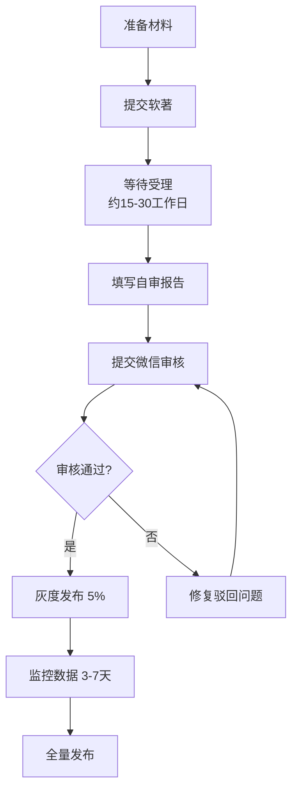

# 上线前检查表

> **版本**: v1.0 | **日期**: 2026-06-25
> **用途**: 微信小游戏提审前的最终检查

---

## 一、🔴 提审前必做 (P0)

### 1.1 广告单元ID

| 项目 | 状态 | 说明 |
|------|:----:|------|
| 填写微信广告位 ID | □ | `WXAdapter.ts` 中 `_getAdUnitId()` 的 7 个空字符串替换为真实 ID |
| 广告位测试 | □ | 在微信开发者工具中验证广告加载/播放/回调正常 |

### 1.2 合规文档

| 项目 | 状态 | 文件 |
|------|:----:|------|
| 软著已受理 | □ | 提交至版权中心 |
| 自审报告已填写 | □ | `docs/自审报告.md` |

### 1.3 启动屏

| 项目 | 状态 | 说明 |
|------|:----:|------|
| 启动图 < 100KB | □ | `assets/splash/` |
| 显示版本号 | □ | 启动屏底部 v0.8.0 |
| 显示版权信息 | □ | "© 2026" |
| 2 秒可跳过 | □ | 点击/等待自动跳过 |

### 1.4 用户协议

| 项目 | 状态 | 说明 |
|------|:----:|------|
| 用户隐私协议 | □ | 需在启动时展示弹窗链接 |
| 儿童保护提示 | □ | 设置中添加"适合12岁以上用户" |
| 适龄提示 | □ | 游戏入口展示 |

---

## 二、🟡 建议修改 (P1)

### 2.1 性能优化

| 项目 | 当前 | 目标 | 状态 |
|------|------|------|:----:|
| 正式美术资源 | 占位符(74个PNG) | 正式像素风格 | □ |
| 图集合并 | 未合并 | 单张图集 < 512KB | □ |
| 主包大小 | ~3.5MB | < 3MB | □ |
| 首帧加载 | 未优化 | < 3 秒 | □ |

### 2.2 用户体验

| 项目 | 状态 | 说明 |
|------|:----:|------|
| 音乐音效 | □ | 6区域BGM + 战斗音效 (M3.5) |
| 加载提示 | □ | 显示"加载中..." |
| 错误提示 | □ | 网络异常时不沉默失败 |
| Haptic反馈 | □ | 翻滚/受伤时震动 |

---

## 三、🟢 提审流程

### 3.1 步骤



### 3.2 时间预估

| 阶段 | 预估时间 | 实际 |
|------|----------|:----:|
| 软著受理 | 15-30 个工作日 | □ |
| 首次审核 | 3-7 个工作日 | □ |
| 整改重审 | 2-5 个工作日 | □ |
| 灰度观察 | 3-7 天 | □ |
| **总计** | **约 5-8 周** | |

### 3.3 审核常见驳回原因及预防

| 驳回原因 | 预防措施 |
|----------|----------|
| 启动屏不合规 | 确保包含版本号+版权信息+跳过按钮 |
| 广告位遮挡内容 | Banner 仅主界面显示 |
| 无版号/软著 | 提前提交软著申请 |
| 适龄提示缺失 | 游戏入口+设置中都标注 |
| 用户协议缺失 | 启动时展示隐私协议 |
| 性能不达标 | 优化Draw Call和同屏单位数 |

---

## 四、📊 灰度期监控指标

| 指标 | 目标值 | 说明 |
|------|--------|------|
| 首日留存 | > 35% | 次日重新打开游戏的比例 |
| 单局时长 | 5~15 分钟 | 太短=缺乏深度,太长=碎片化失败 |
| 战斗时长 | 20~45 秒 | 验证平衡性设计 |
| 人均广告观看 | > 6 次/日 | 核心变现指标 |
| 广告填充率 | > 90% | 网络质量监控 |
| 崩溃率 | < 0.1% | 代码稳定性 |
| 启动时间 | < 5 秒 | 玩家耐心阈值 |

---

## 五、✅ 最终确认清单

提审前逐项确认：

```
□ 1. 广告位ID已填写 → WXAdapter.ts
□ 2. 启动屏 < 100KB
□ 3. 自审报告已打印签字
□ 4. 软著受理回执已上传
□ 5. 用户协议弹窗已实现
□ 6. 适龄提示(12+)已在游戏中展示
□ 7. 无调试/测试代码进入生产
□ 8. 构建版本号已更新
□ 9. 微信开发者工具中全流程跑通
□ 10. 已预留灰度→全量的上线窗口
```
