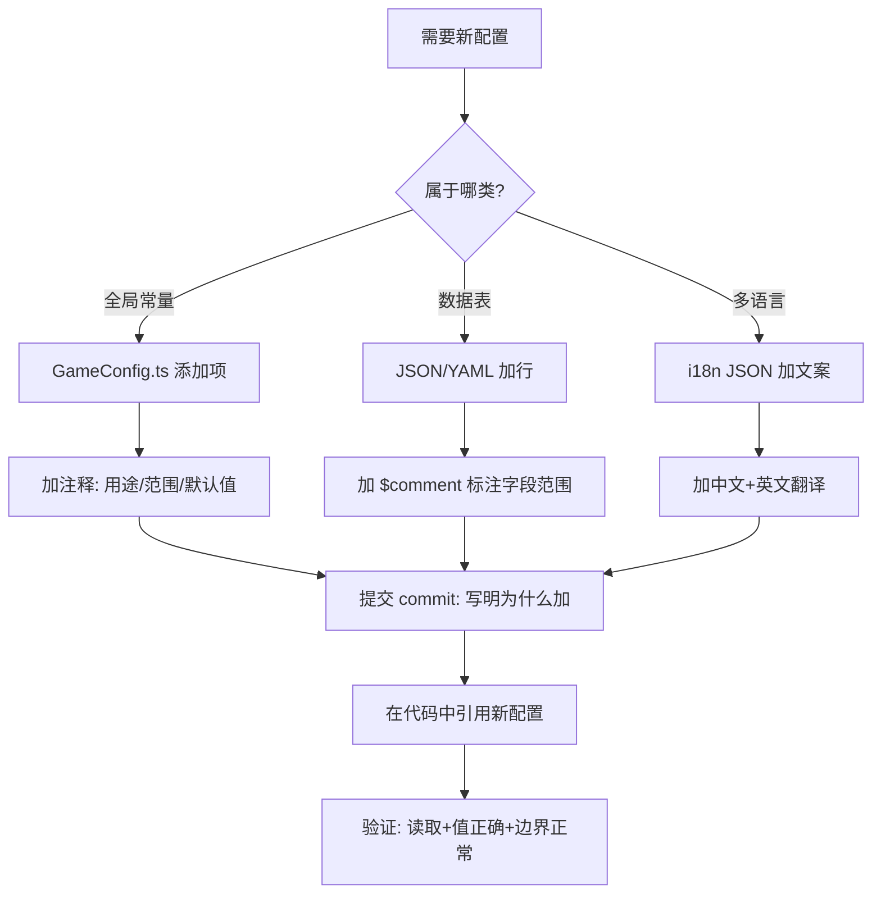

# 配置表规范

> **版本**: v1.0 | **日期**: 2026-06-25 | **状态**: 生效
> **适用范围**: 本项目所有 TypeScript 代码 + 外部配置表（JSON/YAML/Excel）
> **目标**: 消灭所有魔法数字，所有数值配置集中管理

---

## 0. 设计原则

| 原则 | 说明 |
|------|------|
| **零魔法数字** | 代码中禁止出现任何字面量数值，所有数值通过配置键引用 |
| **就近兜底** | 配置缺失不可崩 —— 每层读取都有默认值 |
| **类型安全** | 配置键名使用 TypeScript `as const`，编译期校验 |
| **环境隔离** | 开发/测试/生产使用不同配置覆盖层，不修改核心配置 |
| **变更可追溯** | 每次配置变更必须有 commit message 记录原因 |

---

## 1. 数据格式标准

### 1.1 运行时配置：TypeScript（GameConfig.ts）

```
所有运行时（游戏内）数值写在 GameConfig.ts 中，TypeScript 编译为 JS。
格式: const + as const（编译期常量，零运行时开销）

适用场景:
  - 战斗数值（攻击间隔、暴击倍率）
  - 掉落概率
  - 属性边界（最小值/最大值）
  - UI 时长（动画、过渡时间）
```

### 1.2 静态数据表：JSON / YAML

```
大规模静态数据（怪物属性表、武器参数表、关卡配置）写入 .json 或 .yaml 文件。
通过 ConfigManager 加载为 Map。

适用场景:
  - 武器参数表（12+ 条）
  - 怪物属性表（18+ 条）
  - 关卡配置（6 区域 × 4-5 小关）
  - 套装效果表（6 套 × 3 级效果）
```

### 1.3 多语言文本：单独的 i18n JSON

```json
// assets/resources/i18n/zh-CN.json
{
  "item.healingPotion": "回复药水",
  "item.healingPotion.desc": "立即回复 10 点 HP",
  "skill.dash": "冲刺冲锋",
  "set.tempest.2p": "攻速 +12%"
}
```

**规则**: 多语言文件只含文案，不含数值。文案在 GameConfig 引用数值。

### 1.4 数据结构选择矩阵

| 数据结构 | 适用于 | 不适用于 |
|----------|--------|----------|
| `const + as const` (`GameConfig.ts`) | 全局一次性数值（攻击间隔、暴击率）| 大规模数据表（武器 50+ 种）|
| `Record<string, T>` (JSON/YAML) | 实体属性表（武器/怪物/关卡）| 运行时需频繁修改的数值 |
| `Map<string, ConfigTable>` (ConfigManager) | 运行时动态加载的表 | 小量单一配置（几个 key）|
| `i18n JSON` | 玩家可见的文案 | 纯逻辑数值 |

---

## 2. 命名规范

### 2.1 键名规则

| 规则 | 示例 | 说明 |
|------|------|------|
| 全大写蛇形 `UPPER_SNAKE_CASE` | `AUTO_ATTACK_INTERVAL` | 顶级全局常量，值类型为 `number / boolean / string` |
| 大驼峰 `PascalCase` | `PLAYER_BASE_ATK` | 有类型归属的配置（前缀为领域）|
| 小驼峰 `camelCase` | `healingPotion` | 配置表（JSON/YAML）中的字段键 |
| 蛇形 `snake_case` | `monster_hp_scale` | 外部配置表（Excel 导出）的列名 |

### 2.2 领域前缀

```
所有 GameConfig 键名按领域分组，前缀标明了所属子系统:

领域      前缀               示例
战斗      (无前缀, 命名表意)  AUTO_ATTACK_INTERVAL
玩家      PLAYER_*            PLAYER_BASE_ATK
属性边界  STAT_*              STAT_ATK_SPEED_MIN
怪物      MONSTER_*           MONSTER_ATK_INTERVAL_CHARGER
网格      GRID_*              GRID_SIZE
地图/关卡 FLOOR_*             FLOOR_MIN_ROOMS
掉落      DROP_*              DROP_NORMAL_CHANCE
经济      GOLD_* / KEY_*      GOLD_CAP
道具      ITEM_*              ITEM_BAG_SLOTS
商店      SHOP_*              SHOP_KEY_PRICE
遗物      RELIC_*             RELIC_CAP
套装      SET_*               SET_RADIANCE_AUTO_HEAL
装备      (稀有度)            LEGENDARY_DROP_CHANCE
广告      AD_*                AD_REWARD_DURATION
```

### 2.3 配置表 JSON 命名

```json
{
  "weapons": {
    "sword": { "name": "铁剑", "atk": 10, "range": 1.2, "speed": 0.9 }
  },
  "monsters": {
    "slime": { "name": "史莱姆", "hp": 20, "atk": 3, "ai": "charger" }
  }
}
```

| 层级 | 命名规则 | 示例 |
|------|----------|------|
| 表名 | 小写复数 | `weapons`, `monsters`, `floors` |
| 行键 | 小写单数，语义化 | `sword`, `slime`, `forestGuardian` |
| 字段 | 小驼峰 | `atk`, `maxHP`, `attackRange`, `aiType` |
| 数组 | 小写复数 | `monsters`, `drops`, `rewards` |

---

## 3. 配置项定义规范

### 3.1 TypeScript 配置项模板

```typescript
/** 
 * 配置项注释模板（每个配置项必须有）:
 * 1. 中文描述用途
 * 2. 合法取值范围
 * 3. 默认值
 */
```

示例：

```typescript
export const GameConfig = {
    // ============================================================
    // 1. 战斗系统
    // ============================================================

    /** 自动攻击间隔（秒）| 范围: 0.2~5.0 | 默认: 1.0 */
    AUTO_ATTACK_INTERVAL: 1.0,

    /** D6 骰子面数 | 范围: 2~20 | 默认: 6 | 影响: 伤害波动范围+暴击触发阈值 */
    D6_DICE_SIDES: 6,
} as const;
```

### 3.2 JSON 配置项模板

```json
{
  "sword": {
    "$schema": "武器模板",
    "name": "铁剑",
    "atk": 10,
    "range": 1.2,
    "speed": 0.9,
    "element": "none",
    "$comment": "atk: 1~50 | range: 0.5~5 | speed: 0.3~2.0"
  }
}
```

### 3.3 Excel 导出模板（备用）

```
| ID (string) | name (string) | atk (int 1-50) | range (float 0.5-5.0) | speed (float 0.3-2.0) | element (enum) |
|-------------|---------------|----------------|-----------------------|----------------------|----------------|
| sword       | 铁剑          | 10             | 1.2                   | 0.9                  | none           |
```

---

## 4. 默认值与校验规则

### 4.1 三层兜底策略

```
读取优先级（从高到低）:

    游戏内运行时值 (PlayerStats/Ability 等)
                  ↓
    GameConfig 静态默认值 (GameConfig.ts)
                  ↓
    ConfigManager 兜底默认值 (若配置表缺失)
                  ↓
    原生 JS 默认值 (最后的防线，如 config[key] ?? 0)
```

### 4.2 校验触发时机

```
校验分为两级:

级别 1: 编译期（TypeScript `as const`）
  - 确保配置键名拼写正确
  - 确保类型正确（number / string / boolean）

级别 2: 运行期（ConfigManager._validateAll）
  - 启动时校验所有配置表的完整性
  - 检查空表 → 报警
  - 检查关键数值是否在合理范围内
  - 校验不通过 → 控制台 warning，不影响游戏运行
```

### 4.3 校验规则表

| 校验类型 | 规则 | 示例 |
|----------|------|------|
| 类型检查 | number 必须为 number | `ATK: "10"` → 编译报错 |
| 范围检查 | 值必须在指定范围内 | `GRID_SIZE < 3` → 运行报警 |
| 非空检查 | 配置表不能为空 | `monsters: {}` → 运行报警 |
| 概率和检查 | 概率权重总和应为 100 | `60+30+9+1 === 100` |
| 依赖检查 | 关联配置逻辑一致 | `MIN_DAMAGE <= MAX_DAMAGE` |
| 引用完整性 | 外键指向的 ID 必须存在 | `monster.ai = 'unknown'` → 报警 |

---

## 5. 分组与层级划分

### 5.1 GameConfig 中的分组

```
GameConfig.ts 内的分组通过注释块 + 序号实现:

// ============================================================
// 1. 战斗系统
// ============================================================
AUTO_ATTACK_INTERVAL: 1.0,
...

// ============================================================
// 2. 玩家基础属性
// ============================================================
PLAYER_BASE_ATK: 10,
...
```

### 5.2 配置表 JSON 中的分组

```json
{
  "metadata": {
    "version": "1.0",
    "lastUpdated": "2026-06-25"
  },
  "weapons": { ... },
  "monsters": {
    "forest": { ... },
    "catacombs": { ... },
    "volcano": { ... }
  },
  "floors": {
    "zone1": { ... },
    "zone2": { ... }
  }
}
```

### 5.3 配置文件目录结构

```
assets/resources/config/
├── GameConfig.ts              # 运行时全局常量（必需，编译期生效）
├── weapons.json               # 武器属性表
├── monsters.json              # 怪物属性表  
├── floors.json                # 关卡配置表
├── drops.json                 # 掉落配置表
├── i18n/                      # 多语言文案
│   ├── zh-CN.json             # 简体中文
│   └── en.json                # 英文（预留）
└── env/                       # 环境覆盖层（仅差异配置）
    ├── dev.json               # 开发环境（CD 短、概率调高方便测试）
    ├── test.json              # 测试环境
    └── prod.json              # 生产环境（可能为空，使用默认值）
```

---

## 6. 环境隔离

### 6.1 环境覆盖策略

```
开发/测试/生产 不需要维护三套完整的配置表。
使用 默认配置 + 环境覆盖层 的方式:

1. 开发/测试环境: env/dev.json 或 env/test.json 覆盖部分关键项
2. 生产环境: 不提供 env/prod.json → 使用 GameConfig.ts 的默认值

覆盖层示例 (env/dev.json)：
  {"AUTO_ATTACK_INTERVAL": 0.5}   → 开发时攻速加快方便测试
  {"DROP_NORMAL_CHANCE": 0.5}     → 开发时掉率提高方便验证
  {"SPLASH_MIN_DURATION": 0.5}     → 跳过启动屏加速迭代
```

### 6.2 环境检测

```typescript
// ConfigManager 在加载时检测运行环境
const ENV = {
    DEV: 'dev',
    TEST: 'test',
    PROD: 'prod',
} as const;

function detectEnv(): string {
    // 微信小游戏: wx.getAccountInfoSync().miniProgram.envVersion
    // Cocos: 通过构建宏
    if (CC_DEBUG) return ENV.DEV;
    return ENV.PROD;
}
```

---

## 7. 版本管理与变更流程

### 7.1 配置变更规则

```
每次修改配置必须满足:

1. 单次提交只改一个逻辑 (不要混入无关重构)
2. commit message 必须写明: 改了什么 + 为什么改
3. 数值改动必须标注: 旧值 → 新值 + 改动原因

示例:
  git commit -m "[配置] 下调自动攻击间隔 1.0→0.8（Playtest反馈战斗节奏太慢）
  - AUTO_ATTACK_INTERVAL: 1.0 → 0.8
  - 原因: 早期测试者反映普攻间隔太长，Boss 战拖沓"
```

### 7.2 配置版本标记

```typescript
// GameConfig.ts 底部
export const CONFIG_META = {
    version: '1.1.0',
    updatedAt: '2026-06-25',
    changelog: [
        '1.1.0: 下调攻击间隔 1.0→0.8',
        '1.0.0: 初始配置表建立, 150+ 项',
    ],
} as const;
```

### 7.3 废弃配置的处理

```
配置被废弃时的标准流程:

步骤 1: 在配置项上方加 `@deprecated` 注释（保留值，不改）
步骤 2: 在代码中搜索引用，全部替换为新配置键
步骤 3: 确认无引用后，在下一个大版本中删除该配置项

示例:
  /** @deprecated 请使用 AUTO_ATTACK_INTERVAL。v1.2.0 移除 */
  OLD_ATTACK_SPEED: 1.0,
```

---

## 8. 配置引用规则

### 8.1 代码中引用配置的规则

```typescript
// ✅ 正确: 通过 ConfigManager 或直接 import GameConfig
import { GameConfig } from '../core/GameConfig';
const interval = GameConfig.AUTO_ATTACK_INTERVAL;

// ✅ 正确: 读取配置表
const cfg = ConfigManager.getInstance();
const sword = cfg.getWeaponConfig('sword');

// ❌ 错误: 直接写死在代码里
const interval = 1.0;  // No!
```

### 8.2 配置计算规则

```typescript
// ✅ 正确: 基于配置做计算
const finalDamage = Math.max(GameConfig.MIN_DAMAGE, rawDamage - defense);

// ✅ 正确: 配置值参与公式
const critDamage = Math.floor(damage * GameConfig.CRIT_MULTIPLIER);

// ❌ 错误: 公式中的常数不写死
const critDamage = Math.floor(damage * 1.5);  // No! 使用 GameConfig.CRIT_MULTIPLIER
```

---

## 9. 新增配置项流程



---

## 10. 禁止事项

| 禁止 | 说明 | 替代方案 |
|------|------|----------|
| ❌ 代码中直接写数值 | `Math.max(1, damage)` | `Math.max(GameConfig.MIN_DAMAGE, damage)` |
| ❌ 配置项无注释 | `XXX: 3.0` | `/** 翻滚CD（秒）\| 范围: 1~10 */ XXX: 3.0` |
| ❌ 多环境维护多套配置 | dev/prod 各一套 | 默认+环境覆盖层 |
| ❌ 删除未确认废弃的配置 | 直接删掉 `OLD_XXX` | 先 `@deprecated`，确认无引用再删 |
| ❌ 配置与代码混在一个 commit | 改数值+改逻辑一起提交 | 数值变更单独 commit |

---

## 11. 版本记录

| 版本 | 日期 | 变更 |
|------|------|------|
| v1.0 | 2026-06-25 | 配置表规范初版 |
