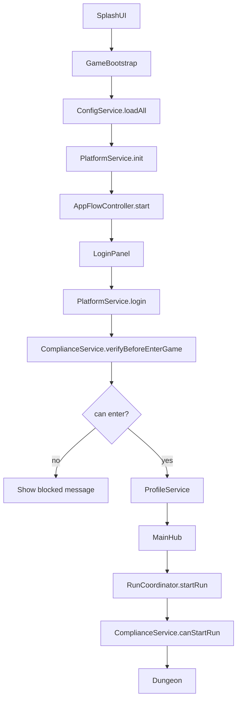

# TapTap 发布迁移详细方案

更新时间：2026-07-08

适用项目：Cocos Creator 3.8.8 项目《回到地面》

目标平台：TapTap Android 正式发布

---

## 1. 迁移结论

当前项目不是简单把微信小游戏包上传到 TapTap。TapTap 发布应按 Android 原生游戏处理：

```text
当前微信小游戏链路：
Cocos Creator -> 微信小游戏构建 -> wx API -> 微信平台发布

目标 TapTap 链路：
Cocos Creator -> Android 原生构建 -> TapSDK / Android Bridge -> TapTap 发布
```

迁移重点不是美术资源，而是以下 7 项：

1. 平台层从 `wx` 专用改成多平台 Adapter。
2. 登录从微信登录改成 TapTap 登录。
3. 实名认证 / 防沉迷接入 TapTap 合规能力。
4. 存档 key 从微信语义改成通用账号语义。
5. 广告、埋点、分享等微信专用 API 隔离。
6. Cocos Android 原生构建、签名、包名、权限、混淆和测试。
7. TapTap 商店资料、隐私协议、适龄和提审材料准备。

---

## 2. 官方依据

需要执行人按以下官方文档确认最新参数：

- TapTap APK 上传与发布：`https://developer.taptap.cn/docs/sdk/apk-upload/guide/`
- TapTap 防沉迷与合规：`https://developer.taptap.cn/docs/v3/sdk/anti-addiction/guide/`
- TapTap 防沉迷最佳实践：`https://developer.taptap.cn/docs/v3/sdk/anti-addiction/practice/`
- Cocos Creator 3.8 Android 发布：`https://docs.cocos.com/creator/3.8/manual/en/editor/publish/android/build-example-android.html`

注意：TapSDK 版本、Gradle 依赖、Android 权限、开发者中心配置可能更新。执行前必须以 TapTap 开发者中心最新文档为准。

---

## 3. 当前项目现状

### 3.1 已具备的有利基础

项目已经有一些正确方向的底座：

```text
assets/scripts/app/AppFlowController.ts
assets/scripts/app/SceneFlowService.ts
assets/scripts/run/RunCoordinator.ts
assets/scripts/core/save/SaveService.ts
assets/scripts/core/storage/StorageService.ts
assets/scripts/platform/PlatformService.ts
assets/scripts/platform/AnalyticsService.ts
assets/scripts/platform/AdService.ts
assets/scripts/ui/main/LoginPanel.ts
```

这些文件说明项目已经开始做：

- 统一流程入口。
- 统一场景切换。
- 统一存档服务。
- 平台服务抽象雏形。
- UI 面板化。

TapTap 迁移不应该绕开这些底座，而是继续强化它们。

### 3.2 当前高风险点

#### 3.2.1 平台层有微信硬编码

已发现：

```text
PlatformService.ts       只识别微信 / 浏览器
AnalyticsService.ts      直接调用 wx.reportAnalytics
AdService.ts             直接调用 wx.createRewardedVideoAd / wx.createBannerAd
LoginPanel.ts            直接使用 wxLogin / wx_openid
WXAdapter.ts             微信适配遗留
text.json                仍有“微信登录”“微信”等文案
ui_assets.json           仍有 ui.login.wechat_btn
```

这些在 Android 原生包中会导致：

- `wx is not defined`
- 登录无法完成
- 防沉迷无法接入
- 账号存档语义混乱

#### 3.2.2 平台层代码已有乱码

部分 TS 文件中文注释已经显示为乱码。这说明历史上存在 GBK / UTF-8 混写问题。迁移 TapTap 时平台层会大量修改，如果不先定规则，会继续扩大问题。

强制规则：

```text
TS / JS / JSON / scene / prefab：
  只写 ASCII 注释和代码标识。

中文说明：
  只写入 docs/*.md。

中文游戏文本：
  只写入 assets/resources/config/text.json。

禁止：
  用 PowerShell open(..., "w") 或默认编码脚本重写 TS 文件。
```

---

## 4. 目标架构

### 4.1 平台层结构

新增结构：

```text
assets/scripts/platform/
├── PlatformService.ts
├── PlatformTypes.ts
├── adapters/
│   ├── PlatformAdapter.ts
│   ├── WebDevPlatformAdapter.ts
│   ├── WeChatPlatformAdapter.ts
│   ├── NativeAndroidPlatformAdapter.ts
│   └── TapTapAndroidAdapter.ts
├── taptap/
│   ├── TapTapBridge.ts
│   └── TapTapTypes.ts
├── ComplianceService.ts
├── AdService.ts
└── AnalyticsService.ts
```

Android 原生侧：

```text
native/engine/android/app/src/main/java/com/yourcompany/backtoground/
├── TapTapBridge.java
└── GameActivity.java
```

实际 Android 路径以 Cocos 生成的 native 工程为准。

### 4.2 调用原则

业务层只能调用：

```ts
PlatformService.instance.init()
PlatformService.instance.login()
PlatformService.instance.getUserId()
PlatformService.instance.checkCompliance()
AnalyticsService.instance.report()
AdService.instance.showRewardedVideo()
SaveService.instance
```

业务层禁止直接调用：

```ts
wx.login()
wx.reportAnalytics()
wx.createRewardedVideoAd()
jsb.reflection.callStaticMethod()
director.loadScene()
```

例外：

```text
TapTapBridge.ts 可以调用 jsb.reflection。
WeChatPlatformAdapter.ts 可以调用 wx。
SceneFlowService.ts 可以调用 director.loadScene。
```

---

## 5. 平台抽象详细方案

### 5.1 PlatformTypes.ts

新增文件：

```ts
export type RuntimePlatform =
    | 'web_dev'
    | 'wechat_minigame'
    | 'native_android'
    | 'taptap_android'
    | 'unknown';

export interface PlatformLoginResult {
    success: boolean;
    userId: string;
    platform: RuntimePlatform;
    nickname?: string;
    avatarUrl?: string;
    token?: string;
    raw?: unknown;
}

export interface ComplianceResult {
    canEnterGame: boolean;
    reason?: string;
    ageRange?: number;
    remainingSeconds?: number;
    raw?: unknown;
}

export interface PlatformInitOptions {
    channel: string;
    debug: boolean;
}
```

### 5.2 PlatformAdapter.ts

新增文件：

```ts
import { ComplianceResult, PlatformInitOptions, PlatformLoginResult, RuntimePlatform } from '../PlatformTypes';

export interface PlatformAdapter {
    readonly platform: RuntimePlatform;

    init(options: PlatformInitOptions): Promise<void>;
    login(): Promise<PlatformLoginResult>;
    logout(): Promise<void>;
    getUserId(): string | null;
    checkCompliance(userId: string): Promise<ComplianceResult>;
    report(eventName: string, params?: Record<string, unknown>): void;
}
```

### 5.3 PlatformService.ts

重构目标：

```ts
import { sys } from 'cc';
import { PlatformAdapter } from './adapters/PlatformAdapter';
import { WebDevPlatformAdapter } from './adapters/WebDevPlatformAdapter';
import { WeChatPlatformAdapter } from './adapters/WeChatPlatformAdapter';
import { NativeAndroidPlatformAdapter } from './adapters/NativeAndroidPlatformAdapter';
import { TapTapAndroidAdapter } from './adapters/TapTapAndroidAdapter';
import { ComplianceResult, PlatformInitOptions, PlatformLoginResult, RuntimePlatform } from './PlatformTypes';

export class PlatformService {
    private static _instance: PlatformService | null = null;
    private _adapter: PlatformAdapter | null = null;
    private _platform: RuntimePlatform = 'unknown';

    static get instance(): PlatformService {
        if (!this._instance) this._instance = new PlatformService();
        return this._instance;
    }

    get platform(): RuntimePlatform {
        return this._platform;
    }

    get isWeChat(): boolean {
        return this._platform === 'wechat_minigame';
    }

    get isTapTap(): boolean {
        return this._platform === 'taptap_android';
    }

    get isDev(): boolean {
        return CC_DEBUG || this._platform === 'web_dev';
    }

    async init(options?: Partial<PlatformInitOptions>): Promise<void> {
        const finalOptions: PlatformInitOptions = {
            channel: options?.channel ?? 'dev',
            debug: options?.debug ?? CC_DEBUG,
        };

        this._adapter = this._createAdapter(finalOptions.channel);
        this._platform = this._adapter.platform;
        await this._adapter.init(finalOptions);
    }

    async login(): Promise<PlatformLoginResult> {
        return this._requireAdapter().login();
    }

    async logout(): Promise<void> {
        await this._requireAdapter().logout();
    }

    getUserId(): string | null {
        return this._adapter?.getUserId() ?? null;
    }

    async checkCompliance(userId: string): Promise<ComplianceResult> {
        return this._requireAdapter().checkCompliance(userId);
    }

    report(eventName: string, params?: Record<string, unknown>): void {
        this._adapter?.report(eventName, params);
    }

    private _createAdapter(channel: string): PlatformAdapter {
        const g = globalThis as any;

        if (typeof g.wx !== 'undefined') {
            return new WeChatPlatformAdapter();
        }

        if (typeof g.jsb !== 'undefined' && sys.os === sys.OS.ANDROID) {
            if (channel === 'taptap') {
                return new TapTapAndroidAdapter();
            }
            return new NativeAndroidPlatformAdapter();
        }

        return new WebDevPlatformAdapter();
    }

    private _requireAdapter(): PlatformAdapter {
        if (!this._adapter) {
            throw new Error('PlatformService is not initialized');
        }
        return this._adapter;
    }
}
```

### 5.4 WebDevPlatformAdapter.ts

用于浏览器预览和编辑器预览：

```ts
import { PlatformAdapter } from './PlatformAdapter';
import { ComplianceResult, PlatformInitOptions, PlatformLoginResult, RuntimePlatform } from '../PlatformTypes';

export class WebDevPlatformAdapter implements PlatformAdapter {
    readonly platform: RuntimePlatform = 'web_dev';
    private _userId: string | null = null;

    async init(_options: PlatformInitOptions): Promise<void> {
        this._userId = localStorage.getItem('dev_user_id');
    }

    async login(): Promise<PlatformLoginResult> {
        const id = this._userId ?? 'dev_user';
        this._userId = id;
        localStorage.setItem('dev_user_id', id);
        return { success: true, userId: id, platform: this.platform, nickname: 'Dev User' };
    }

    async logout(): Promise<void> {
        this._userId = null;
        localStorage.removeItem('dev_user_id');
    }

    getUserId(): string | null {
        return this._userId;
    }

    async checkCompliance(_userId: string): Promise<ComplianceResult> {
        return { canEnterGame: true };
    }

    report(eventName: string, params?: Record<string, unknown>): void {
        console.log('[Analytics]', eventName, params ?? {});
    }
}
```

### 5.5 NativeAndroidPlatformAdapter.ts

用于不接 TapTap 的 Android 测试包：

```ts
import { PlatformAdapter } from './PlatformAdapter';
import { ComplianceResult, PlatformInitOptions, PlatformLoginResult, RuntimePlatform } from '../PlatformTypes';

export class NativeAndroidPlatformAdapter implements PlatformAdapter {
    readonly platform: RuntimePlatform = 'native_android';
    private _userId: string | null = null;

    async init(_options: PlatformInitOptions): Promise<void> {
        this._userId = 'android_local_user';
    }

    async login(): Promise<PlatformLoginResult> {
        const id = this._userId ?? 'android_local_user';
        this._userId = id;
        return { success: true, userId: id, platform: this.platform };
    }

    async logout(): Promise<void> {
        this._userId = null;
    }

    getUserId(): string | null {
        return this._userId;
    }

    async checkCompliance(_userId: string): Promise<ComplianceResult> {
        return { canEnterGame: true };
    }

    report(eventName: string, params?: Record<string, unknown>): void {
        console.log('[NativeAnalytics]', eventName, params ?? {});
    }
}
```

---

## 6. TapTap SDK 接入方案

### 6.1 接入前置条件

在 TapTap 开发者中心完成：

1. 创建游戏。
2. 获取 Client ID / Client Token。
3. 配置 Android 包名。
4. 配置签名证书指纹。
5. 开通登录能力。
6. 开通合规认证 / 防沉迷。
7. 配置隐私政策 URL 和用户协议 URL。

注意：

```text
客户端可以保存必要 Client ID / Client Token。
服务端密钥、Server Secret、支付回调密钥禁止放进客户端资源。
```

### 6.2 TapTapBridge.ts

新增：

```ts
export class TapTapBridge {
    private static readonly CLASS_NAME = 'com/yourcompany/backtoground/TapTapBridge';

    static init(): Promise<void> {
        return this._call('init', {});
    }

    static login(): Promise<unknown> {
        return this._call('login', {});
    }

    static checkCompliance(userId: string): Promise<unknown> {
        return this._call('checkCompliance', { userId });
    }

    private static _call(method: string, payload: Record<string, unknown>): Promise<unknown> {
        return new Promise((resolve, reject) => {
            const jsb = (globalThis as any).jsb;
            if (!jsb?.reflection) {
                reject(new Error('jsb reflection unavailable'));
                return;
            }

            const callbackId = `tap_cb_${Date.now()}_${Math.floor(Math.random() * 100000)}`;
            (globalThis as any)[callbackId] = (raw: string) => {
                try {
                    delete (globalThis as any)[callbackId];
                    const result = JSON.parse(raw);
                    if (result.success) {
                        resolve(result.data);
                    } else {
                        reject(new Error(result.error ?? 'TapTap bridge failed'));
                    }
                } catch (err) {
                    reject(err);
                }
            };

            jsb.reflection.callStaticMethod(
                this.CLASS_NAME,
                method,
                '(Ljava/lang/String;Ljava/lang/String;)V',
                JSON.stringify(payload),
                callbackId
            );
        });
    }
}
```

### 6.3 TapTapAndroidAdapter.ts

新增：

```ts
import { PlatformAdapter } from './PlatformAdapter';
import { ComplianceResult, PlatformInitOptions, PlatformLoginResult, RuntimePlatform } from '../PlatformTypes';
import { TapTapBridge } from '../taptap/TapTapBridge';

interface TapLoginRaw {
    openId?: string;
    unionId?: string;
    name?: string;
    avatar?: string;
    token?: string;
}

interface TapComplianceRaw {
    canEnterGame?: boolean;
    ageRange?: number;
    remainingSeconds?: number;
    reason?: string;
}

export class TapTapAndroidAdapter implements PlatformAdapter {
    readonly platform: RuntimePlatform = 'taptap_android';
    private _userId: string | null = null;

    async init(_options: PlatformInitOptions): Promise<void> {
        await TapTapBridge.init();
    }

    async login(): Promise<PlatformLoginResult> {
        const raw = await TapTapBridge.login() as TapLoginRaw;
        const userId = raw.openId ?? raw.unionId;
        if (!userId) {
            throw new Error('TapTap login result missing user id');
        }

        this._userId = userId;
        return {
            success: true,
            userId,
            platform: this.platform,
            nickname: raw.name,
            avatarUrl: raw.avatar,
            token: raw.token,
            raw,
        };
    }

    async logout(): Promise<void> {
        this._userId = null;
    }

    getUserId(): string | null {
        return this._userId;
    }

    async checkCompliance(userId: string): Promise<ComplianceResult> {
        const raw = await TapTapBridge.checkCompliance(userId) as TapComplianceRaw;
        return {
            canEnterGame: raw.canEnterGame === true,
            ageRange: raw.ageRange,
            remainingSeconds: raw.remainingSeconds,
            reason: raw.reason,
            raw,
        };
    }

    report(eventName: string, params?: Record<string, unknown>): void {
        console.log('[TapTapAnalytics]', eventName, params ?? {});
    }
}
```

### 6.4 Android TapTapBridge.java

路径按 Cocos 生成工程调整：

```java
package com.yourcompany.backtoground;

import android.app.Activity;
import org.json.JSONObject;

public final class TapTapBridge {
    private static Activity activity;

    private TapTapBridge() {}

    public static void setActivity(Activity value) {
        activity = value;
    }

    public static void init(String payload, String callbackId) {
        try {
            // TODO: Init TapSDK here.
            callbackSuccess(callbackId, new JSONObject());
        } catch (Exception e) {
            callbackError(callbackId, e.getMessage());
        }
    }

    public static void login(String payload, String callbackId) {
        try {
            // TODO: Call TapTap login SDK.
            // Replace this mock with real TapTap login result.
            JSONObject data = new JSONObject();
            data.put("openId", "mock_taptap_openid");
            data.put("name", "TapTap User");
            callbackSuccess(callbackId, data);
        } catch (Exception e) {
            callbackError(callbackId, e.getMessage());
        }
    }

    public static void checkCompliance(String payload, String callbackId) {
        try {
            // TODO: Call TapTap compliance / anti-addiction SDK.
            JSONObject data = new JSONObject();
            data.put("canEnterGame", true);
            callbackSuccess(callbackId, data);
        } catch (Exception e) {
            callbackError(callbackId, e.getMessage());
        }
    }

    private static void callbackSuccess(String callbackId, JSONObject data) throws Exception {
        JSONObject result = new JSONObject();
        result.put("success", true);
        result.put("data", data);
        callback(callbackId, result.toString());
    }

    private static void callbackError(String callbackId, String message) {
        try {
            JSONObject result = new JSONObject();
            result.put("success", false);
            result.put("error", message == null ? "unknown error" : message);
            callback(callbackId, result.toString());
        } catch (Exception ignored) {
        }
    }

    private static void callback(String callbackId, String json) {
        String escaped = json.replace("\\", "\\\\").replace("'", "\\'");
        String script = "window['" + callbackId + "']('" + escaped + "')";
        com.cocos.lib.CocosJavascriptJavaBridge.evalString(script);
    }
}
```

GameActivity 中：

```java
@Override
protected void onCreate(Bundle savedInstanceState) {
    super.onCreate(savedInstanceState);
    TapTapBridge.setActivity(this);
}
```

---

## 7. 登录流程改造

### 7.1 登录流程目标

```text
LoginPanel.open()
  -> PlatformService.login()
  -> ComplianceService.verifyBeforeEnterGame(userId)
  -> ProfileService.bindPlatformUser()
  -> AppFlowController.goTo(PROFILE_CHECK)
```

### 7.2 ComplianceService.ts

新增：

```ts
import { ComplianceResult } from './PlatformTypes';
import { PlatformService } from './PlatformService';

export class ComplianceService {
    private static _instance: ComplianceService | null = null;
    private _lastResult: ComplianceResult | null = null;

    static get instance(): ComplianceService {
        if (!this._instance) this._instance = new ComplianceService();
        return this._instance;
    }

    get lastResult(): ComplianceResult | null {
        return this._lastResult;
    }

    async verifyBeforeEnterGame(userId: string): Promise<ComplianceResult> {
        const result = await PlatformService.instance.checkCompliance(userId);
        this._lastResult = result;
        return result;
    }

    canStartRun(): boolean {
        return this._lastResult?.canEnterGame !== false;
    }
}
```

### 7.3 LoginPanel.ts 修改要点

属性命名从 `wxLoginBtn` 改成 `platformLoginBtn`。

核心代码：

```ts
private async _onPlatformLogin(): Promise<void> {
    this._setStatus(T('ui.loading'));
    this._setButtonsEnabled(false);

    try {
        const login = await PlatformService.instance.login();
        if (!login.success) {
            this._setStatus(T('ui.loginFailed'));
            this._setButtonsEnabled(true);
            return;
        }

        const compliance = await ComplianceService.instance.verifyBeforeEnterGame(login.userId);
        if (!compliance.canEnterGame) {
            this._setStatus(compliance.reason ?? T('ui.complianceBlocked'));
            this._setButtonsEnabled(true);
            return;
        }

        StorageService.instance.set('platform_user_id', login.userId);
        StorageService.instance.set('platform_type', login.platform);
        StorageService.instance.set('is_guest', 'false');

        this._onLoginSuccess();
    } catch (err) {
        console.error('[LoginPanel] platform login failed:', err);
        this._setStatus(T('ui.loginFailed'));
        this._setButtonsEnabled(true);
    }
}
```

游客登录建议：

```text
正式 TapTap 包：
  默认关闭游客登录。

开发包：
  可以保留 Dev Guest。

如果必须保留游客：
  仍然要走防沉迷与实名流程，不允许绕过。
```

---

## 8. AppFlowController 改造

### 8.1 启动时初始化平台

目标：

```ts
async start(): Promise<void> {
    await ConfigService.instance.loadAll();
    await PlatformService.instance.init(platformConfig);
    await this.goTo(AppFlowState.AUTH_CHECK);
}
```

### 8.2 进入地牢前合规二次检查

在 `RunCoordinator.startRun()` 前：

```ts
if (!ComplianceService.instance.canStartRun()) {
    AppFlowController.instance.goTo(AppFlowState.MAIN_HUB, {
        toast: T('ui.complianceBlocked'),
    });
    return;
}
```

原因：

```text
登录时检查只能保证进入主城合法。
开始一局游戏前也要检查，避免未成年人剩余时长耗尽后继续开局。
```

---

## 9. 埋点改造

### 9.1 当前问题

`AnalyticsService.ts` 直接调用 `wx.reportAnalytics`。TapTap Android 包中没有 `wx`。

### 9.2 改造目标

```ts
report(eventName: string, data: Record<string, unknown>): void {
    try {
        PlatformService.instance.report(eventName, data);
    } catch (err) {
        this._cacheEvent(eventName, data);
    }
}
```

### 9.3 事件规范

统一事件名：

```json
{
  "game_start": {},
  "login_start": { "platform": "taptap_android" },
  "login_success": { "platform": "taptap_android" },
  "compliance_blocked": { "reason": "..." },
  "run_start": { "characterId": "warrior", "zone": "forest" },
  "run_end": { "result": "win", "duration": 123 },
  "ad_impression": { "placement": "revive" }
}
```

事件参数不得包含：

```text
手机号
身份证号
真实姓名
Token
Server Secret
未脱敏设备标识
```

---

## 10. 广告改造

### 10.1 当前问题

`AdService.ts` 使用微信广告 API。TapTap 包没有微信广告。

### 10.2 改造方案

新增 Adapter：

```ts
export interface AdAdapter {
    showRewardedVideo(placement: string): Promise<boolean>;
    showInterstitial(placement: string): Promise<boolean>;
    showBanner(placement: string): Promise<boolean>;
    hideBanner(): void;
}
```

TapTap 首版建议：

```ts
export class NoopAdAdapter implements AdAdapter {
    async showRewardedVideo(_placement: string): Promise<boolean> {
        return false;
    }

    async showInterstitial(_placement: string): Promise<boolean> {
        return false;
    }

    async showBanner(_placement: string): Promise<boolean> {
        return false;
    }

    hideBanner(): void {}
}
```

业务逻辑必须处理无广告：

```ts
const rewarded = await AdService.instance.showRewardedVideo('revive');
if (!rewarded) {
    this._showNoAdAvailableMessage();
    return;
}
```

不要默认给奖励，否则会影响经济系统。

---

## 11. 存档与账号迁移

### 11.1 新存档 key 规范

统一：

```text
platform_user_id
platform_type
profile_id
save.profile
save.settings
save.run_snapshot
save.version
```

废弃：

```text
wx_openid
wechat_openid
is_wx
```

### 11.2 兼容迁移

```ts
export function migratePlatformKeys(storage: StorageService): void {
    const platformUserId = storage.get('platform_user_id');
    if (platformUserId) return;

    const wxOpenId = storage.get('wx_openid');
    if (wxOpenId) {
        storage.set('legacy_wx_openid', wxOpenId);
        storage.set('platform_user_id', wxOpenId);
        storage.set('platform_type', 'wechat_minigame');
    }
}
```

TapTap 正式包中，如果用户没有旧本地存档，不需要做微信迁移。但代码可以保留兼容。

---

## 12. 配置文件修改

### 12.1 新增 platform.json

路径：

```text
assets/resources/config/platform.json
```

内容：

```json
{
  "channel": "taptap",
  "platform": "android",
  "login": {
    "provider": "taptap",
    "allowGuest": false
  },
  "compliance": {
    "enabled": true,
    "checkOnLogin": true,
    "checkBeforeRun": true
  },
  "analytics": {
    "provider": "local_buffer"
  },
  "ads": {
    "enabled": false,
    "provider": "none"
  }
}
```

### 12.2 text.json 修改

替换微信语义：

```json
{
  "ui.loginTapTap": "TapTap 登录",
  "ui.loginGuest": "游客试玩",
  "ui.settingsPlatform": "TapTap",
  "ui.settingsAccount": "账号",
  "ui.complianceBlocked": "当前账号暂时无法进入游戏",
  "ui.complianceRemaining": "剩余游戏时间：{minutes} 分钟",
  "ui.privacyPolicy": "隐私政策",
  "ui.userAgreement": "用户协议"
}
```

保留规则：

```text
美术图片内禁止出现 TapTap、微信、英文按钮文字。
所有按钮文字继续由 Label + text.json 提供。
```

### 12.3 ui_assets.json 修改

建议把：

```text
ui.login.wechat_btn
```

改成：

```text
ui.login.platform_btn
```

或者：

```text
ui.login.taptap_btn
```

推荐通用方案：

```json
{
  "ui.login.platform_btn": {
    "assetId": "textures/ui/login/btn_platform",
    "type": "sliced"
  }
}
```

好处：

```text
以后换 TapTap / Android 官方 / iOS / Steam，不需要改场景节点 key。
只需要换配置和文案。
```

---

## 13. Android 构建方案

### 13.1 环境准备

需要安装并配置：

```text
JDK
Android Studio
Android SDK
Android NDK
Gradle
Cocos Creator 3.8.8 Android 构建环境
```

Cocos 偏好设置中配置：

```text
Android SDK 路径
NDK 路径
JDK 路径
Gradle 路径
```

### 13.2 包名

建议：

```text
com.yourcompany.backtoground
```

上线后不要随意修改包名。

### 13.3 签名

生成 keystore：

```text
backtoground_taptap_release.keystore
```

必须保存：

```text
keystore 文件
alias
store password
key password
SHA1
MD5
SHA256
```

不要提交到 Git 仓库。建议放：

```text
E:/game/secrets/backtoground_taptap_release.keystore
```

`.gitignore`：

```gitignore
*.keystore
*.jks
secrets/
```

### 13.4 构建 profile

建议新增：

```text
build_profiles/android_taptap_debug.json
build_profiles/android_taptap_release.json
```

Release 关键项：

```json
{
  "platform": "android",
  "debug": false,
  "md5Cache": true,
  "sourceMaps": false,
  "encryptJs": true,
  "orientation": "landscape",
  "packageName": "com.yourcompany.backtoground",
  "appABIs": ["arm64-v8a", "armeabi-v7a"]
}
```

### 13.5 权限控制

只申请必要权限：

```xml
<uses-permission android:name="android.permission.INTERNET" />
<uses-permission android:name="android.permission.ACCESS_NETWORK_STATE" />
```

不要默认申请：

```text
读取通讯录
读取短信
定位
录音
相机
外部存储
```

除非确有功能需要，并且隐私政策明确说明。

---

## 14. TapTap 后台配置

必须填写：

```text
游戏名称
包名
签名指纹
Client ID
Client Token
隐私政策 URL
用户协议 URL
客服联系信息
适龄提示
游戏分类
游戏简介
截图
宣传图
图标
```

TapTap 登录失败常见原因：

```text
包名不一致
签名 MD5 / SHA1 不一致
Client ID 用错环境
Debug 包和 Release 包签名不同
没有启用对应 SDK 能力
Android Bridge 类路径不一致
```

---

## 15. UI 与资源修改

### 15.1 登录界面

需要调整：

```text
微信登录 -> TapTap 登录
游客登录 -> 视合规策略决定是否保留
协议入口 -> 必须保留
隐私政策入口 -> 必须保留
```

资源：

```text
assets/resources/textures/ui/login/btn_wechat.png
```

建议替换为：

```text
assets/resources/textures/ui/login/btn_platform.png
```

资源要求：

```text
不含文字
不含英文
不含 TapTap logo，除非确认授权和平台要求
卡通动物风
可 9-slice
透明背景 RGBA
```

### 15.2 设置界面

原“微信”文案改为“TapTap”或“平台账号”。

推荐文案：

```text
账号：TapTap
切换账号
隐私政策
用户协议
联系客服
```

### 15.3 分享能力

微信分享如果存在，TapTap 首版先禁用或改成普通系统分享。

代码规则：

```ts
if (!PlatformService.instance.isWeChat) {
    return false;
}
```

但业务代码不要直接判断 `isWeChat`，最好由 `ShareService` 封装。

---

## 16. 质量门禁

### 16.1 新增架构检查

更新 `tools/config_pipeline/check_all.py`，加入：

```text
禁止业务代码直接出现 wx.
禁止业务代码直接出现 jsb.reflection
禁止业务代码直接出现 director.loadScene
禁止新增 wx_openid
禁止 TS 文件中文乱码字符
```

示例检查脚本逻辑：

```python
FORBIDDEN = [
    ("wx.", ["assets/scripts/platform/adapters/WeChatPlatformAdapter.ts"]),
    ("jsb.reflection", ["assets/scripts/platform/taptap/TapTapBridge.ts"]),
    ("director.loadScene", ["assets/scripts/app/SceneFlowService.ts"]),
    ("wx_openid", []),
]
```

### 16.2 编码检查

必须检查：

```text
U+FFFD 替换字符
常见 mojibake 字符串
TS 文件中文注释
JSON 解析
scene / prefab YAML 正常
```

### 16.3 Android 真机检查

清单：

```text
启动不黑屏
横屏方向正确
分辨率适配正常
登录按钮可点击
TapTap 登录成功
实名 / 防沉迷正常
主城可进入
创角可完成
进入地牢正常
战斗正常
结算正常
退出重进存档正常
无 wx is not defined
无 jsb bridge callback 泄漏
无明显内存增长
无隐私权限弹窗异常
```

---

## 17. 实施路线

### P0：Android 原生包跑通

目标：不接 TapSDK，先证明游戏能作为 Android 原生包运行。

任务：

1. 配 Android 构建环境。
2. 新建 `platform.json`。
3. 重构 `PlatformService` 基础接口。
4. 新增 `NativeAndroidPlatformAdapter`。
5. `LoginPanel` 使用通用 `PlatformService.login()`。
6. 打 Android Debug 包。
7. 真机测试主流程。

验收：

```text
APK 可以安装
启动正常
主城正常
地牢正常
无 wx is not defined
```

### P1：TapTap 登录接入

任务：

1. TapTap 后台创建应用。
2. 配包名和签名。
3. Android 工程接 TapSDK 登录。
4. 新增 `TapTapBridge.java`。
5. 新增 `TapTapBridge.ts`。
6. 新增 `TapTapAndroidAdapter`。
7. LoginPanel 接 TapTap 登录。

验收：

```text
TapTap 登录能拉起
能拿到 openId
能进入主城
重启后账号保持
```

### P2：实名与防沉迷

任务：

1. TapTap 后台开通合规认证。
2. Android Bridge 接防沉迷。
3. 新增 `ComplianceService`。
4. 登录后检查。
5. 开局前检查。
6. 增加 UI 提示文案。

验收：

```text
未允许进入时不能进游戏
允许进入时流程正常
防沉迷错误有明确提示
```

### P3：广告 / 埋点 / 分享隔离

任务：

1. `AnalyticsService` 去除直接 `wx.reportAnalytics`。
2. `AdService` 改 Adapter。
3. 分享能力抽成 `ShareService`。
4. TapTap 首版广告默认关闭。

验收：

```text
Android 包无 wx API 报错
事件本地缓存正常
无广告时业务不崩
```

### P4：Release 与 TapTap 提审

任务：

1. 配 release keystore。
2. 关闭 debug。
3. 开启 JS 加密。
4. 打 release APK。
5. 完成真机回归。
6. 上传 TapTap。
7. 填写商店资料。
8. 提交审核。

验收：

```text
TapTap 后台 APK 解析成功
签名校验成功
隐私合规资料完整
测试账号可用
```

---

## 18. 发布前检查表

### 18.1 代码

```text
[ ] 无业务层 wx.
[ ] 无业务层 jsb.reflection
[ ] 无业务层 director.loadScene
[ ] 无 wx_openid 新写入
[ ] PlatformService 初始化早于 LoginPanel
[ ] TapTap 登录失败有 UI 提示
[ ] 防沉迷失败有 UI 提示
[ ] RunCoordinator 开局前检查合规状态
[ ] SaveService 不依赖微信存储
[ ] TS 文件无乱码注释
```

### 18.2 配置

```text
[ ] platform.json channel=taptap
[ ] text.json 无微信登录文案
[ ] ui_assets.json 无 ui.login.wechat_btn
[ ] assets.json 路径完整
[ ] Android 包名正确
[ ] 签名证书正确
[ ] TapTap 后台包名正确
[ ] TapTap 后台签名指纹正确
```

### 18.3 资源

```text
[ ] 登录按钮无文字
[ ] 协议入口为 Label 文本
[ ] 图片无英文
[ ] 图片无骷髅 / 血液 / 器官 / 心脏
[ ] UI 9-slice 资源边框正确
[ ] 横屏 16:9 / 20:9 / 平板适配正常
```

### 18.4 Android

```text
[ ] Debug 包可安装
[ ] Release 包可安装
[ ] 首次启动正常
[ ] 断网登录提示正常
[ ] 切后台恢复正常
[ ] 音频正常
[ ] 存档正常
[ ] 无多余权限
[ ] 无明显卡顿
```

### 18.5 TapTap

```text
[ ] APK 上传成功
[ ] 包体解析成功
[ ] 登录能力配置完成
[ ] 合规认证开通
[ ] 隐私政策 URL 可访问
[ ] 用户协议 URL 可访问
[ ] 商店图标合规
[ ] 商店截图无违规内容
[ ] 测试账号说明完整
```

---

## 19. 需要优先修改的文件清单

```text
assets/scripts/platform/PlatformService.ts
assets/scripts/platform/AnalyticsService.ts
assets/scripts/platform/AdService.ts
assets/scripts/ui/main/LoginPanel.ts
assets/scripts/app/AppFlowController.ts
assets/scripts/run/RunCoordinator.ts
assets/scripts/core/storage/StorageService.ts
assets/scripts/core/save/SaveService.ts
assets/resources/config/text.json
assets/resources/config/ui_assets.json
assets/resources/config/platform.json
tools/config_pipeline/check_all.py
```

新增：

```text
assets/scripts/platform/PlatformTypes.ts
assets/scripts/platform/ComplianceService.ts
assets/scripts/platform/adapters/PlatformAdapter.ts
assets/scripts/platform/adapters/WebDevPlatformAdapter.ts
assets/scripts/platform/adapters/WeChatPlatformAdapter.ts
assets/scripts/platform/adapters/NativeAndroidPlatformAdapter.ts
assets/scripts/platform/adapters/TapTapAndroidAdapter.ts
assets/scripts/platform/taptap/TapTapBridge.ts
assets/scripts/platform/taptap/TapTapTypes.ts
assets/resources/config/platform.json
```

Android 原生新增：

```text
native Android 工程中的 TapTapBridge.java
TapSDK Gradle 依赖
AndroidManifest 必要配置
```

---

## 20. 风险与规避

### 20.1 TapSDK 接入不稳定

规避：

```text
先 P0 跑通 Android 原生包。
再 P1 接登录。
最后 P2 接防沉迷。
不要一次性把所有平台能力接上。
```

### 20.2 签名配置错误

规避：

```text
Debug 和 Release 分开记录签名。
TapTap 后台确认包名和证书指纹。
不要随意换 keystore。
```

### 20.3 防沉迷阻断流程遗漏

规避：

```text
登录后检查。
开局前检查。
支付前检查。
结算后可刷新状态。
```

### 20.4 平台代码再次乱码

规避：

```text
TS 文件只写 ASCII 注释。
中文写 md。
修改代码用 apply_patch 或 UTF-8 明确写入工具。
新增编码门禁。
```

### 20.5 UI 资源又出现文字

规避：

```text
登录按钮和平台按钮不画字。
TapTap 字样走 Label。
所有 UI 图片继续过图片内文字审计。
```

---

## 21. 推荐最终结构



---

## 22. 给执行 AI 的明确要求

执行时必须遵守：

1. 不要直接删除微信适配，先隔离到 `WeChatPlatformAdapter`。
2. 不要让业务代码直接调用 TapSDK 或 `jsb.reflection`。
3. 不要绕过 `AppFlowController` 和 `RunCoordinator`。
4. 不要把 TapTap 密钥类敏感信息写入 Git。
5. 不要在 TS 文件写中文注释。
6. 每完成一个阶段运行 `python tools/config_pipeline/check_all.py`。
7. 每完成一个阶段做一次 Android 真机验证。
8. 任何平台差异必须落在 Adapter 层，不允许散落到 UI / battle / dungeon 业务代码中。

---

## 23. 最小可执行版本

如果时间有限，先做以下最小版本：

```text
1. PlatformService 重构为 Adapter。
2. WebDev + NativeAndroid + TapTapAndroid 三个 Adapter。
3. LoginPanel 改成 platform login。
4. TapTapBridge 接登录。
5. ComplianceService 接防沉迷。
6. RunCoordinator 开局前检查。
7. Android release 包签名。
8. TapTap 后台上传。
```

暂缓：

```text
广告 SDK
支付
云存档
高级埋点
系统分享
多渠道包自动化
```

---

## 24. 交付标准

完成迁移后，应交付：

```text
[ ] TapTap Android Debug APK
[ ] TapTap Android Release APK
[ ] release keystore 信息备份
[ ] TapTap 后台配置截图或记录
[ ] 登录测试记录
[ ] 防沉迷测试记录
[ ] 真机兼容测试记录
[ ] 发布前检查表
[ ] 代码门禁通过记录
```

只有以上全部满足，才可以进入 TapTap 提审。

