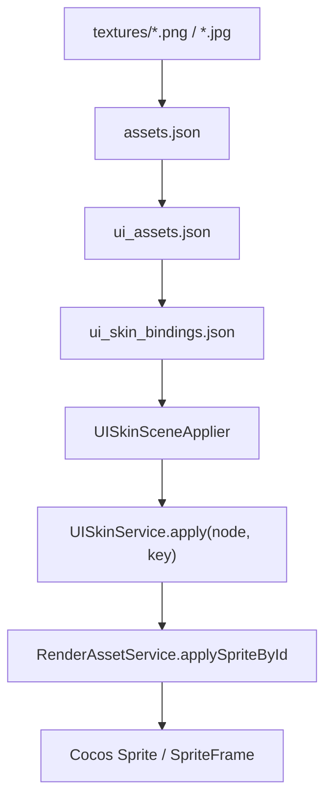

# UI资源自动绑定实施方案

更新时间：2026-07-06

## 1. 目标

当前项目已经有两层资源映射：

- `assets/resources/config/assets.json`：资源文件路径到可加载资源 ID 的映射。
- `assets/resources/config/ui_assets.json`：业务语义 key 到 `assetId` 的映射。

这两层已经解决了“资源能不能被加载”的问题，但还没有完全解决“场景节点自动使用哪张 UI 图”的问题。

本方案新增第三层：

- `assets/resources/config/ui_skin_bindings.json`：场景节点路径到 UI 语义 key 的绑定表。

最终目标：

1. 不需要在编辑器里给大量节点手动挂 `UISkinBinder`。
2. 节点换图只改配置，不改业务代码。
3. UI 节点改名、资源缺失、key 填错都能被门禁脚本发现。
4. `main.scene`、`splash.scene`、`dungeon.scene` 都用同一套自动绑定机制。
5. 支持后续新增 UI 面板、HUD、地图、装备、升级界面，不需要改底层加载代码。

## 2. 总体架构



三层配置职责：

| 文件 | 职责 | 修改频率 |
|---|---|---|
| `assets.json` | 资源 ID 到实际 SpriteFrame/Texture 的加载映射 | 资源新增、删除、移动时修改 |
| `ui_assets.json` | 业务语义 key 到资源 ID 的映射 | 换皮肤、换美术图时修改 |
| `ui_skin_bindings.json` | 场景节点路径到业务语义 key 的绑定 | UI 节点结构调整时修改 |

注意：`UISkinBinder` 可以保留，但作为少量特殊节点或临时调试使用。正式批量 UI 换图应优先走 `ui_skin_bindings.json`。

## 3. 新增配置文件

新增：

`assets/resources/config/ui_skin_bindings.json`

推荐格式：

```json
{
  "metadata": {
    "version": "1.0.0",
    "lastUpdated": "2026-07-06",
    "description": "Scene node path to ui_assets semantic key bindings."
  },
  "splash": {
    "Canvas/SplashUI/SplashImage": "ui.splash.bg",
    "Canvas/SplashUI/Logo": "ui.splash.logo",
    "Canvas/SplashUI/SkipButton": "ui.main.start_button"
  },
  "main": {
    "Canvas/MainUI/Background": "ui.main.bg",
    "Canvas/MainUI/TitleDeco": "ui.main.titledeco",
    "Canvas/MainUI/StartButton": "ui.main.start_button",
    "Canvas/MainUI/characterBtn": "ui.main.character_button",
    "Canvas/MainUI/ShopBtn": "ui.main.shop_button",
    "Canvas/MainUI/LogBtn": "ui.main.log_button",
    "Canvas/MainUI/SettingsBtn": "ui.main.settings_button",

    "Canvas/LoginPanel/PanelRoot/PanelFrame": "ui.panel.frame",
    "Canvas/LoginPanel/PanelRoot/ContentRoot/TitleImage": "ui.login.title",
    "Canvas/LoginPanel/PanelRoot/ContentRoot/WechatBtn": "ui.login.wechat_btn",
    "Canvas/LoginPanel/PanelRoot/ContentRoot/GuestBtn": "ui.login.guest_btn",

    "Canvas/CreatePanel/PanelRoot/PanelFrame": "ui.panel.frame",
    "Canvas/CreatePanel/PanelRoot/ContentRoot/ModelArea": "ui.create.model_area",
    "Canvas/CreatePanel/PanelRoot/ContentRoot/ConfirmBtn": "ui.create.confirm_btn",
    "Canvas/CreatePanel/PanelRoot/ContentRoot/SkipBtn": "ui.create.skip_btn",

    "Canvas/AreaSelectPanel/PanelRoot/PanelFrame": "ui.panel.frame",
    "Canvas/AreaSelectPanel/PanelRoot/ContentRoot/StartBtn": "ui.area.start_btn",
    "Canvas/AreaSelectPanel/PanelRoot/ContentRoot/BackBtn": "ui.area.back_btn",

    "Canvas/SettingsPanel/PanelRoot/PanelFrame": "ui.panel.frame",
    "Canvas/SettingsPanel/PanelRoot/ContentRoot/CloseBtn": "ui.settings.close_btn",
    "Canvas/SettingsPanel/PanelRoot/ContentRoot/ResetBtn": "ui.settings.reset_btn",

    "Canvas/AdventureLogPanel/PanelRoot/PanelFrame": "ui.panel.frame",
    "Canvas/AdventureLogPanel/PanelRoot/ContentRoot/CloseBtn": "ui.log.close_btn",

    "Canvas/SettlementPanel/PanelRoot/PanelFrame": "ui.panel.frame",
    "Canvas/SettlementPanel/PanelRoot/ContentRoot/ResultPanel": "ui.settlement.result_panel",
    "Canvas/SettlementPanel/PanelRoot/ContentRoot/DoubleBtn": "ui.settlement.double_btn",
    "Canvas/SettlementPanel/PanelRoot/ContentRoot/BackBtn": "ui.settlement.back_btn"
  },
  "dungeon": {
    "Canvas/UIRoot/BattleHUD/HpBarBg": "ui.hud.hpbar_bg",
    "Canvas/UIRoot/BattleHUD/HpBarFill": "ui.hud.hpbar_fill",
    "Canvas/UIRoot/BattleHUD/HpBarFrame": "ui.hud.hpbar_frame",
    "Canvas/UIRoot/SkillUI/SkillSlot1": "ui.hud.skillslot",
    "Canvas/UIRoot/SkillUI/SkillSlot2": "ui.hud.skillslot",
    "Canvas/UIRoot/SkillUI/SkillSlot3": "ui.hud.skillslot",
    "Canvas/UIRoot/VirtualJoystick/Base": "ui.joystick.base",
    "Canvas/UIRoot/VirtualJoystick/Dot": "ui.joystick.dot",

    "Canvas/UIRoot/DungeonMapUI/CurrentNode": "ui.map.node_current",
    "Canvas/UIRoot/DungeonMapUI/VisitedNode": "ui.map.node_visited",
    "Canvas/UIRoot/DungeonMapUI/UnknownNode": "ui.map.node_unknown",

    "Canvas/UIRoot/UpgradeUI/PanelRoot/PanelFrame": "ui.panel.frame",
    "Canvas/UIRoot/DeathUI/PanelRoot/PanelFrame": "ui.panel.frame",
    "Canvas/UIRoot/EquipmentUI/PanelRoot/PanelFrame": "ui.panel.frame"
  }
}
```

配置规范：

1. 第一层只能是 `metadata`、`splash`、`main`、`dungeon`。
2. 节点路径从场景根节点下的 `Canvas` 开始写。
3. 绑定值必须是 `ui_assets.json` 中存在的 key。
4. 配置里不写文字，文字仍然走 `text.json` 和 `LocalizedLabel` / `T()`。
5. `DimMask` 不建议绑定图片。遮罩应使用纯色 `Sprite` 或 `Graphics`，避免误用 `panel_bg`。
6. 动态生成的节点可以不写在绑定表里，由脚本创建后直接调用 `UISkinService.apply()`。

## 4. 新增运行时服务

新增：

`assets/scripts/ui/UISkinSceneApplier.ts`

核心代码：

```ts
import { JsonAsset, Node, resources } from 'cc';
import { UISkinService } from './UISkinService';

export type SceneSkinBindings = Record<string, string>;

interface UISkinBindingsConfig {
    metadata?: Record<string, unknown>;
    splash?: SceneSkinBindings;
    main?: SceneSkinBindings;
    dungeon?: SceneSkinBindings;
}

export class UISkinSceneApplier {
    private static _config: UISkinBindingsConfig | null = null;
    private static _loading: Promise<void> | null = null;

    static async applyScene(sceneRoot: Node | null, sceneKey: 'splash' | 'main' | 'dungeon'): Promise<void> {
        if (!sceneRoot || !sceneRoot.isValid) return;

        await this.loadConfig();
        await UISkinService.instance.loadConfig();

        const bindings = this._config?.[sceneKey] ?? {};
        const entries = Object.entries(bindings);
        if (entries.length === 0) {
            console.warn(`[UISkinSceneApplier] no bindings for scene: ${sceneKey}`);
            return;
        }

        for (const [path, skinKey] of entries) {
            const node = this.findByPath(sceneRoot, path);
            if (!node) {
                console.warn(`[UISkinSceneApplier] node not found: scene=${sceneKey}, path=${path}, key=${skinKey}`);
                continue;
            }

            const ok = await UISkinService.instance.apply(node, skinKey);
            if (!ok) {
                console.warn(`[UISkinSceneApplier] apply failed: scene=${sceneKey}, path=${path}, key=${skinKey}`);
            }
        }
    }

    static async loadConfig(): Promise<void> {
        if (this._config) return;
        if (this._loading) return this._loading;

        this._loading = new Promise<void>((resolve) => {
            resources.load('config/ui_skin_bindings', JsonAsset, (err, asset) => {
                if (err || !asset) {
                    console.error('[UISkinSceneApplier] load config/ui_skin_bindings failed', err);
                    this._config = {};
                    resolve();
                    return;
                }

                this._config = asset.json as UISkinBindingsConfig;
                resolve();
            });
        });

        return this._loading;
    }

    static findByPath(root: Node, path: string): Node | null {
        const parts = path.split('/').filter(Boolean);
        if (parts.length === 0) return root;

        let current: Node | null = root;
        if (current.name === parts[0]) {
            parts.shift();
        }

        for (const part of parts) {
            current = current?.getChildByName(part) ?? null;
            if (!current) return null;
        }

        return current;
    }
}
```

代码要求：

1. 代码注释、日志、错误信息使用英文，避免再次出现源码编码损坏。
2. `applyScene()` 失败时只打印 warning，不阻断游戏流程。
3. 不直接修改 `text.json` 或 Label 文本。
4. 不处理世界角色、怪物、背景图的战斗运行时资源，战斗资源仍由现有 `DungeonSceneInstaller`、`RenderAssetService`、`SpriteAnimationService` 负责。

## 5. 三个场景的接入方式

### 5.1 splash.scene

修改：

`assets/scripts/ui/SplashUI.ts`

在 `onLoad()` 中创建进度条之前或之后调用均可，建议放在 `GameBootstrap` 初始化之后：

```ts
import { UISkinSceneApplier } from './UISkinSceneApplier';

onLoad(): void {
    GameManager.ensure(this.node.scene);
    this._bootstrap = GameBootstrap.ensure(this.node.scene ?? this.node);

    void UISkinSceneApplier.applyScene(this.node.scene ?? this.node, 'splash');

    this._createProgressBar();
    // existing logic...
}
```

注意：

1. 进度条目前是 `Graphics` 绘制，不走图片绑定。
2. `skipLabel` 和 `loadingLabel` 仍然走 `LocalizedLabel` 或代码更新，不走 UI 图片绑定。
3. `SplashImage` 可以绑定 `ui.splash.bg`。
4. `Logo` 如果场景里没有节点，先不写绑定，避免 warning 淹没真正问题。

### 5.2 main.scene

修改：

`assets/scripts/MainSceneController.ts`

在 `onLoad()` 里注册 Panel 之前或之后应用皮肤均可，建议在 `_registerPanels()` 前：

```ts
import { UISkinSceneApplier } from './ui/UISkinSceneApplier';

onLoad(): void {
    PlayerDataManager.getInstance();
    this.shopUI?.init();

    void UISkinSceneApplier.applyScene(this.node.scene ?? this.node, 'main');

    WXAdapter.getInstance().showBanner();
    // existing logic...
}
```

注意：

1. 主城固定按钮、面板底板、关闭按钮适合放入 `ui_skin_bindings.json`。
2. 角色卡、路线卡、商店格子如果是动态生成，建议由对应 Panel 脚本调用 `UISkinService.apply()`。
3. TopBar 的 `CharNameLabel`、`CharClassLabel`、`LevelLabel`、`SoulStoneLabel` 是动态文本，不走皮肤绑定。
4. `PanelRoot` 初始隐藏时也可以 apply，因为隐藏节点上的 SpriteFrame 设置不会影响后续显示。

### 5.3 dungeon.scene

修改：

`assets/scripts/DungeonSceneController.ts`

在 `_bootstrap()` 中 `_installer.loadInitialArt()` 后、`_wireUI()` 前调用：

```ts
import { UISkinSceneApplier } from './ui/UISkinSceneApplier';

private async _bootstrap(): Promise<void> {
    if (this._booted) return;
    this._booted = true;

    try {
        await this._ensureStartupReady();
    } catch (err) {
        console.error('[DungeonSceneController] startup failed:', err);
        return;
    }

    // existing run state logic...

    if (this._installedRefs) {
        await this._installer.loadInitialArt(
            this._installedRefs,
            PlayerDataManager.getInstance().selectedCharacter,
            rc.state ? rc.getCurrentZone() : gm.currentZone,
        );
    }

    await UISkinSceneApplier.applyScene(this.node.scene ?? this.node, 'dungeon');

    this._wireSystems();
    this._wireServices();
    this._wireUI();
    this._wireEvents();
}
```

注意：

1. 地牢世界背景、格子、角色、怪物不通过 `ui_skin_bindings.json` 管。
2. 地牢 HUD、摇杆、技能槽、地图节点、弹窗底板可以通过 `ui_skin_bindings.json` 管。
3. 如果某些 HUD 节点由代码动态创建，应在创建后立即调用 `UISkinService.apply()`。

示例：

```ts
await UISkinService.instance.apply(skillSlotNode, 'ui.hud.skillslot');
await UISkinService.instance.apply(iconNode, 'icon.skill.dash');
```

## 6. 动态节点处理规范

不是所有 UI 都适合写静态路径。以下类型应使用代码动态绑定：

| 类型 | 示例 | 处理方式 |
|---|---|---|
| 列表项 | 商店商品格子、背包格子 | 创建节点后调用 `UISkinService.apply()` |
| 角色卡 | 角色选择卡片 | 根据角色 ID 拼 key |
| 技能图标 | 技能栏图标 | 根据技能 ID 拼 key |
| 地图房间 | 随机地图节点 | 根据房间类型拼 key |
| 装备品质框 | 装备栏/掉落物 | 根据品质拼 key |

推荐封装：

```ts
import { Node } from 'cc';
import { UISkinService } from '../UISkinService';

export async function applySkillIcon(node: Node, skillId: string): Promise<void> {
    await UISkinService.instance.apply(node, `icon.skill.${skillId}`);
}

export async function applyRoomIcon(node: Node, roomType: string): Promise<void> {
    await UISkinService.instance.apply(node, `ui.map.room_${roomType}`);
}

export async function applyRarityFrame(node: Node, rarity: string): Promise<void> {
    await UISkinService.instance.apply(node, `ui.equipment.rarity_${rarity}`);
}
```

## 7. 门禁脚本增强方案

现有：

`tools/check_assets_registry.py`

已经检查：

1. 磁盘资源是否全部注册到 `assets.json`。
2. `assets.json` 注册的文件是否真实存在。
3. `ui_assets.json` 引用的 `assetId` 是否存在于 `assets.json`。

需要新增：

1. `ui_skin_bindings.json` 中的所有 skin key 是否存在于 `ui_assets.json`。
2. `ui_skin_bindings.json` 中的节点路径是否能在对应 `.scene` 文件中找到。
3. `ui_assets.json` 的 `type` 是否属于允许枚举。
4. `nine_slice` 类型是否仅用于面板、按钮、可拉伸背景。
5. 输出未被绑定或代码引用的 UI key，作为 warning。

建议新增脚本：

`tools/check_ui_skin_bindings.py`

核心代码：

```python
#!/usr/bin/env python3
import json
import sys
from pathlib import Path

PROJECT_DIR = Path(__file__).resolve().parents[1]
CONFIG_DIR = PROJECT_DIR / "assets" / "resources" / "config"
SCENE_DIR = PROJECT_DIR / "assets" / "scenes"

UI_ASSETS_JSON = CONFIG_DIR / "ui_assets.json"
UI_BINDINGS_JSON = CONFIG_DIR / "ui_skin_bindings.json"

SCENE_FILES = {
    "splash": SCENE_DIR / "splash.scene",
    "main": SCENE_DIR / "main.scene",
    "dungeon": SCENE_DIR / "dungeon.scene",
}

VALID_TYPES = {"sprite", "nine_slice", "icon", "background"}


def load_json(path: Path) -> dict:
    with path.open("r", encoding="utf-8") as f:
        raw = json.load(f)
    return raw.get("data", raw)


def load_scene_names(path: Path) -> set[str]:
    text = path.read_text(encoding="utf-8", errors="replace")
    names = set()
    marker = '"_name":'
    for part in text.split(marker)[1:]:
        value = part.split(",", 1)[0].strip().strip('"')
        if value:
            names.add(value)
    return names


def likely_path_exists(scene_names: set[str], node_path: str) -> bool:
    # Scene serialization is UUID based, so this is a lightweight but useful check.
    # Every segment should at least exist as a node name in the scene.
    segments = [x for x in node_path.split("/") if x]
    return all(seg in scene_names for seg in segments)


def main() -> int:
    issues = []
    warnings = []

    ui_assets = load_json(UI_ASSETS_JSON)
    ui_keys = {k for k in ui_assets.keys() if k != "metadata"}

    for key, value in ui_assets.items():
        if key == "metadata":
            continue
        asset_type = value.get("type")
        if asset_type not in VALID_TYPES:
            issues.append(f"invalid ui_assets type: key={key}, type={asset_type}")

    bindings = load_json(UI_BINDINGS_JSON)
    used_keys = set()

    for scene_key, scene_file in SCENE_FILES.items():
        scene_bindings = bindings.get(scene_key, {})
        if not isinstance(scene_bindings, dict):
            issues.append(f"scene binding must be object: {scene_key}")
            continue

        scene_names = load_scene_names(scene_file) if scene_file.exists() else set()

        for node_path, skin_key in scene_bindings.items():
            used_keys.add(skin_key)
            if skin_key not in ui_keys:
                issues.append(f"binding key not found: scene={scene_key}, path={node_path}, key={skin_key}")
            if scene_names and not likely_path_exists(scene_names, node_path):
                warnings.append(f"node path segment may be missing: scene={scene_key}, path={node_path}")

    unused = sorted(ui_keys - used_keys)
    for key in unused:
        warnings.append(f"ui asset key not bound by scene config: {key}")

    for item in warnings:
        print(f"[WARN] {item}")
    for item in issues:
        print(f"[ERROR] {item}")

    print(f"[SUMMARY] errors={len(issues)} warnings={len(warnings)}")
    return 1 if issues else 0


if __name__ == "__main__":
    sys.exit(main())
```

加入总门禁：

`tools/config_pipeline/check_all.py`

```python
CHECKS = [
    ("配置校验", ["python", "tools/config_pipeline/validate_configs.py", "--ci"]),
    ("包体预算", ["python", "tools/check_bundle_budget.py", "--ci"]),
    ("编码审计", ["python", "tools/check_encoding.py", "--ci"]),
    ("架构门禁", ["python", "tools/config_pipeline/check_architecture.py"]),
    ("TS静态检查", ["python", "tools/config_pipeline/check_ts_static.py"]),
    ("资源注册", ["python", "tools/check_assets_registry.py", "--ci"]),
    ("UI皮肤绑定", ["python", "tools/check_ui_skin_bindings.py"]),
]
```

## 8. 迁移步骤

### Phase 1：准备配置

1. 新建 `ui_skin_bindings.json`。
2. 先只填 `splash` 和 `main` 中最稳定的节点：
   - Splash 背景。
   - Splash Logo。
   - Main 背景。
   - Main 底部按钮。
   - 各 Panel 的 `PanelFrame`。
3. 不确定节点路径的先不填，避免 warning 太多。

### Phase 2：接入运行时

1. 新增 `UISkinSceneApplier.ts`。
2. `SplashUI.onLoad()` 调用 `applyScene(..., 'splash')`。
3. `MainSceneController.onLoad()` 调用 `applyScene(..., 'main')`。
4. `DungeonSceneController._bootstrap()` 调用 `applyScene(..., 'dungeon')`。

### Phase 3：验证显示

1. 运行 `npm.cmd run validate:all`。
2. 浏览器预览 `splash.scene`：
   - 背景显示正确。
   - Logo 显示正确。
   - 进度条不受影响。
3. 进入 `main.scene`：
   - 主背景显示正确。
   - 按钮底图显示正确。
   - 打开各 Panel，`PanelFrame` 显示正确。
   - 文本仍然由 `text.json` 控制。
4. 进入 `dungeon.scene`：
   - 背景、角色、怪物仍由战斗运行时系统加载。
   - HUD、摇杆、技能槽、地图图标显示正确。

### Phase 4：清理手动绑定

1. 已经手动挂上的 `UISkinBinder` 可以保留，但不建议继续扩散。
2. 对同一个节点，不要同时用 `UISkinBinder` 和 `ui_skin_bindings.json` 绑定不同 key。
3. 如果发现重复绑定，以 `ui_skin_bindings.json` 为准，并删除编辑器里的 `UISkinBinder`。

## 9. 使用规则

### 9.1 换一张 UI 图

只改：

`ui_assets.json`

示例：

```json
"ui.main.start_button": {
  "assetId": "textures/ui/common/btn_active",
  "type": "sprite",
  "usage": "button"
}
```

不改场景、不改代码。

### 9.2 UI 节点改名或移动

只改：

`ui_skin_bindings.json`

示例：

```json
"Canvas/MainUI/BottomBar/StartButton": "ui.main.start_button"
```

不改 `ui_assets.json`。

### 9.3 新增一个 UI 面板

步骤：

1. 新图放入 `assets/resources/textures/ui/...`。
2. 在 `assets.json` 注册资源 ID。
3. 在 `ui_assets.json` 增加语义 key。
4. 在 `ui_skin_bindings.json` 增加节点路径绑定。
5. 如果是动态列表项，由 Panel 脚本创建节点后调用 `UISkinService.apply()`。

### 9.4 禁止事项

1. 禁止在 UI 图片里生成文字。
2. 禁止在 `.ts` 文件中写中文注释作为长期代码说明。
3. 禁止在多个 UI 脚本里散落硬编码资源路径。
4. 禁止直接 `resources.load('textures/ui/...')` 加 UI 图。
5. 禁止对同一节点既挂 `UISkinBinder` 又在 `ui_skin_bindings.json` 里绑定不同 key。

## 10. 验收标准

实施完成后必须满足：

1. `npm.cmd run validate:all` 通过。
2. `tools/check_assets_registry.py --ci` 通过。
3. `tools/check_ui_skin_bindings.py` 无 error。
4. `splash.scene`、`main.scene`、`dungeon.scene` 均能正常进入。
5. 控制台没有 `missing ui asset key`。
6. 控制台没有 `node not found` 的高频 warning。
7. Main 所有主按钮和 PanelFrame 显示正确。
8. Dungeon HUD、技能槽、摇杆、地图 UI 显示正确。
9. 文本仍然由 `text.json` 控制，图片中没有文字。
10. UI 图没有骷髅、血液、器官、英文伪文字等微信小游戏审核风险。

## 11. 当前项目特别注意

1. `UISkinService.ts` 已经具备自动加载和 `nine_slice` 处理能力，但仍需实际场景接入。
2. `UISkinBinder.ts` 当前注释存在乱码显示风险，建议后续改为英文注释。
3. `ui.panel.mask` 当前指向 `panel_bg`，不建议用于 `DimMask`。遮罩应由纯色半透明 Sprite 或 Graphics 实现。
4. `character.avatar.*` 和 `character.card.*` 当前多处指向 `panel_bg`，这是占位方案，不是最终角色头像/卡片资源。
5. 如果某些节点还没在场景里建立，不要提前写进 `ui_skin_bindings.json`，否则会产生无效 warning。
6. 当前资源注册完整性通过不代表 UI 全部接入，只代表资源链路可加载。

