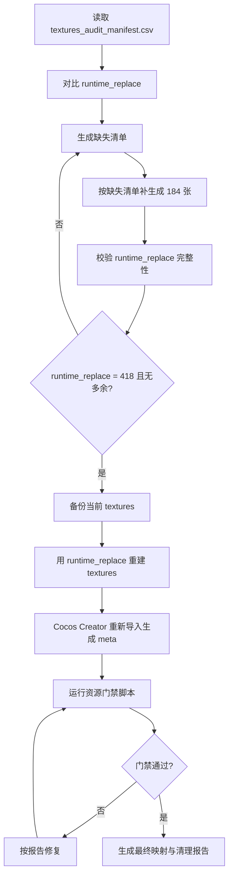

# runtime_replace 补齐与整体替换方案

## 1. 当前结论

当前不能直接删除 `assets/resources/textures` 后用 `runtime_replace` 替换。

原因是：

- `textures_audit_manifest.csv`：418 张
- 当前 `assets/resources/textures`：418 张
- 当前 `art_source/textures_export/runtime_replace`：234 张
- `runtime_replace` 相比 CSV 缺失：184 张
- `runtime_replace` 相比 CSV 多余：0 张

缺失分类：

| 一级目录 | 缺失数量 |
|---|---:|
| bosses | 36 |
| effects | 27 |
| icons | 16 |
| monsters | 30 |
| tiles | 24 |
| ui | 51 |

所以正确路线是：先把 `runtime_replace` 补齐成完整替换包，再整体重建 `assets/resources/textures`。

## 2. 最终目标

替换完成后必须满足：

| 检查项 | 目标 |
|---|---:|
| `textures_audit_manifest.csv` 记录数 | 418 |
| `runtime_replace` PNG 数 | 418 |
| `assets/resources/textures` PNG 数 | 418 |
| `runtime_replace` 多余路径 | 0 |
| `runtime_replace` 缺失路径 | 0 |
| PNG 模式 | RGB/RGBA |
| P 模式 PNG | 0 |
| 缺 `.png.meta` | 0 |
| CSV 有但磁盘缺失 | 0 |
| 磁盘有但 CSV 未登记 | 0 |

## 3. 总体流程



## 4. 补齐 runtime_replace 的规则

补生成资源时，以 `art_source/textures_audit_manifest.csv` 为唯一准绳，不以旧 `textures` 文件为准。

每一张缺失图必须满足：

1. 路径完全一致。
   - CSV 中 `path=effects/combat/fx_crit.png`
   - 必须生成到 `art_source/textures_export/runtime_replace/effects/combat/fx_crit.png`

2. 文件名不能改。
   - 不能把 `boss_forestguardian_death.png` 改成 `forest_guardian_dead.png`
   - 不能加 `_new`、`_hd`、`_v2`

3. 尺寸按 CSV 目标字段。
   - 优先使用 `target_w/target_h`
   - 如果为空，使用 `frame_w/frame_h`
   - 如果仍为空，按分类默认规则补齐

4. PNG 必须是 RGB 或 RGBA。
   - 禁止 `P` 模式
   - 禁止索引色调色板 PNG
   - 透明 UI、角色、怪物、特效使用 RGBA
   - 无透明背景图可用 RGB

5. 不允许图片里出现英文、乱码、水印、AI 签名。
   - UI 按钮文字、图标数字、场景牌匾文字，尽量拆到 Cocos Label 中做
   - 必须保留的图中文字，需要在 CSV 的文字审计字段中标记

6. 不能生成 CSV 之外的资源。
   - 如果生成了额外文件，必须删除或单独放到 `art_source/drafts`

## 4.1 路径放置规范

`runtime_replace` 必须模拟最终的 `assets/resources/textures` 内部结构。

也就是说：

```text
textures_audit_manifest.csv 的 path
    = assets/resources/textures 下的相对路径
    = art_source/textures_export/runtime_replace 下的相对路径
```

路径对应关系：

| CSV path | runtime_replace 放置位置 | 替换后 textures 位置 |
|---|---|---|
| `ui/hud/hud_hpbar_bg.png` | `art_source/textures_export/runtime_replace/ui/hud/hud_hpbar_bg.png` | `assets/resources/textures/ui/hud/hud_hpbar_bg.png` |
| `icons/items/icon_item_key.png` | `art_source/textures_export/runtime_replace/icons/items/icon_item_key.png` | `assets/resources/textures/icons/items/icon_item_key.png` |
| `monsters/forest/monster_forest_slime_idle.png` | `art_source/textures_export/runtime_replace/monsters/forest/monster_forest_slime_idle.png` | `assets/resources/textures/monsters/forest/monster_forest_slime_idle.png` |
| `bosses/finalboss/forest/boss_forestguardian_death.png` | `art_source/textures_export/runtime_replace/bosses/finalboss/forest/boss_forestguardian_death.png` | `assets/resources/textures/bosses/finalboss/forest/boss_forestguardian_death.png` |

注意：`runtime_replace` 里面不要再套一层 `textures`。

错误示例：

```text
art_source/textures_export/runtime_replace/textures/ui/hud/hud_hpbar_bg.png
```

正确示例：

```text
art_source/textures_export/runtime_replace/ui/hud/hud_hpbar_bg.png
```

## 4.2 路径错误的典型情况

| 错误情况 | 后果 |
|---|---|
| 多套一层 `textures/` | 替换后路径变成 `textures/textures/...`，CSV 映射失效 |
| 少一级目录 | bundle/atlas 分组错误 |
| boss 未放区域目录 | 区域 Boss 映射错误 |
| icon 放到 ui 目录 | 图集组错误 |
| 文件名加 `_hd` | CSV 找不到 |
| 文件名大小写不同 | 微信小游戏真机可能找不到 |
| 中文文件名 | 后续脚本、包体、远程资源风险增加 |
| 空格或括号 | 自动化脚本匹配风险增加 |

## 4.3 路径放置硬性规则

1. `runtime_replace` 下只放 CSV 中存在的路径。
2. 所有路径使用 `/` 层级概念，不要混用新命名结构。
3. 文件名全部保持 CSV 原名。
4. 不允许多一层 `textures`。
5. 不允许少区域目录，例如 `forest`、`volcano`、`abyss`。
6. 不允许把未完成图放进 `runtime_replace`。
7. 草稿图放到 `art_source/drafts`。
8. 被拒绝图放到 `art_source/textures_export/rejected`。
9. 已验收图才能进入 `runtime_replace`。

## 4.4 按分类的目录规则

| 分类 | 正确目录规则 |
|---|---|
| backgrounds | `runtime_replace/backgrounds/*.png` |
| characters | `runtime_replace/characters/<角色名>/*.png` |
| monsters | `runtime_replace/monsters/<区域>/*.png` |
| bosses/finalboss | `runtime_replace/bosses/finalboss/<区域>/*.png`，如果 CSV 里是无区域旧路径，则按 CSV 保留 |
| bosses/miniboss | `runtime_replace/bosses/miniboss/<区域>/*.png` |
| tiles | `runtime_replace/tiles/<区域>/*.png` |
| effects/combat | `runtime_replace/effects/combat/*.png` |
| effects/reactions | `runtime_replace/effects/reactions/*.png` |
| effects/relics | `runtime_replace/effects/relics/*.png` |
| effects/ui | `runtime_replace/effects/ui/*.png` |
| icons/items | `runtime_replace/icons/items/*.png` |
| icons/relics | `runtime_replace/icons/relics/*.png` |
| icons/equipment | `runtime_replace/icons/equipment/*.png` |
| ui/hud | `runtime_replace/ui/hud/*.png` |
| ui/main | `runtime_replace/ui/main/*.png` |
| ui/shop | `runtime_replace/ui/shop/*.png` |
| ui/equipment | `runtime_replace/ui/equipment/*.png` |
| ui/death | `runtime_replace/ui/death/*.png` |
| ui/splash | `runtime_replace/ui/splash/*.png` |

如果实际 CSV 与上表冲突，以 CSV 为准。

## 4.5 路径校验通过标准

替换前必须满足：

```text
CSV path 集合 == runtime_replace path 集合
```

也就是：

```text
missing = 0
extra = 0
```

只要有一个路径缺失或多余，就不能整体替换。

## 5. 缺失资源生成优先级

### P0：影响基础运行

优先补：

- `ui`
- `icons`
- `effects`
- `tiles`

原因：

- UI 和 icons 影响界面完整度
- effects 影响战斗反馈
- tiles 影响地牢渲染

### P1：影响战斗表现

然后补：

- `monsters`
- `bosses`

原因：

- 角色、怪物、Boss 可以先用 idle 占位跑通
- 但最终替换前必须补齐所有动作图

## 6. 分类生成要求

## 6.0 通用制作规范

这 184 张缺失资源不是简单“补图片”，而是要按运行时替换包标准制作。所有补齐资源必须遵守以下规范。

### 6.0.1 文件规范

| 项目 | 要求 |
|---|---|
| 文件格式 | PNG |
| 色彩模式 | RGB 或 RGBA |
| 禁止格式 | P 模式、索引色、带调色板 PNG |
| 路径 | 必须和 CSV `path` 完全一致 |
| 文件名 | 必须和 CSV `path` 完全一致 |
| 额外文件 | 禁止 `_new`、`_hd`、`_fixed`、`_backup` |
| 透明背景 | 角色、怪物、Boss、UI、图标、特效默认 RGBA |
| 非透明背景 | 背景、地块可 RGB，但要以 CSV `has_alpha` 为准 |
| 水印 | 禁止 |
| 英文文字 | 禁止，除非该资源在文字审计中明确允许 |
| EXIF/附加信息 | 尽量清理 |

### 6.0.2 尺寸规范

尺寸以 `textures_audit_manifest.csv` 为准。

优先级：

1. `target_w/target_h`
2. `frame_w/frame_h`
3. 分类默认尺寸

分类默认尺寸只在 CSV 目标字段为空时使用：

| 分类 | 默认尺寸建议 |
|---|---:|
| characters | 192x192 |
| monsters 普通怪 | 128x128 或 CSV 指定 |
| monsters 精英怪 | 192x192 或 CSV 指定 |
| miniboss | 192x192 |
| finalboss | 256x256 |
| icons | 128x128 |
| effects | 128x128 或 CSV 指定 |
| tiles | 128x128 或 CSV 指定 |
| ui 按钮/图标 | 128x128 或 CSV 指定 |
| ui 面板/背景 | CSV 指定 |
| backgrounds | CSV 指定 |

注意：

- 不能生成小图再在 Cocos 里放大。
- 不能把 48px 小图硬拉到 192px。
- 像素风资源需要使用最近邻放大，不要双线性模糊。
- 角色、怪物、Boss 的主体不要贴边，保留 8%-12% 安全边距。
- UI 面板类资源要考虑九宫格拉伸，边框不能太薄。

### 6.0.3 像素清晰度规范

AI 生成后必须检查：

- 边缘不能糊成半透明灰边。
- 不要有照片质感。
- 不要有噪点纹理冒充像素。
- 像素块要干净，轮廓清楚。
- 小尺寸预览时主体仍能识别。
- 不要过度压缩导致色块破碎。

推荐处理流程：

1. AI 生成高于目标尺寸 2 倍的图。
2. 人工或脚本裁切到主体居中。
3. 用最近邻缩放到目标尺寸。
4. 转成 RGBA/RGB。
5. 清理透明边缘杂点。
6. 再压缩，但不要用会破坏像素边缘的强压缩参数。

### 6.0.4 构图规范

| 类型 | 构图要求 |
|---|---|
| 角色/怪物/Boss | 主体居中，脚底/重心一致，朝向一致 |
| 动作帧 | 同一角色不同动作比例一致 |
| 特效 | 爆点或中心点在画布中心 |
| 图标 | 主体占画布 70%-85%，不可贴边 |
| 地块 | 上帝视角，可无缝拼接 |
| UI | 对齐规则统一，边框厚度一致 |
| 背景 | 不要把重要视觉元素放在 UI 常驻区域 |

### 6.0.5 风格规范

补齐资源必须跟现有高清资源统一：

- 暗黑地牢题材。
- 像素风。
- 高对比但不要过曝。
- 颜色按区域区分：
  - forest：绿、苔藓、木质、自然
  - catacombs：骨、石、冷灰、幽暗
  - volcano：熔岩、焦黑、火光
  - tundra：冰雪、冷蓝、白灰
  - swamp：毒沼、湿泥、暗绿
  - abyss：紫黑、虚空、暗影
- 不要出现现代物品、科幻 UI、写实照片风。
- 不要出现不属于当前区域的材质。

### 6.0.5.1 风格基准

补齐资源的目标不是“重新设计一套美术”，而是延续 `runtime_replace` 已有 234 张高清资源的样式。

制作时以这 234 张作为视觉基准：

```text
art_source/textures_export/runtime_replace
```

同类资源必须优先参考同目录下已存在的资源。

例如：

| 要补资源 | 优先参考 |
|---|---|
| `bosses/finalboss/forest/*_death.png` | 同目录或同 Boss 的 `idle/attack/skill` |
| `monsters/forest/*_idle.png` | `monsters/forest` 下已生成怪物 |
| `tiles/volcano/*` | `tiles/volcano` 下已生成地块 |
| `ui/hud/*` | `ui/hud` 下已生成 HUD |
| `icons/relics/*` | `icons/relics` 下已生成遗物图标 |
| `effects/reactions/*` | `effects/reactions` 下已生成元素反应特效 |

不要跨类型参考：

- 不要用 UI 风格生成怪物。
- 不要用背景风格生成图标。
- 不要用森林色彩生成火山资源。
- 不要用普通怪比例生成 Boss。

### 6.0.5.2 像素风统一标准

所有补齐资源要保持同一套像素语言：

| 项目 | 标准 |
|---|---|
| 线条 | 外轮廓清楚，暗边统一，不要软糊描边 |
| 明暗 | 2-4 层主明暗，不要照片级渐变 |
| 材质 | 用块面表达，不用写实噪点 |
| 颗粒 | 像素颗粒可见，但不能杂乱 |
| 饱和度 | 中高饱和，避免灰脏 |
| 对比 | 主体和背景区分清楚 |
| 阴影 | 角色/怪物阴影方向一致 |
| 透明边 | 干净，不要半透明脏边 |
| 分辨率感 | 像素边缘清晰，不要 AI 涂抹感 |

禁止出现：

- 写实插画质感
- 3D 渲染质感
- 手绘厚涂质感
- 水彩/油画质感
- 过度平滑渐变
- 高噪点伪细节
- 自动锐化产生的毛边

### 6.0.5.3 同组一致性

同组资源要保持以下一致：

| 资源组 | 必须一致 |
|---|---|
| 同一 Boss 多动作 | 身体比例、主色、朝向、武器/角/翅膀等标志物 |
| 同一区域怪物 | 色彩氛围、阴影方向、画布占比 |
| 同一区域地块 | 透视角度、材质颗粒、边缘衔接 |
| 同一套 UI | 边框厚度、圆角、金属/石质/皮革材质 |
| 同类图标 | 底板、视角、主体占比、描边 |
| 同类特效 | 光晕强度、透明边、粒子密度 |

验收时如果一张图单独看不错，但放进同组后明显突兀，也要判定为 `rejected`。

### 6.0.5.4 区域色彩规范

| 区域 | 主色 | 辅色 | 禁忌 |
|---|---|---|---|
| forest | 苔绿、深绿、木棕 | 金黄、暗青 | 不要偏荧光绿，不要太童话 |
| catacombs | 冷灰、骨白、暗紫 | 铁锈、幽蓝 | 不要太明亮，不要像现代水泥 |
| volcano | 熔岩红、焦黑、橙黄 | 暗褐、烟灰 | 不要变成纯红一片 |
| tundra | 冰蓝、白灰、深蓝 | 淡紫、冷青 | 不要过曝纯白 |
| swamp | 沼泽绿、暗泥褐 | 毒紫、腐黄 | 不要清新草地感 |
| abyss | 紫黑、深蓝、虚空紫 | 冷白、暗红 | 不要科幻霓虹过强 |

### 6.0.5.5 UI 风格规范

UI 补齐资源必须服务于微信小游戏横屏优先操作。

本项目属于地牢探索/战斗类游戏，需要同时展示角色、怪物、地形、技能按钮、摇杆或移动控制、血条和战斗反馈。横屏更适合作为主布局：

- 视野更宽，适合地牢房间、横向移动和战斗预判。
- 左侧移动、右侧技能的双手操作更自然。
- Boss、怪物、特效和地形不会被 UI 大面积遮挡。
- 1280x720 背景资源和当前场景尺寸更接近横屏设计。

竖屏不建议作为主操作布局，除非玩法改成单手点击、自动战斗、卡牌选择或轻度放置。若未来要做竖屏版本，应单独设计竖屏 UI 和相机视野，不能简单把横屏资源压缩进 750x1334。

横屏 UI 制作要求：

- 按钮轮廓要清楚，适合右手点击。
- 左侧移动区、右侧技能区要预留安全空间。
- 图标要在手机横屏小尺寸下可识别。
- 不要把文字做进图片。
- HUD 资源不要太花，避免遮挡战斗。
- 装备格、背包格、品质框要成套。
- 主界面、商店、死亡结算等页面要保持统一材质语言。

UI 推荐视觉方向：

```text
dark dungeon pixel UI, stone and metal frame, clean readable shape,
landscape mobile game HUD, no embedded text, crisp pixel edge
```

### 6.0.5.6 风格参考工作流

每张缺失资源生成前，先找参考图：

1. 先找同路径目录下已有图。
2. 再找同分类、同区域图。
3. 再找同功能图。
4. 最后才使用通用风格模板。

示例：

```text
要补: bosses/finalboss/forest/boss_forestguardian_death.png

参考优先级:
1. bosses/finalboss/forest/boss_forestguardian_idle.png
2. bosses/finalboss/forest/boss_forestguardian_attack.png
3. bosses/finalboss/forest/boss_forestguardian_skill.png
4. 其他 forest boss
```

### 6.0.5.7 AI 提示词统一模板

建议每次生成都使用统一结构：

```text
[资源类型], [区域/主题], [动作/功能],
pixel art, dark dungeon mobile game style,
same visual style as existing runtime_replace assets,
clear silhouette, centered composition,
crisp pixel edges, limited palette, high readability,
[尺寸要求], [透明要求],
no text, no watermark
```

示例：

```text
final boss death sprite, forest guardian, defeated collapsing pose,
pixel art, dark dungeon mobile game style,
same visual style as existing runtime_replace forest boss assets,
clear silhouette, centered composition,
crisp pixel edges, limited palette, high readability,
256x256, transparent background,
no text, no watermark
```

### 6.0.5.8 风格验收方式

单张资源通过技术检查后，还要做风格检查：

1. 把新图和同组 3-5 张已有图放在同一张 contact sheet。
2. 缩小到手机实际显示尺寸看一次。
3. 检查主体比例、色彩、描边、明暗是否统一。
4. 检查是否有明显 AI 生成痕迹。
5. 检查是否比同组资源过亮、过暗、过细、过糊。

风格验收结果写入制作清单：

| status | 含义 |
|---|---|
| approved | 风格一致，可导入 |
| rejected_style | 风格不一致，需要重做 |
| rejected_blur | 像素模糊，需要重做 |
| rejected_text | 含文字/水印，需要重做 |
| rejected_size | 尺寸/构图不合格，需要重做 |

### 6.0.6 AI 生成通用负面词

所有资源生成都建议附加以下负面词：

```text
text, letters, english words, watermark, logo, signature, blurry,
photorealistic, 3d render, smooth gradient, jpeg artifacts,
dirty alpha edge, cropped body, cut off, extra limbs, low resolution,
tiny sprite, unreadable silhouette
```

### 6.0.7 AI 生成后处理要求

生成后统一做以下处理：

1. 检查是否有文字、水印、乱码。
2. 检查 PNG 是否为 P 模式。
3. 检查透明背景是否干净。
4. 检查尺寸是否与 CSV 目标一致。
5. 检查主体是否居中。
6. 检查同组资源比例是否一致。
7. 检查文件大小是否超过 `target_size_kb`。
8. 检查路径是否与 CSV 完全一致。

验收失败的资源不能进入 `runtime_replace`，应放入：

```text
art_source/textures_export/rejected
```

### 6.1 Boss

缺失重点是 `death`、`phasechange` 等动作。

要求：

- 保持和同 Boss 的 `idle/attack/skill` 视觉一致
- 构图中心点一致
- 透明背景
- RGBA
- 不要新增阴影到画布边缘外
- 不要改变角色朝向

AI 提示词要包含：

```text
pixel art game boss sprite, transparent background, same character design,
same camera angle, centered, clean silhouette, no text, no watermark,
RGBA PNG, crisp pixel edges
```

动作补充词：

| 动作 | 追加描述 |
|---|---|
| death | defeated pose, collapsing, readable silhouette |
| phasechange | transformation aura, power-up state, same body shape |

### 6.2 Effects

要求：

- 透明背景
- RGBA
- 画布尺寸与 CSV 一致
- 视觉中心在画布中心
- 不要出现英文拟声词，例如 `CRIT`、`HIT`

AI 提示词：

```text
pixel art VFX sprite, transparent background, centered, high contrast,
clean alpha edge, no letters, no numbers, no watermark, crisp pixels
```

### 6.3 Icons

要求：

- 图标必须可在小尺寸下识别
- 不要包含英文缩写
- 不要包含小字
- 背景透明或统一图标底板，按 CSV/目录现状保持

AI 提示词：

```text
pixel art item icon, centered, readable at small size, simple silhouette,
transparent background, no text, no letters, no watermark, crisp pixel art
```

### 6.4 Monsters

要求：

- 与同区域风格一致
- idle 图必须轮廓清楚
- 精英怪和普通怪要有明显差异
- 透明背景
- RGBA

AI 提示词：

```text
pixel art dungeon monster idle sprite, transparent background, centered,
clear silhouette, same scale as other monsters, no text, no watermark,
crisp pixel edges
```

### 6.5 Tiles

要求：

- 可平铺
- 边缘不能有明显接缝
- floor/wall/thorn/highground 区分清楚
- 一般不需要透明，除非 CSV 标记需要 alpha

AI 提示词：

```text
seamless pixel art dungeon tile, top-down view, tileable edges,
clear material pattern, no text, no watermark, crisp pixels
```

### 6.6 UI

要求：

- 按钮、面板、槽位不能包含英文
- 文本交给 Cocos Label
- 保持九宫格/拉伸安全区域
- 透明资源必须 RGBA

AI 提示词：

```text
pixel art mobile game UI asset, clean shape, no embedded text,
transparent background where needed, readable silhouette, crisp pixels,
no watermark
```

## 6.7 缺失资源交付清单规范

每一张待补齐资源都应按以下格式进入制作清单。这个清单可以从 CSV 自动生成，也可以人工维护。

| 字段 | 是否必填 | 说明 |
|---|---|---|
| path | 是 | 输出到 `runtime_replace` 的相对路径 |
| category | 是 | 资源分类 |
| target_w | 是 | 目标宽度 |
| target_h | 是 | 目标高度 |
| has_alpha | 是 | 是否需要透明 |
| mode | 是 | RGB/RGBA |
| bundle | 是 | 目标 bundle |
| atlas_group | 条件必填 | UI/icon/monster/boss/effect 必填 |
| visual_group | 是 | 同风格组，例如 forest、volcano、hud、equipment |
| prompt_base | 是 | AI 主提示词 |
| prompt_variant | 是 | 当前资源差异描述 |
| negative_prompt | 是 | 负面词 |
| acceptance | 是 | 验收要求 |
| status | 是 | todo/generated/rejected/approved/imported |
| note | 否 | 备注 |

示例：

```csv
path,category,target_w,target_h,has_alpha,mode,bundle,atlas_group,visual_group,prompt_base,prompt_variant,negative_prompt,acceptance,status,note
bosses/finalboss/forest/boss_forestguardian_death.png,bosses,256,256,true,RGBA,bundle_boss_forest,atlas_boss_forest,forest_boss,"pixel art game boss sprite, transparent background, centered, crisp pixels","forest guardian defeated pose, same design as idle/attack/skill","text, watermark, blurry, cropped body","256x256 RGBA, no text, centered, same scale",todo,
```

状态流转：

```text
todo -> generated -> approved -> imported
              └── rejected
```

状态含义：

| 状态 | 含义 |
|---|---|
| todo | 尚未生成 |
| generated | 已生成，未验收 |
| rejected | 验收失败，需要重做 |
| approved | 已验收，可进入 `runtime_replace` |
| imported | 已进入 `runtime_replace` 并通过脚本校验 |

## 6.8 单张资源验收表

每张资源进入 `runtime_replace` 前，必须逐项通过：

| 检查项 | 必须通过 |
|---|---|
| 路径与 CSV 一致 | 是 |
| 文件名与 CSV 一致 | 是 |
| 尺寸与目标一致 | 是 |
| PNG 模式为 RGB/RGBA | 是 |
| 透明通道正确 | 是 |
| 无 P 模式 | 是 |
| 无英文/水印/乱码 | 是 |
| 主体没有裁切 | 是 |
| 主体居中 | 是 |
| 风格与同组一致 | 是 |
| 小尺寸下可识别 | 是 |
| 文件大小不明显超预算 | 是 |

只要有一项失败，就不能覆盖进 `runtime_replace`。

## 6.9 批量验收标准

每一批资源补完后，不要等 184 张全部完成才检查。建议按目录批量验收：

1. `ui`
2. `icons`
3. `effects`
4. `tiles`
5. `monsters`
6. `bosses`

每批验收输出：

| 输出 | 说明 |
|---|---|
| 缺失数量 | 这一批还缺多少 |
| 多余数量 | 是否生成了 CSV 外文件 |
| P 模式数量 | 是否有索引色 PNG |
| 尺寸错误数量 | 是否尺寸不对 |
| 文字风险数量 | 是否疑似有文字 |
| rejected 数量 | 需要重做多少 |
| approved 数量 | 可以进入 runtime_replace 多少 |

批量验收通过后，再进入下一批。

## 7. 补齐检查命令

在 `E:\game` 下执行：

```powershell
@'
from pathlib import Path
import csv

base = Path(r"E:\game")
project = next(p for p in base.iterdir() if (p / "assets" / "resources" / "textures").exists())
manifest = project / "art_source" / "textures_audit_manifest.csv"
replace = project / "art_source" / "textures_export" / "runtime_replace"

rows = list(csv.DictReader(open(manifest, encoding="utf-8-sig", newline="")))
csv_paths = {r["path"].replace("\\", "/").removeprefix("textures/") for r in rows}
replace_paths = {p.relative_to(replace).as_posix() for p in replace.rglob("*.png")}

missing = sorted(csv_paths - replace_paths)
extra = sorted(replace_paths - csv_paths)

print("CSV:", len(csv_paths))
print("runtime_replace:", len(replace_paths))
print("missing:", len(missing))
print("extra:", len(extra))

if missing:
    print("\n[MISSING]")
    for p in missing:
        print(p)

if extra:
    print("\n[EXTRA]")
    for p in extra:
        print(p)
'@ | python -
```

这段命令不需要在命令行里直接输入中文路径，能避开 Windows 控制台编码导致中文路径变成 `????` 的问题。

## 8. 补齐完成判定

当命令输出满足以下结果，才允许进入整体替换：

```text
CSV: 418
runtime_replace: 418
missing: 0
extra: 0
```

如果不是这个结果，不要替换 `assets/resources/textures`。

## 8.1 missing/extra 处理规则

路径检查会输出两类问题：

| 类型 | 含义 | 处理方式 |
|---|---|---|
| missing | CSV 需要，但 `runtime_replace` 没有 | 按显示路径补生成到对应位置 |
| extra | `runtime_replace` 有，但 CSV 没有 | 从 `runtime_replace` 移出，不参与替换 |

示例：

```text
[MISSING]
effects/combat/fx_crit.png
```

必须补到：

```text
art_source/textures_export/runtime_replace/effects/combat/fx_crit.png
```

示例：

```text
[EXTRA]
textures/effects/combat/fx_crit.png
```

说明多套了一层 `textures`，应改为：

```text
effects/combat/fx_crit.png
```

处理原则：

1. `missing` 只能通过补文件解决。
2. `extra` 不能直接留在 `runtime_replace`。
3. 如果 `extra` 是路径放错，要移动到正确位置。
4. 如果 `extra` 是草稿或废图，要移动到 `art_source/drafts` 或 `art_source/textures_export/rejected`。
5. 不允许为了让校验通过而改 CSV 路径，除非这是一次明确的资源目录重构。

## 9. 整体替换方案

### 9.1 替换前准备

关闭 Cocos Creator，避免编辑器同时读写 `.meta`。

备份当前资源：

```powershell
$project = "E:\game\回到地面"
$stamp = Get-Date -Format "yyyyMMdd_HHmmss"
$src = Join-Path $project "assets\resources\textures"
$bak = Join-Path $project "art_source\backup\textures_before_runtime_replace_$stamp"
New-Item -ItemType Directory -Force -Path (Split-Path $bak) | Out-Null
Copy-Item -LiteralPath $src -Destination $bak -Recurse -Force
Write-Host "Backup:" $bak
```

### 9.2 重建 textures

只有在 `runtime_replace` 已完整 418 张时执行。

```powershell
$project = "E:\game\回到地面"
$textures = Join-Path $project "assets\resources\textures"
$replace = Join-Path $project "art_source\textures_export\runtime_replace"
$manifest = Join-Path $project "art_source\textures_audit_manifest.csv"

if (-not (Test-Path $replace)) {
    throw "runtime_replace not found"
}

$check = @'
from pathlib import Path
import csv
import os
import sys

project = Path(os.environ["PROJECT_ROOT"])
manifest = project / "art_source" / "textures_audit_manifest.csv"
replace = project / "art_source" / "textures_export" / "runtime_replace"

rows = list(csv.DictReader(open(manifest, encoding="utf-8-sig", newline="")))
csv_paths = {r["path"].replace("\\", "/").removeprefix("textures/") for r in rows}
replace_paths = {p.relative_to(replace).as_posix() for p in replace.rglob("*.png")}

missing = sorted(csv_paths - replace_paths)
extra = sorted(replace_paths - csv_paths)

print(f"CSV paths: {len(csv_paths)}")
print(f"runtime_replace paths: {len(replace_paths)}")
print(f"missing: {len(missing)}")
print(f"extra: {len(extra)}")

if missing:
    print("[MISSING]")
    print("\n".join(missing[:100]))
if extra:
    print("[EXTRA]")
    print("\n".join(extra[:100]))

if missing or extra:
    sys.exit(2)
'@

$env:PROJECT_ROOT = $project
$check | python -
if ($LASTEXITCODE -ne 0) {
    throw "runtime_replace path set is not identical to CSV; abort rebuild"
}

Remove-Item -LiteralPath $textures -Recurse -Force
New-Item -ItemType Directory -Force -Path $textures | Out-Null
Copy-Item -Path (Join-Path $replace "*") -Destination $textures -Recurse -Force
Write-Host "textures rebuilt from runtime_replace"
```

说明：

- 这里会删除旧 `textures` 文件夹。
- 删除前必须已完成备份。
- 删除前会再次校验 `runtime_replace` 和 CSV 路径集合完全一致。
- 如果未来场景已经绑定 SpriteFrame，不建议使用这种整体删除方式；应改为同路径覆盖 PNG 并保留旧 `.meta`。
- 你当前说明“场景还没有绑定 SpriteFrame”，所以可以采用整体重建。

### 9.3 让 Cocos 重新导入

1. 打开 Cocos Creator。
2. 等待资源导入完成。
3. 确认 `assets/resources/textures` 下每张 PNG 都生成 `.png.meta`。
4. 不要手动改 `.meta`。

## 10. 替换后校验

执行资源门禁：

```powershell
python E:\game\tools\art_resource_gate.py
```

必须重点看：

```text
Missing files: 0
extra files: 0
P-mode: 0
missing meta: 0
```

如果 `missing meta` 不为 0：

1. 确认 Cocos Creator 已经打开并完成导入。
2. 关闭 Cocos。
3. 再跑一次脚本。

如果 `P-mode` 不为 0：

需要把对应 PNG 转成 RGBA 或 RGB。

## 11. 映射生成规则

整体替换后，映射以 CSV 为主，不以旧目录为主。

生成映射时，每一行至少包含：

| 字段 | 含义 |
|---|---|
| path | 相对 `textures` 的路径 |
| category | 资源分类 |
| width/height | 实际 PNG 尺寸 |
| mode | PNG 模式 |
| has_alpha | 是否有透明 |
| size_kb | 文件大小 |
| bundle | 目标 bundle |
| atlas_group | 图集组 |
| reference_count | 静态强引用数量 |
| used_by | 静态引用来源 |
| status | 当前处理状态 |
| note | 备注 |

映射生成后要满足：

- CSV 路径全部存在
- 磁盘 PNG 全部在 CSV 中登记
- `bundle` 不为空，尤其是 S/A 级资源
- `atlas_group` 不为空，尤其是 UI、icon、monster、boss
- 背景资源不强制进 atlas

## 12. 不要做的事

不要：

- 在 `runtime_replace` 只有 234 张时删除 `textures`
- 只按文件名匹配，不按完整路径匹配
- 生成 `_new`、`_hd`、`_fixed` 文件名
- 把旧资源混进 `runtime_replace`
- 把 `arts/placeholders` 混进 `textures`
- 使用 P 模式 PNG
- 直接删除备份
- 在 Cocos 打开时删除 `assets/resources/textures`

## 13. 推荐最终执行顺序

1. 生成缺失清单。
2. 补齐 184 张到 `runtime_replace`。
3. 校验 `runtime_replace`：418 张、缺失 0、多余 0。
4. 关闭 Cocos Creator。
5. 备份当前 `assets/resources/textures`。
6. 删除并重建 `assets/resources/textures`。
7. 打开 Cocos Creator 等待导入。
8. 跑 `art_resource_gate.py`。
9. 修复报告里的阻断项。
10. 生成最终映射报告。

## 14. 成功标准

最终成功标准不是“文件复制完成”，而是：

```text
runtime_replace 完整
textures 与 CSV 一致
Cocos meta 完整
PNG 格式正确
无 P 模式
无多余资源
无缺失资源
映射报告可追踪
微信小游戏包体预算可继续压缩优化
```
