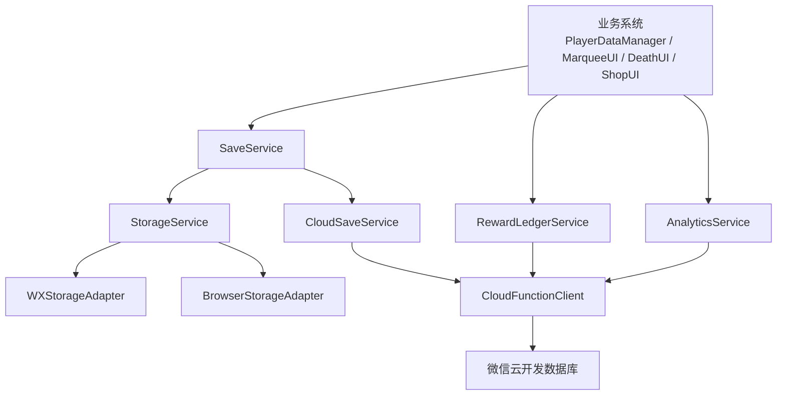
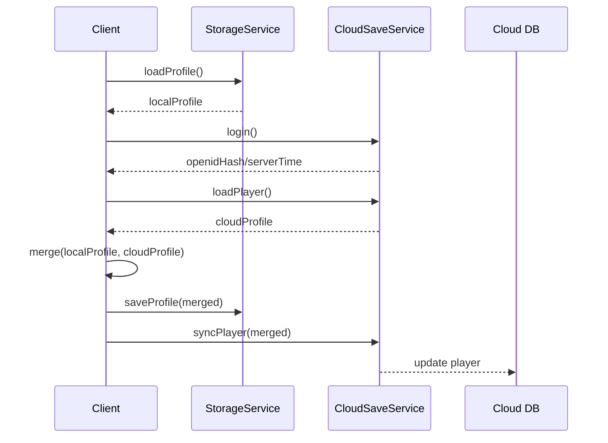

# 数据存放与数据库实施方案

> 项目：回到地面  
> 平台：微信小游戏  
> 当前状态：本地存档 + JSON 配置，无服务端数据库  
> 目标：建立清晰的数据分层、本地存档规范、云端同步能力、广告奖励流水和后续运营数据基础。

---

## 1. 结论

这个项目不建议一开始就把所有数据放进数据库。更合适的方案是：

```text
静态游戏配置：JSON / 远程 JSON / 版本管理
本地即时存档：StorageService + wx storage / localStorage
长期玩家资产：云端数据库
广告奖励流水：云端数据库
排行榜/每日挑战：云端数据库
埋点日志：微信数据助手 / 云函数日志 / 第三方分析平台
资源版本/公告/活动：远程 JSON 或云数据库
```

也就是说，数据库主要负责“需要跨设备、需要校验、需要运营、需要防刷”的数据；怪物、装备、技能、区域这种静态配置仍然保留 JSON 更好。

---

## 2. 当前项目数据现状

### 2.1 已有静态配置

位置：

```text
assets/resources/config/
├─ battle.json
├─ economy.json
├─ elements.json
├─ equipment.json
├─ items.json
├─ monsters.json
├─ player.json
├─ skills.json
├─ text.json
└─ zones.json
```

这些属于“游戏静态配置”，不应该直接进入传统数据库。原因：

- 适合跟代码一起版本管理。
- 方便策划 review 和 diff。
- 构建时可校验。
- 客户端读取速度快。
- 不依赖网络。

后续如果要做运营活动，可以把少量动态配置放远程，例如公告、活动开关、每日挑战 seed、广告位开关。

### 2.2 已有本地存档

相关代码：

- `assets/scripts/core/PlayerDataManager.ts`
- `assets/scripts/utils/WXAdapter.ts`
- `assets/scripts/ui/MarqueeUI.ts`

当前问题：

1. `PlayerDataManager` 直接判断 `wx` / `localStorage`。
2. `MarqueeUI` 也直接写 `wx` / `localStorage`，绕过了统一存储入口。
3. `WXAdapter` 里已有 `setData/getData/removeData`，但还有 500 bytes 的硬限制，不适合通用存档。
4. 存档结构版本较简单，缺少 migration、checksum、备份、脏数据恢复。
5. 没有区分“局外永久数据”和“单局临时数据”。
6. 没有云端同步和广告奖励流水，后续上线容易被刷奖励。

---

## 3. 数据分类方案

### 3.1 数据分层表

| 数据 | 示例 | 存放位置 | 是否上云 | 是否进数据库 |
|---|---|---|---|---|
| 静态配置 | 怪物、装备、技能、区域、文本 | `assets/resources/config` | 可选远程 JSON | 不建议 |
| 本地设置 | 音量、震动、画质、语言 | 本地存储 | 可选 | 不需要 |
| 玩家长期资产 | 魂石、角色解锁、天赋、遗物池 | 本地 + 云端 | 是 | 建议 |
| 单局进度 | 当前楼层、血量、背包、随机种子 | 本地 | 可选 | 不建议长期存 |
| 广告奖励记录 | 激励视频发奖、双倍奖励、跑马灯奖励 | 云端 | 是 | 必须 |
| 排行榜 | 最高层数、通关时间、每日挑战分数 | 云端 | 是 | 必须 |
| 活动与公告 | 活动开关、公告、每日挑战 seed | 远程 JSON / 云数据库 | 是 | 可选 |
| 埋点日志 | 关卡失败、广告漏斗、留存事件 | 分析平台 / 云端日志 | 是 | 可选 |
| 错误日志 | 黑屏、资源加载失败、异常堆栈 | 云函数 / 日志平台 | 是 | 可选 |

### 3.2 本地数据再拆分

```text
local_save_profile       # 局外永久数据
local_save_run           # 当前单局数据
local_save_settings      # 设置
local_cache_analytics    # 埋点失败缓存
local_cache_ad_state     # 广告冷却、临时状态
local_cache_marquee      # 跑马灯进度
```

不要把所有内容塞进一个 `player_data`。长期会越来越难迁移，也不利于云端只同步关键字段。

---

## 4. 推荐总体架构



### 4.1 代码模块建议

```text
assets/scripts/core/storage/
├─ StorageTypes.ts
├─ StorageService.ts
├─ WXStorageAdapter.ts
├─ BrowserStorageAdapter.ts
├─ SaveMigrator.ts
├─ SaveValidator.ts
└─ SaveChecksum.ts

assets/scripts/core/save/
├─ SaveTypes.ts
├─ SaveService.ts
├─ PlayerProfileService.ts
├─ RunSaveService.ts
└─ SettingsService.ts

assets/scripts/platform/cloud/
├─ CloudClient.ts
├─ CloudSaveService.ts
├─ RewardLedgerService.ts
├─ LeaderboardService.ts
└─ RemoteConfigService.ts
```

---

## 5. 本地存档设计

### 5.1 玩家永久存档

key：

```text
save_profile_v1
```

结构：

```json
{
  "schemaVersion": 1,
  "playerId": "local_or_openid_hash",
  "updatedAt": 1782520000000,
  "createdAt": 1782000000000,
  "profile": {
    "soulStones": 0,
    "unlockedCharacters": ["warrior"],
    "selectedCharacter": "warrior",
    "selectedTalent": null,
    "unlockedRelicPoolExtras": []
  },
  "stats": {
    "bestFloor": 0,
    "totalKills": 0,
    "totalRuns": 0,
    "totalRevives": 0,
    "totalAdsWatched": 0
  },
  "flags": {
    "tutorialFinished": false,
    "privacyAccepted": false
  },
  "checksum": "optional_checksum"
}
```

说明：

- `profile` 是玩家资产和选择。
- `stats` 是统计。
- `flags` 是开关状态。
- `checksum` 可以后续再加，第一阶段可以先预留字段。

### 5.2 单局存档

key：

```text
save_run_v1
```

结构：

```json
{
  "schemaVersion": 1,
  "runId": "run_1782520000000_xxxx",
  "seed": 123456789,
  "startedAt": 1782520000000,
  "updatedAt": 1782520300000,
  "zoneId": "forest",
  "floor": 3,
  "roomId": "room_3_2",
  "player": {
    "hp": 80,
    "maxHp": 100,
    "level": 2,
    "exp": 30
  },
  "inventory": {
    "items": [],
    "equipment": []
  },
  "rng": {
    "runSeed": 123456789,
    "combatStep": 42,
    "lootStep": 15
  }
}
```

说明：

- 单局数据优先本地保存，不建议每一步都上云。
- 死亡或结算后删除 `save_run_v1`。
- 如果未来支持断线续玩，可以按房间结束时保存。

### 5.3 设置数据

key：

```text
save_settings_v1
```

结构：

```json
{
  "schemaVersion": 1,
  "audio": {
    "music": true,
    "sfx": true,
    "musicVolume": 0.8,
    "sfxVolume": 0.8
  },
  "display": {
    "quality": "auto",
    "damageNumber": true,
    "screenShake": true
  },
  "control": {
    "joystickMode": "fixed"
  }
}
```

### 5.4 广告和活动临时状态

key：

```text
cache_ad_state_v1
cache_marquee_v1
```

示例：

```json
{
  "schemaVersion": 1,
  "marqueeLights": [false, true, false],
  "updatedAt": 1782520000000
}
```

这类数据不应混进 `PlayerDataManager` 主存档。

---

## 6. StorageService 实施方案

### 6.1 接口设计

```ts
export interface StorageAdapter {
    getString(key: string): string | null;
    setString(key: string, value: string): boolean;
    remove(key: string): void;
    has(key: string): boolean;
}

export interface StorageReadResult<T> {
    ok: boolean;
    value: T;
    source: 'storage' | 'default' | 'migration' | 'recovered';
    error?: string;
}

export class StorageService {
    get<T>(key: string, defaultValue: T): StorageReadResult<T>;
    set<T>(key: string, value: T): boolean;
    remove(key: string): void;
    backup(key: string): void;
    restoreBackup<T>(key: string, defaultValue: T): StorageReadResult<T>;
}
```

### 6.2 关键行为

读取：

```text
读取 key
→ raw 为空：返回 default
→ JSON parse
→ schemaVersion 检查
→ migration
→ validate
→ 返回结果
```

写入：

```text
写入前更新 updatedAt
→ JSON.stringify
→ 写 backup key
→ 写正式 key
→ 成功返回 true
```

异常恢复：

```text
正式 key 解析失败
→ 尝试 backup key
→ backup 成功则恢复
→ backup 也失败则 default
→ 上报 storage_corrupted
```

### 6.3 当前代码替换点

第一批替换：

- `PlayerDataManager._load()`
- `PlayerDataManager._save()`
- `MarqueeUI._loadProgress()`
- `MarqueeUI._saveProgress()`
- `WXAdapter._cacheEvent()`
- `WXAdapter.flushAnalyticsCache()`

替换后依赖方向：

```text
PlayerDataManager -> SaveService -> StorageService -> WXStorageAdapter
MarqueeUI         -> SaveService -> StorageService -> WXStorageAdapter
WXAdapter         -> StorageService
```

---

## 7. SaveService 实施方案

### 7.1 职责

`SaveService` 负责业务级存档，不直接接触 `wx`。

```text
SaveService
├─ loadProfile()
├─ saveProfile()
├─ patchProfile()
├─ loadRun()
├─ saveRun()
├─ clearRun()
├─ loadSettings()
├─ saveSettings()
└─ exportDebugSave()
```

### 7.2 PlayerDataManager 改造

当前：

```text
PlayerDataManager
→ wx.getStorageSync / localStorage
```

目标：

```text
PlayerDataManager
→ SaveService.loadProfile()
→ SaveService.saveProfile()
```

示例：

```ts
class PlayerDataManager {
    private _profile: PlayerProfileSave;

    init(saveService: SaveService): void {
        this._profile = saveService.loadProfile();
    }

    addSoulStones(amount: number): void {
        if (amount <= 0) return;
        this._profile.profile.soulStones += amount;
        SaveService.instance.saveProfile(this._profile);
        eventBus.emit('playerdata:soulStones_changed', this._profile.profile.soulStones);
    }
}
```

### 7.3 自动保存策略

不要每个字段变化都立即同步云端。

本地保存：

```text
重要资产变化：立即保存本地
单局房间结束：保存本地
设置变化：立即保存本地
普通统计变化：节流保存，1-3 秒合并一次
```

云端同步：

```text
登录成功后拉取
主界面进入时同步一次
结算后同步一次
广告奖励发放后同步一次
应用切后台时尝试同步一次
```

---

## 8. Migration 方案

### 8.1 为什么必须有 migration

上线后存档结构不能随便改。玩家旧版本数据会长期存在，如果没有 migration，新增字段可能导致：

- 商店无法读取。
- 角色解锁丢失。
- 统计为空。
- 存档解析失败。

### 8.2 版本迁移设计

```ts
type Migrator<T> = (oldData: any) => T;

const profileMigrators: Record<number, Migrator<any>> = {
    1: migrateProfileV1ToV2,
    2: migrateProfileV2ToV3,
};
```

流程：

```text
读到 schemaVersion = 1
→ migrate 1 -> 2
→ migrate 2 -> 3
→ validate v3
→ 写回 v3
```

### 8.3 当前 `player_data` 兼容迁移

因为现有存档 key 是：

```text
player_data
```

第一版需要兼容：

```text
读取 save_profile_v1
→ 如果不存在，读取旧 player_data
→ 转换为新 profile 结构
→ 写入 save_profile_v1
→ 保留旧 player_data 一段时间
```

迁移映射：

| 旧字段 | 新字段 |
|---|---|
| `soulStones` | `profile.soulStones` |
| `unlockedCharacters` | `profile.unlockedCharacters` |
| `selectedCharacter` | `profile.selectedCharacter` |
| `selectedTalent` | `profile.selectedTalent` |
| `unlockedRelicPoolExtras` | `profile.unlockedRelicPoolExtras` |
| `bestFloor` | `stats.bestFloor` |
| `totalKills` | `stats.totalKills` |
| `totalRuns` | `stats.totalRuns` |
| `version` | `schemaVersion` |

---

## 9. 云端数据库选择

### 9.1 推荐第一阶段：微信云开发 CloudBase

理由：

- 和微信小游戏天然集成。
- 不需要自建登录系统。
- 获取 openid 方便。
- 云函数可以做奖励校验。
- 数据库够支撑早期排行榜、云存档、广告流水。

适合当前项目的云能力：

- 云存档。
- 广告奖励流水。
- 排行榜。
- 每日挑战 seed。
- 远程配置。
- 错误日志。

### 9.2 后续自建后端的时机

以下情况再考虑自建后端：

- 多平台，不只微信。
- 复杂账号体系。
- 付费订单、退款、风控。
- 复杂运营后台。
- 大规模实时排行榜。
- 需要 Redis、队列、BI 数据仓库。

---

## 10. 云数据库集合设计

以下以微信云开发数据库为例。

### 10.1 `players`

用途：玩家主档案。

```json
{
  "_id": "openid",
  "openid": "openid",
  "createdAt": 1782000000000,
  "updatedAt": 1782520000000,
  "lastLoginAt": 1782520000000,
  "profile": {
    "soulStones": 120,
    "unlockedCharacters": ["warrior"],
    "selectedCharacter": "warrior",
    "selectedTalent": null,
    "unlockedRelicPoolExtras": []
  },
  "stats": {
    "bestFloor": 8,
    "totalKills": 300,
    "totalRuns": 20,
    "totalRevives": 3,
    "totalAdsWatched": 12
  },
  "clientSaveVersion": 1,
  "lastClientVersion": "1.0.0"
}
```

权限：

- 只允许用户读自己的。
- 写操作建议通过云函数，不让客户端直接改关键资产。

### 10.2 `reward_ledgers`

用途：广告奖励、防重复发奖、审计。

```json
{
  "_id": "reward_1782520000000_xxxx",
  "openid": "openid",
  "rewardId": "reward_1782520000000_xxxx",
  "placement": "revive",
  "rewardType": "soulStones",
  "rewardAmount": 20,
  "status": "granted",
  "adResult": {
    "provider": "wechat",
    "completed": true
  },
  "runId": "run_123",
  "createdAt": 1782520000000,
  "clientVersion": "1.0.0"
}
```

关键点：

- `rewardId` 必须客户端生成并传云端。
- 云函数检查 `rewardId` 是否已存在。
- 已存在则不重复发奖。
- 生产环境不接受“广告失败但发奖”。

### 10.3 `leaderboards`

用途：排行榜。

```json
{
  "_id": "openid_global_best_floor",
  "openid": "openid",
  "board": "global_best_floor",
  "score": 18,
  "extra": {
    "character": "warrior",
    "seed": 123456789,
    "kills": 120
  },
  "updatedAt": 1782520000000
}
```

建议排行榜类型：

```text
global_best_floor
daily_challenge
weekly_best_floor
```

### 10.4 `daily_challenges`

用途：每日挑战配置。

```json
{
  "_id": "2026-06-27",
  "date": "2026-06-27",
  "seed": 6272026,
  "zoneRoute": ["forest", "ruins", "cave"],
  "modifiers": ["enemy_hp_up_10", "loot_up_20"],
  "createdAt": 1782520000000
}
```

### 10.5 `remote_configs`

用途：活动开关、广告配置、灰度参数。

```json
{
  "_id": "prod",
  "version": 1,
  "updatedAt": 1782520000000,
  "features": {
    "dailyChallenge": true,
    "cloudSave": true,
    "interstitialAd": true
  },
  "ads": {
    "rewardFallbackInProd": false,
    "reviveDailyLimit": 5,
    "coinDoubleDailyLimit": 10
  },
  "balance": {
    "soulStoneMultiplier": 1
  }
}
```

### 10.6 `client_errors`

用途：线上错误日志。

```json
{
  "_id": "err_1782520000000_xxxx",
  "openid": "openid_or_unknown",
  "message": "Cannot read properties of null",
  "stack": "...",
  "scene": "splash",
  "clientVersion": "1.0.0",
  "platform": "wechat",
  "createdAt": 1782520000000
}
```

---

## 11. 云函数设计

### 11.1 云函数列表

```text
login
loadPlayer
syncPlayer
grantReward
submitScore
getLeaderboard
getDailyChallenge
getRemoteConfig
reportClientError
```

### 11.2 `login`

职责：

- 获取 openid。
- 创建玩家记录。
- 返回服务器时间。

返回：

```json
{
  "ok": true,
  "openidHash": "safe_hash",
  "serverTime": 1782520000000,
  "isNewPlayer": false
}
```

客户端不要把 openid 明文到处传，内部可以用 hash 或只存在 CloudClient 中。

### 11.3 `loadPlayer`

职责：

- 拉取云端玩家主档案。
- 如果没有，返回空档案。

冲突策略：

```text
云端不存在：上传本地
本地不存在：使用云端
两边都存在：
  - soulStones 等资产：以云端为准，或取更可信流水结果
  - bestFloor：取最大值
  - totalKills/totalRuns：取较大值或按版本合并
  - selectedCharacter/settings：本地优先
```

### 11.4 `syncPlayer`

职责：

- 同步非敏感统计和本地档案。
- 不建议客户端直接传“增加多少魂石”。
- 关键货币最好通过 `grantReward` 或结算接口处理。

### 11.5 `grantReward`

职责：

- 发放广告奖励。
- 去重。
- 写奖励流水。
- 更新玩家资产。

请求：

```json
{
  "rewardId": "reward_1782520000000_xxxx",
  "placement": "coin_double",
  "rewardType": "soulStones",
  "rewardAmount": 20,
  "adCompleted": true,
  "runId": "run_123",
  "clientVersion": "1.0.0"
}
```

服务端校验：

```text
rewardId 是否重复
placement 是否合法
rewardAmount 是否超过配置上限
每日次数是否超过限制
adCompleted 是否为 true
```

返回：

```json
{
  "ok": true,
  "duplicated": false,
  "profilePatch": {
    "soulStones": 140
  }
}
```

### 11.6 `submitScore`

职责：

- 提交排行榜成绩。
- 校验基础合理性。
- 更新最高分。

建议：

- 第一阶段只做轻量校验。
- 后续引入 seed 回放或服务端校验关键指标。

---

## 12. 客户端同步策略

### 12.1 登录同步流程



### 12.2 离线策略

微信小游戏需要考虑无网络：

```text
无网络：
  本地可玩
  本地保存
  云同步任务进入 pending 队列

网络恢复：
  flush pending 队列
  拉取云端最新数据
  合并冲突
```

本地队列 key：

```text
sync_queue_v1
```

结构：

```json
[
  {
    "id": "op_1782520000000_xxxx",
    "type": "grant_reward",
    "payload": {},
    "createdAt": 1782520000000,
    "retry": 0
  }
]
```

### 12.3 冲突合并规则

| 字段 | 合并规则 |
|---|---|
| `bestFloor` | 取最大 |
| `totalKills` | 取最大或按流水合并 |
| `totalRuns` | 取最大或按流水合并 |
| `soulStones` | 云端权威 |
| `unlockedCharacters` | 取并集，但消费货币要以云端流水为准 |
| `selectedCharacter` | 本地优先 |
| `settings` | 本地优先 |
| `daily limits` | 云端权威 |

---

## 13. 广告奖励数据方案

当前项目广告奖励入口较多：

- 复活
- 宝箱
- 额外升级
- 商店折扣
- 金币/魂石双倍
- 每日奖励
- 跑马灯

### 13.1 推荐链路

```text
客户端请求广告
→ 微信广告完整观看
→ 客户端生成 rewardId
→ 调用云函数 grantReward
→ 云端校验和写 reward_ledgers
→ 云端更新 players
→ 客户端刷新本地 profile
```

### 13.2 本地优先和云端确认

第一阶段可以采用“本地先发，云端补记”的柔性方案：

```text
广告完成
→ 本地立即给奖励
→ pending queue 记录 grant_reward
→ 有网络时同步云端
```

但正式上线更推荐：

```text
广告完成
→ 云端 grantReward 成功
→ 本地发奖励
```

如果担心网络延迟影响体验，可以显示“奖励发放中”。

### 13.3 防重复

必须加入：

- `rewardId`
- `placement`
- `createdAt`
- `dailyLimit`
- 云端唯一索引或重复查询

---

## 14. 静态配置与远程配置方案

### 14.1 静态配置继续 JSON

保留：

```text
assets/resources/config/*.json
```

这些不进数据库：

- 怪物基础属性。
- 装备词条。
- 技能定义。
- 元素反应。
- 区域定义。
- 本地化文本。

### 14.2 远程配置只放运营开关

可以远程化：

- 是否开启插屏广告。
- 激励广告每日次数。
- 活动倍率。
- 公告内容。
- 每日挑战 seed。
- 灰度开关。

### 14.3 配置加载顺序

```text
本地 config JSON
→ 远程 remote_config
→ 合并覆盖运营字段
→ 写入本地 cache
```

无网络时：

```text
使用本地 config JSON + 上次 remote_config cache
```

---

## 15. 实施阶段规划

### Phase 1：统一本地存储入口（1-2 天）

目标：先不接数据库，把当前数据读写统一。

任务：

1. 新增：

```text
assets/scripts/core/storage/StorageTypes.ts
assets/scripts/core/storage/StorageService.ts
assets/scripts/core/storage/WXStorageAdapter.ts
assets/scripts/core/storage/BrowserStorageAdapter.ts
assets/scripts/core/save/SaveTypes.ts
assets/scripts/core/save/SaveService.ts
assets/scripts/core/save/SaveMigrator.ts
```

2. 改造：

```text
PlayerDataManager._load()
PlayerDataManager._save()
MarqueeUI._loadProgress()
MarqueeUI._saveProgress()
WXAdapter analytics cache
```

3. 保留旧 key 兼容：

```text
player_data -> save_profile_v1
marquee_progress -> cache_marquee_v1
```

验收：

- 删除 `player_data` 后能创建新存档。
- 存在旧 `player_data` 时能迁移到新结构。
- `PlayerDataManager` 不再直接访问 `wx/localStorage`。
- `MarqueeUI` 不再直接访问 `wx/localStorage`。

### Phase 2：存档安全与调试工具（1-2 天）

目标：让本地存档稳定、可恢复、可调试。

任务：

1. 增加 backup：

```text
save_profile_v1
save_profile_v1_backup
save_run_v1
save_run_v1_backup
```

2. 增加 validate：

```text
soulStones >= 0
unlockedCharacters 至少包含 warrior
selectedCharacter 必须在 unlockedCharacters 中
bestFloor >= 0
totalRuns >= 0
```

3. 增加 debug 导出：

```text
SaveService.exportDebugSave()
SaveService.resetProfile()
SaveService.resetRun()
```

验收：

- 手动写坏存档后，能从 backup 恢复或回默认值。
- 控制台能输出清晰错误。
- 测试时可以一键重置存档。

### Phase 3：接入微信云开发基础能力（2-4 天）

目标：具备云端玩家档案和远程配置。

任务：

1. 开通微信云开发环境。
2. 创建集合：

```text
players
remote_configs
client_errors
```

3. 新增云函数：

```text
login
loadPlayer
syncPlayer
getRemoteConfig
reportClientError
```

4. 客户端新增：

```text
CloudClient
CloudSaveService
RemoteConfigService
```

验收：

- 真机能获取 openid。
- 首次进入自动创建 players 记录。
- 本地档案能同步到云端。
- 云端 remote_config 能影响广告开关或活动开关。

### Phase 4：广告奖励流水上云（2-3 天）

目标：解决广告奖励可追踪和防重复。

任务：

1. 创建集合：

```text
reward_ledgers
```

2. 新增云函数：

```text
grantReward
```

3. 改造广告奖励入口：

```text
DeathUI 双倍奖励
MarqueeUI 跑马灯奖励
宝箱奖励
商店折扣
每日奖励
```

4. 增加 pending queue：

```text
sync_queue_v1
```

验收：

- 同一个 `rewardId` 不能重复发奖。
- 云端能看到每次广告奖励流水。
- 断网时可以排队，联网后补同步。

### Phase 5：排行榜和每日挑战（2-4 天）

目标：建立轻运营能力。

任务：

1. 创建集合：

```text
leaderboards
daily_challenges
```

2. 新增云函数：

```text
submitScore
getLeaderboard
getDailyChallenge
```

3. 客户端新增：

```text
LeaderboardService
DailyChallengeService
```

验收：

- 结算后能提交最高层数。
- 主界面能拉取排行榜。
- 每日挑战 seed 云端统一。

---

## 16. 当前代码改造清单

### 16.1 第一批必须改

| 文件 | 改造 |
|---|---|
| `assets/scripts/core/PlayerDataManager.ts` | 移除直接 `wx/localStorage`，改用 `SaveService` |
| `assets/scripts/ui/MarqueeUI.ts` | 跑马灯进度改用 `SaveService` |
| `assets/scripts/utils/WXAdapter.ts` | 存储逻辑下沉到 `StorageService`，保留平台广告/埋点 |
| `assets/scripts/MainSceneController.ts` | 启动时初始化 `StorageService`、`SaveService` |

### 16.2 第二批建议改

| 文件/模块 | 改造 |
|---|---|
| `DeathUI` | 结算奖励通过 `PlayerProfileService` 写入 |
| `ShopUI` | 消费魂石走统一交易接口 |
| `MarqueeUI` | 广告奖励接入 `RewardLedgerService` |
| `GameManager` | 单局进度保存到 `RunSaveService` |
| `ConfigManager` | 远程配置覆盖运营字段 |

---

## 17. 交易接口建议

货币不要随处 `addSoulStones/spendSoulStones`，建议引入交易原因。

```ts
export enum CurrencyReason {
    RunSettlement = 'run_settlement',
    AdReward = 'ad_reward',
    ShopPurchase = 'shop_purchase',
    CharacterUnlock = 'character_unlock',
    TalentUnlock = 'talent_unlock',
    Debug = 'debug',
}

export interface CurrencyTransaction {
    id: string;
    currency: 'soulStones';
    amount: number;
    reason: CurrencyReason;
    sourceId?: string;
    createdAt: number;
}
```

好处：

- 后续能查为什么魂石变多/变少。
- 广告奖励能防重复。
- 云端同步更清晰。
- 运营数据更好看。

---

## 18. 数据安全与防作弊边界

微信小游戏本地存储不安全，玩家可以改包或改本地数据。不同阶段的策略：

### 第一阶段：轻防护

- 本地 checksum。
- 关键字段 validate。
- 异常值回滚。
- 资产变化写 transaction log。

### 第二阶段：云端权威

- 魂石、角色解锁、广告奖励以云端为准。
- 客户端只提交行为请求。
- 云函数决定是否发奖。

### 第三阶段：强校验

- 每日挑战 seed 云端下发。
- 排行榜成绩做合理性校验。
- 异常玩家进入风控列表。

---

## 19. 发布前检查

新增检查项：

```text
1. 是否仍有业务代码直接访问 wx.setStorageSync / localStorage
2. 是否所有存档 key 都有 schemaVersion
3. 是否保留旧 key migration
4. 是否能恢复损坏存档
5. 是否广告奖励有 rewardId
6. 是否生产环境广告失败不发奖励
7. 是否云函数失败时有本地 pending queue
8. 是否排行榜提交有限频
9. 是否 remote_config 有默认值
10. 是否有错误日志上报
```

可以用 `rg` 做静态扫描：

```bash
rg "wx\\.setStorageSync|wx\\.getStorageSync|localStorage" assets/scripts
```

目标：除 `StorageAdapter` 和极少数平台封装文件外，不应再出现直接访问。

---

## 20. 最推荐的落地顺序

```text
第 1 步：新增 StorageService 和 SaveService
第 2 步：迁移 player_data 到 save_profile_v1
第 3 步：迁移 marquee_progress 到 cache_marquee_v1
第 4 步：加入 backup / validate / migration
第 5 步：接入微信云开发 login / loadPlayer / syncPlayer
第 6 步：接入 remote_config
第 7 步：广告奖励 grantReward 上云
第 8 步：排行榜和每日挑战上云
第 9 步：错误日志和埋点完善
第 10 步：再考虑是否需要自建后端
```

---

## 21. 一句话实施原则

不要把数据库当成“万能存档文件夹”。  
这个项目的数据系统应该是：

```text
配置 JSON 化
存档服务化
资产云端权威化
奖励流水化
运营远程化
埋点日志化
```

这样既能保持单机 Roguelike 的开发效率，又能支撑微信小游戏上线后的云存档、广告、排行榜、活动和基础防作弊。

