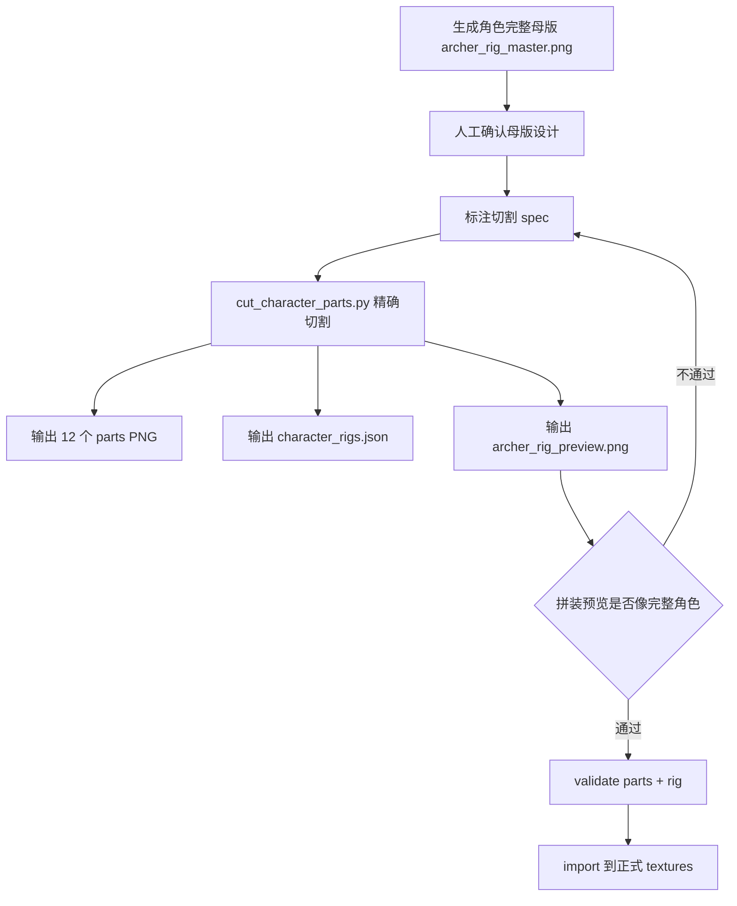

# 角色部件化母版切割与精确拼装方案

日期：2026-07-11

适用范围：

```text
E:/game/回到地面/art_source/textures_review/master/characters/*/parts
E:/game/回到地面/assets/resources/textures/characters/*/parts
E:/game/回到地面/tools/art_pipeline.py
```

## 1. 结论

角色部件不能继续按 12 张独立图片分别 AI 生成。独立生成会天然产生：

```text
比例不一致
颜色不一致
光源不一致
线条粗细不一致
关节接不上
拼起来像贴纸
```

正确方案是：

```text
1. AI 只生成完整角色母版。
2. 从同一张母版精确切割 12 个部件。
3. 每个部件保留关节重叠区。
4. 切割脚本同时生成 rig 坐标。
5. 每次切割后自动生成拼装预览图。
6. 只有拼装预览通过，才允许导入正式 textures。
```

一句话：

```text
部件来自同一张母版，拼装才可能像一个完整角色。
```

## 2. 目标链路



## 3. 目录结构

建议新增：

```text
art_source/characters/
└── archer/
    ├── reference/
    │   ├── archer_rig_master.png
    │   └── archer_rig_master_marked.png
    ├── cut_specs/
    │   └── archer_part_cut_spec.json
    ├── parts_preview/
    │   ├── archer_parts_contact.png
    │   └── archer_rig_preview.png
    └── export/
        └── parts/
            ├── body.png
            ├── head.png
            ├── ear_l.png
            ├── ear_r.png
            ├── arm_l.png
            ├── arm_r.png
            ├── leg_l.png
            ├── leg_r.png
            ├── tail.png
            ├── bow.png
            ├── quiver.png
            └── cape.png
```

正式资源目录：

```text
assets/resources/textures/characters/archer/parts/
```

配置目录：

```text
assets/resources/config/character_parts.json
assets/resources/config/character_rigs.json
assets/resources/config/character_part_animations.json
```

工具目录：

```text
tools/cut_character_parts.py
tools/check_character_parts.py
tools/preview_character_rig.py
```

## 4. 母版生成规范

### 4.1 母版尺寸

推荐：

```text
768x768 PNG RGBA
```

最低：

```text
512x512 PNG RGBA
```

母版越大，切割越精确，后续缩放越不糊。

### 4.2 母版姿势

必须是“切割友好”的 rig pose：

```text
角色完整站立
三分之四正面
头、身体、四肢清楚分离
双臂略微离开身体
双腿略微分开
耳朵、尾巴、披风、武器完整可见
不要夸张动作
不要透视过强
不要遮挡关键关节
不要带地面阴影
```

推荐母版构图：

```text
头部在上方中心
身体在画面中心
双臂左右展开 10-20 度
双腿自然分开
弓握在右侧，和手有少量重叠
箭袋在背后或侧后方，至少露出可切割主体
披风在身体后方
尾巴从身体后侧露出
```

### 4.3 母版提示词

用于生成完整角色母版，而不是生成部件：

```text
Create one complete cute cartoon animal ranger character for a 2D mobile action RPG, full body, rig-friendly neutral pose, three-quarter front view, arms slightly away from torso, legs slightly apart, all body parts clearly visible for later cutout, warm orange-brown deer fur, big friendly eyes, small muzzle, green ranger cape, leather belt, small wooden bow, small quiver with arrow tips, fluffy tail, leaf ornament, rounded animation style, clean readable silhouette, consistent soft forest lighting, high-resolution polished cartoon rendering, centered on transparent-ready plain background, no ground shadow, no scenery, no UI frame, no text.
Target canvas: 768x768.
```

注意：母版可以允许完整角色，因为它就是唯一设计来源。

## 5. 部件清单

标准 12 部件：

| part | 说明 | 是否必需 |
|---|---|---|
| `body` | 躯干、衣服、腰带、肩部连接区 | 必需 |
| `head` | 头、脸、帽饰或发饰 | 必需 |
| `ear_l` | 左耳 | 可选但建议 |
| `ear_r` | 右耳 | 可选但建议 |
| `arm_l` | 左臂，含肩部连接区、手 | 必需 |
| `arm_r` | 右臂，含肩部连接区、手 | 必需 |
| `leg_l` | 左腿，含胯部连接区、脚 | 必需 |
| `leg_r` | 右腿，含胯部连接区、脚 | 必需 |
| `tail` | 尾巴，含根部连接区 | 职业需要时必需 |
| `bow` | 武器，弓 | archer 必需 |
| `quiver` | 箭袋 | archer 必需 |
| `cape` | 披风 | archer 必需 |

## 6. 精确切割核心原则

精确切割不能靠“看着差不多”。必须使用：

```text
母版统一坐标
切割 rect
pivot
socket
overlap
z order
自动预览
```

### 6.1 rect

`rect` 是母版上的裁切矩形：

```json
"rect": [x, y, width, height]
```

坐标以母版左上角为原点：

```text
x 向右增加
y 向下增加
```

### 6.2 pivot

`pivot` 是部件旋转点，坐标相对于裁出来的部件图：

```json
"pivot": [px, py]
```

例如右臂应该绕肩膀转，pivot 不能放在图片中心：

```json
"arm_r": {
  "pivot": [24, 32]
}
```

### 6.3 socket

`socket` 是该部件在完整角色坐标里的连接点：

```json
"socket": [sx, sy]
```

一般等于：

```text
socket = rect 左上角 + pivot
```

这样运行时可以把 socket 对齐到角色 root 坐标。

### 6.4 overlap

每个关节必须保留重叠区，避免拼接露缝。

| 部件 | overlap 规则 |
|---|---|
| `head` | 下方保留脖子 8-16px |
| `body` | 保留肩、脖子、胯部连接区 |
| `arm_l/arm_r` | 肩部多裁 12-20px |
| `leg_l/leg_r` | 胯部多裁 12-20px |
| `tail` | 根部多裁 8-16px |
| `cape` | 领口多裁 12-24px |
| `bow` | 手握区域允许被手臂盖住 |
| `quiver` | 背带或背部连接区多裁 8-16px |

### 6.5 z order

拼装必须有固定层级：

```text
shadow       z=0
tail         z=1
cape         z=2
leg_l        z=3
leg_r        z=4
body         z=5
quiver       z=6
arm_l        z=7
arm_r        z=8
bow          z=9
head         z=10
ear_l        z=11
ear_r        z=12
```

如果武器要被手盖住，可以拆成：

```text
bow_back
hand
bow_front
```

第一版可以先不拆，但要允许 z order 调整。

## 7. 切割规格文件

新增：

```text
art_source/characters/archer/cut_specs/archer_part_cut_spec.json
```

示例：

```json
{
  "characterId": "archer",
  "source": "art_source/characters/archer/reference/archer_rig_master.png",
  "canvas": [768, 768],
  "runtimeRootSize": [256, 256],
  "scaleToRuntime": 0.333333,
  "parts": {
    "body": {
      "rect": [278, 300, 210, 230],
      "pivot": [105, 112],
      "socket": [383, 412],
      "z": 5,
      "outputSize": [160, 160]
    },
    "head": {
      "rect": [292, 150, 184, 188],
      "pivot": [92, 148],
      "socket": [384, 298],
      "z": 10,
      "outputSize": [128, 128]
    },
    "ear_l": {
      "rect": [250, 105, 92, 130],
      "pivot": [58, 105],
      "socket": [308, 210],
      "z": 11,
      "outputSize": [64, 96]
    },
    "ear_r": {
      "rect": [426, 105, 92, 130],
      "pivot": [34, 105],
      "socket": [460, 210],
      "z": 12,
      "outputSize": [64, 96]
    },
    "arm_l": {
      "rect": [198, 300, 150, 210],
      "pivot": [112, 48],
      "socket": [310, 348],
      "z": 7,
      "outputSize": [96, 128]
    },
    "arm_r": {
      "rect": [420, 300, 150, 210],
      "pivot": [38, 48],
      "socket": [458, 348],
      "z": 8,
      "outputSize": [96, 128]
    },
    "leg_l": {
      "rect": [300, 485, 110, 170],
      "pivot": [58, 32],
      "socket": [358, 517],
      "z": 3,
      "outputSize": [80, 112]
    },
    "leg_r": {
      "rect": [382, 485, 110, 170],
      "pivot": [52, 32],
      "socket": [434, 517],
      "z": 4,
      "outputSize": [80, 112]
    },
    "tail": {
      "rect": [205, 390, 130, 190],
      "pivot": [104, 64],
      "socket": [309, 454],
      "z": 1,
      "outputSize": [96, 128]
    },
    "cape": {
      "rect": [250, 250, 260, 310],
      "pivot": [130, 70],
      "socket": [380, 320],
      "z": 2,
      "outputSize": [128, 160]
    },
    "bow": {
      "rect": [500, 255, 170, 280],
      "pivot": [64, 140],
      "socket": [564, 395],
      "z": 9,
      "outputSize": [128, 128]
    },
    "quiver": {
      "rect": [210, 250, 130, 180],
      "pivot": [72, 92],
      "socket": [282, 342],
      "z": 6,
      "outputSize": [96, 96]
    }
  }
}
```

说明：上面的数值是结构示例，不能直接套用，必须按实际母版标注。

## 8. 怎么保证精确切割

### 8.1 第一层：母版姿势保证可切

如果母版本身四肢贴在身体上，后面再精确也没用。

母版必须满足：

```text
双臂和身体之间至少有 12-24px 空隙
腿和身体之间至少有可识别连接区
耳朵和头有清楚边界
尾巴根部可见
披风和身体有清楚层级
武器和手有可遮挡区域
```

不满足就不要切，重生成母版。

### 8.2 第二层：人工标注为主，脚本校验为辅

脚本可以辅助标注，但不应该全自动决定切割区域。

原因：

```text
卡通动物角色的耳朵、披风、尾巴、手臂、武器经常互相贴近。
脚本只能看像素连通区域，不能可靠理解“哪个像素属于哪个部件”。
如果让脚本全自动切割，很容易把耳朵切进头、把武器切进手、把披风切进身体。
```

正确流程是：

```text
1. 人工在 cut spec 里填写 rect / pivot / socket / z。
2. 脚本按 spec 画 marked 图。
3. 人工看 marked 图确认框、点、层级是否正确。
4. 脚本按 spec 裁切。
5. 脚本自动拼装预览。
6. 人工只调整 JSON 坐标，不手工改图片。
```

脚本允许做的辅助：

```text
自动找 alpha bbox
自动提示部件是否贴边
自动提示 opaque_ratio 是否异常
自动画出 rect 框
自动画出 pivot/socket 点
自动生成拼装预览
自动检查 socket 对齐误差
```

脚本不应该做的事：

```text
不应该自动判断“这个区域是 arm_l”
不应该自动判断“这个像素属于 bow 还是 hand”
不应该自动裁出最终部件并直接入库
不应该跳过人工 marked 图确认
```

最稳的标注辅助方式是生成网格图：

```text
archer_rig_master_grid.png
```

网格图要求：

```text
每 16px 一条细网格线
每 64px 标坐标
画出画布中心线
画出角色 root 点
画出建议安全边界
```

这样人工填写坐标时不会凭感觉估算。

示例：

```json
"arm_l": {
  "rect": [112, 184, 120, 160],
  "pivot": [88, 36],
  "socket": [200, 220],
  "z": 7
}
```

### 8.3 第三层：用 marked 图标注

切割前先生成标注图：

```text
archer_rig_master_marked.png
```

标注内容：

```text
每个 part 的 rect 框
每个 pivot 点
每个 socket 点
每个 z order 标签
```

这样人工检查时不是看 JSON，而是看图。

### 8.4 第四层：脚本裁切，不手工裁图

禁止用 PS/画图手工另存 12 张部件。必须由脚本读取 spec 裁切。

原因：

```text
手工裁切无法复现
手工裁切容易偏 1-3px
手工裁切不会自动同步 rig
手工裁切很难回滚
```

### 8.5 第五层：透明 bbox 自动校验

每个裁切后部件都要检查：

```text
alpha bbox 不贴边
透明边距 >= 4px
主体面积比例合理
不是整个人物
不是空图
```

示例规则：

| part | opaque_ratio 建议 |
|---|---:|
| `ear_l/ear_r` | 0.12-0.45 |
| `arm_l/arm_r` | 0.18-0.45 |
| `leg_l/leg_r` | 0.18-0.45 |
| `tail` | 0.12-0.42 |
| `bow` | 0.08-0.35 |
| `quiver` | 0.12-0.45 |
| `body` | 0.25-0.60 |
| `head` | 0.30-0.70 |
| `cape` | 0.25-0.65 |

### 8.6 第六层：自动拼装预览

切完 12 张后必须自动生成：

```text
archer_rig_preview.png
```

这个预览必须展示：

```text
完整站姿
关节是否接上
头是否浮空
腿是否错位
手是否能握住弓
尾巴是否在身体后方
披风是否在身体后方
```

没有预览图，不允许导入正式资源。

### 8.7 第七层：像素级对齐校验

脚本根据 spec 可校验：

```text
part_socket_runtime = part_position + pivot
目标 socket_runtime = source_socket * scaleToRuntime
误差 <= 1px
```

超过 1px 就失败。

## 9. 手与武器结合时怎么切

弓、剑、法杖这类武器经常和手贴在一起。第一版不要强行追求“手和武器完全分离”，否则很容易出现：

```text
手被切断
武器脱手
武器旋转点不自然
手指和武器交界处露缝
攻击动画时武器飘开
```

正确做法是按动画需求决定切割粒度。

### 9.1 三种切割方案

| 方案 | 部件 | 适用情况 | 推荐度 |
|---|---|---|---|
| A. 手武器合并 | `arm_r_weapon` | 第一版、动作少、追求稳定 | 高 |
| B. 武器独立，手盖在上面 | `arm_r` + `bow` | 需要换武器，但手部遮挡简单 | 中 |
| C. 武器前后分层 | `bow_back` + `arm_r` + `bow_front` | 需要武器穿过手、视觉最自然 | 高，但复杂 |

### 9.2 第一版推荐：手武器合并

对 archer，第一版建议：

```text
arm_r_weapon.png = 右臂 + 握弓的手 + 弓
```

而不是：

```text
arm_r.png + bow.png 完全独立
```

原因：

```text
弓箭手攻击动作里，右手和弓的相对位置高度固定。
合并后不会脱手。
合并后只需要绕 shoulder_r pivot 旋转。
合并后拼装更稳定，动画更容易做。
```

此时部件清单从 12 个变为：

```text
body
head
ear_l
ear_r
arm_l
arm_r_weapon
leg_l
leg_r
tail
quiver
cape
bow_optional
```

其中 `bow_optional` 可不做，除非后续需要换武器展示。

### 9.3 arm_r_weapon 的切割要求

`arm_r_weapon` 的 rect 必须包含：

```text
右肩连接区
右上臂
右前臂
握弓的手
完整弓
少量弓外侧透明边距
```

`pivot` 放在右肩连接处：

```json
"arm_r_weapon": {
  "rect": [398, 250, 250, 300],
  "pivot": [42, 92],
  "socket": [440, 342],
  "z": 9,
  "outputSize": [192, 192]
}
```

注意：

```text
pivot 不在弓中心。
pivot 不在手中心。
pivot 必须在肩膀连接处。
```

这样攻击动画旋转时，会像整条手臂带着弓运动。

### 9.4 左手拉弦怎么处理

如果母版里左手也接触弓弦，有两种做法：

#### 简化版

```text
arm_l 独立
arm_r_weapon 包含弓
动画时 arm_l 旋转到靠近弓弦的位置
```

优点：

```text
部件少
实现简单
不会脱手太严重
```

缺点：

```text
左手可能没有真的握住弓弦
```

#### 精细版

```text
arm_l_string.png = 左臂 + 拉弦手 + 一小段弓弦
arm_r_weapon.png = 右臂 + 弓主体
```

适合后续 attack 动作优化。

### 9.5 如果要支持换武器

如果后续 archer 需要换不同弓，不能只用 `arm_r_weapon`。

应该使用三层：

```text
bow_back   z=7
arm_r      z=8
bow_front  z=9
```

解释：

```text
bow_back：弓在手后面的部分
arm_r：手臂和手，盖住握把
bow_front：弓在手前面的装饰或弦
```

这种方案视觉最好，但标注和动画成本更高。

### 9.6 当前 archer 推荐选择

当前阶段推荐：

```text
使用 arm_r_weapon 合并方案。
暂时不做 bow 独立换装。
等 idle / attack 拼装稳定后，再评估是否拆 bow_back / bow_front。
```

对应 cut spec：

```json
{
  "parts": {
    "arm_r_weapon": {
      "rect": [398, 250, 250, 300],
      "pivot": [42, 92],
      "socket": [440, 342],
      "z": 9,
      "outputSize": [192, 192],
      "contains": ["arm_r", "hand_r", "bow"]
    },
    "arm_l": {
      "rect": [190, 280, 145, 210],
      "pivot": [110, 48],
      "socket": [300, 328],
      "z": 8,
      "outputSize": [96, 128],
      "contains": ["arm_l", "hand_l"]
    }
  }
}
```

如果使用 `arm_r_weapon`，则 `character_parts.json` 中 archer 的部件也要对应改：

```json
{
  "archer": {
    "parts": {
      "body": "textures/characters/archer/parts/body",
      "head": "textures/characters/archer/parts/head",
      "ear_l": "textures/characters/archer/parts/ear_l",
      "ear_r": "textures/characters/archer/parts/ear_r",
      "arm_l": "textures/characters/archer/parts/arm_l",
      "arm_r_weapon": "textures/characters/archer/parts/arm_r_weapon",
      "leg_l": "textures/characters/archer/parts/leg_l",
      "leg_r": "textures/characters/archer/parts/leg_r",
      "tail": "textures/characters/archer/parts/tail",
      "quiver": "textures/characters/archer/parts/quiver",
      "cape": "textures/characters/archer/parts/cape"
    }
  }
}
```

## 10. 切割脚本核心代码

新增：

```text
tools/cut_character_parts.py
```

核心逻辑：

```python
import json
from pathlib import Path
from PIL import Image, ImageDraw

def crop_part(source, part_spec):
    x, y, w, h = part_spec["rect"]
    return source.crop((x, y, x + w, y + h)).convert("RGBA")

def fit_to_output(part_img, output_size):
    target_w, target_h = output_size
    alpha = part_img.getchannel("A")
    bbox = alpha.getbbox()
    if not bbox:
        return Image.new("RGBA", output_size, (0, 0, 0, 0))

    # Keep full crop area, do not auto-tight-crop by default.
    # This preserves pivot relationship.
    img = part_img.copy()
    img.thumbnail(output_size, Image.LANCZOS)
    canvas = Image.new("RGBA", output_size, (0, 0, 0, 0))
    ox = (target_w - img.width) // 2
    oy = (target_h - img.height) // 2
    canvas.alpha_composite(img, (ox, oy))
    return canvas

def cut_parts(spec_path):
    spec = json.loads(Path(spec_path).read_text(encoding="utf-8"))
    root = Path(spec_path).parent.parent
    source_path = Path("E:/game/回到地面") / spec["source"]
    source = Image.open(source_path).convert("RGBA")

    out_dir = root / "export" / "parts"
    out_dir.mkdir(parents=True, exist_ok=True)

    for part_name, part_spec in spec["parts"].items():
        part = crop_part(source, part_spec)
        output_size = tuple(part_spec["outputSize"])
        part = fit_to_output(part, output_size)
        part.save(out_dir / f"{part_name}.png")
```

注意：

```text
第一版建议不要自动 tight-crop。
因为 tight-crop 会改变 pivot 和 socket，需要额外记录偏移。
如果要 tight-crop，必须把 trim offset 写进 rig。
```

## 11. 支持 tight-crop 的精确算法

如果希望每个部件文件更紧凑，可以开启 trim，但必须记录偏移。

### 11.1 trim 数据

```json
"body": {
  "rect": [278, 300, 210, 230],
  "trim": [12, 8, 186, 210],
  "pivot": [105, 112],
  "pivotAfterTrim": [93, 104]
}
```

公式：

```text
pivotAfterTrim.x = pivot.x - trimLeft
pivotAfterTrim.y = pivot.y - trimTop
```

如果缩放到 outputSize，还要乘缩放比。

### 11.2 建议

第一阶段不要 tight-crop。

推荐：

```text
保留裁切矩形内透明空间
输出固定尺寸
保证 pivot 简单稳定
等动画拼装稳定后，再做 trim 优化
```

## 12. rig 生成规则

`character_rigs.json` 不建议手写。应由切割 spec 生成。

公式：

```text
runtimeSocket = (socket - characterRootInSource) * scaleToRuntime
runtimePartPosition = runtimeSocket - pivotInOutput
```

其中：

```text
characterRootInSource = 母版角色脚底中心或身体中心
scaleToRuntime = runtimeRootSize / sourceCharacterSize
```

第一版可简化：

```text
母版中心 [384, 384] 映射到 runtime [0, 0]
scaleToRuntime = 256 / 768 = 0.333333
```

生成结果示例：

```json
{
  "archer": {
    "rootSize": [256, 256],
    "parts": {
      "body": {
        "z": 5,
        "position": [0, -8],
        "anchor": [0.5, 0.5],
        "pivot": [80, 80]
      },
      "head": {
        "z": 10,
        "position": [0, 48],
        "anchor": [0.5, 0.72],
        "pivot": [64, 92]
      }
    }
  }
}
```

## 13. 拼装预览脚本核心代码

新增：

```text
tools/preview_character_rig.py
```

核心逻辑：

```python
from pathlib import Path
from PIL import Image
import json

def preview(spec_path):
    spec = json.loads(Path(spec_path).read_text(encoding="utf-8"))
    root = Path(spec_path).parent.parent
    parts_dir = root / "export" / "parts"

    canvas_w, canvas_h = spec["runtimeRootSize"]
    canvas = Image.new("RGBA", (canvas_w, canvas_h), (0, 0, 0, 0))
    center = (canvas_w // 2, canvas_h // 2)

    items = sorted(spec["parts"].items(), key=lambda kv: kv[1]["z"])
    for part_name, part_spec in items:
        img = Image.open(parts_dir / f"{part_name}.png").convert("RGBA")
        sx, sy = part_spec["socket"]
        px, py = part_spec["pivot"]
        scale = spec["scaleToRuntime"]

        # Source socket -> runtime socket.
        rx = int((sx - spec["canvas"][0] / 2) * scale + center[0])
        ry = int((sy - spec["canvas"][1] / 2) * scale + center[1])

        # If pivot was not scaled with image, use output-space pivot in spec.
        out_pivot = part_spec.get("outputPivot", [img.width // 2, img.height // 2])
        x = rx - out_pivot[0]
        y = ry - out_pivot[1]
        canvas.alpha_composite(img, (x, y))

    out = root / "parts_preview" / f"{spec['characterId']}_rig_preview.png"
    out.parent.mkdir(parents=True, exist_ok=True)
    canvas.save(out)
```

## 14. 标注图生成

新增：

```text
tools/draw_character_cut_marks.py
```

标注内容：

```text
rect：彩色框
pivot：红点
socket：蓝点
z：文字标签
part name：文字标签
```

核心代码：

```python
def draw_marks(spec_path):
    spec = json.loads(Path(spec_path).read_text(encoding="utf-8"))
    img = Image.open(Path("E:/game/回到地面") / spec["source"]).convert("RGBA")
    draw = ImageDraw.Draw(img)

    for name, ps in spec["parts"].items():
        x, y, w, h = ps["rect"]
        px, py = ps["pivot"]
        sx, sy = ps["socket"]
        draw.rectangle([x, y, x + w, y + h], outline=(255, 220, 0, 255), width=3)
        draw.ellipse([x + px - 5, y + py - 5, x + px + 5, y + py + 5], fill=(255, 0, 0, 255))
        draw.ellipse([sx - 5, sy - 5, sx + 5, sy + 5], fill=(0, 120, 255, 255))
        draw.text((x, y - 16), f"{name} z={ps['z']}", fill=(255, 255, 255, 255))

    out = Path(spec_path).parent.parent / "reference" / f"{spec['characterId']}_rig_master_marked.png"
    img.save(out)
```

## 15. 验收标准

### 15.1 单部件验收

每个部件必须：

```text
PNG RGBA
尺寸等于 outputSize
非空
主体不贴边
没有其他无关部件
颜色来自母版
没有独立 AI 生成痕迹
```

### 15.2 拼装验收

`archer_rig_preview.png` 必须：

```text
看起来是一个完整角色
头连接身体
手臂连接肩膀
腿连接胯部
尾巴在身体后方
披风在身体后方
武器位置可被手自然握住
没有明显白边、断层、错位、漂浮
```

### 15.3 动画验收

在 Cocos 中播放：

```text
idle
attack
walk
hit
```

检查：

```text
旋转点是否正确
手臂是否绕肩膀转
头是否绕脖子轻摆
腿是否绕胯部摆动
武器是否不脱手
```

## 16. art_pipeline 接入方式

不要再执行：

```bash
python tools/art_pipeline.py generate --category characters/archer/parts
```

改成：

```bash
python tools/art_pipeline.py generate --resource characters/archer/reference/archer_rig_master.png
python tools/cut_character_parts.py art_source/characters/archer/cut_specs/archer_part_cut_spec.json
python tools/preview_character_rig.py art_source/characters/archer/cut_specs/archer_part_cut_spec.json
python tools/check_character_parts.py --character archer
```

然后再导入：

```bash
python tools/art_pipeline.py import --category characters/archer/parts
```

如果 `art_pipeline.py` 要统一入口，建议新增命令：

```bash
python tools/art_pipeline.py cut-parts --character archer
python tools/art_pipeline.py preview-rig --character archer
python tools/art_pipeline.py validate-parts --character archer
```

## 17. 当前 archer 的修复路线

当前错误的：

```text
art_source/textures_review/master/characters/archer/parts/*.png
```

不要继续基于这些图修。它们已经是独立 AI 生成物，无法保证拼装一体。

正确修复：

```text
1. 删除或隔离当前错误 parts。
2. 生成 archer_rig_master.png。
3. 人工确认母版。
4. 建 archer_part_cut_spec.json。
5. 运行切割脚本。
6. 生成 archer_rig_preview.png。
7. 按预览调整 rect/pivot/socket。
8. 通过后导入正式目录。
```

## 18. 什么时候需要重新生成母版

如果出现以下情况，不要继续调切割 spec，直接重做母版：

```text
手臂贴身体，无法切出完整肩部
武器遮挡手臂太严重
披风和身体边缘混在一起
尾巴不可见
耳朵和头部边界不清
角色透视太强，部件无法旋转
角色不是标准站姿
角色风格和其它职业不一致
```

## 19. 最终完成定义

完成 archer 部件化，不是指 12 张 PNG 存在，而是必须同时满足：

```text
1. 有通过审核的 archer_rig_master.png。
2. 有 archer_part_cut_spec.json。
3. 12 个部件由脚本从母版切出。
4. 有 archer_rig_preview.png。
5. 拼装预览看起来像完整一体的角色。
6. character_rigs.json 由 spec 生成或与 spec 一致。
7. Cocos 中 idle/attack 至少两个动作可正常播放。
8. validate:all 通过。
```
