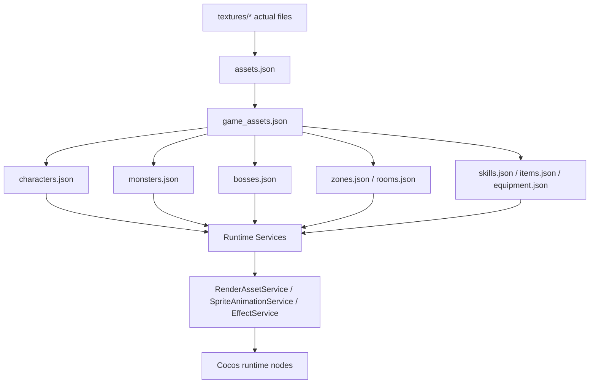

# 非UI美术资源配置化治理方案

更新时间：2026-07-06

## 1. 目标

UI 资源已经规划为：

```text
assets.json -> ui_assets.json -> ui_skin_bindings.json -> UISkinSceneApplier
```

但项目中还有大量非 UI 美术资源：

- 角色 characters
- 怪物 monsters
- Boss bosses
- 背景 backgrounds
- 地块 tiles
- 特效 effects
- 图标 icons

这些资源不应该在 Cocos 场景里手动绑定，也不应该在代码里散落 `textures/...` 路径。正式上线结构应统一为：

```text
assets.json -> game_assets.json -> 业务配置表 -> Runtime Service
```

最终目标：

1. 场景节点不直接绑定具体美术资源。
2. 业务代码不直接写 `textures/xxx` 资源路径。
3. 所有角色、怪物、Boss、背景、tile、effect、icon 都通过语义 key 加载。
4. 换图只改配置，不改业务代码。
5. 新增资源有统一门禁，能检查尺寸、帧数、透明、格式、体积、合规风险。
6. 适配微信小游戏包体、审核、安全、动态加载要求。

## 2. 总体架构



核心原则：

```text
real file path -> assetId -> semantic asset key -> business config -> runtime renderer
```

禁止：

```ts
resources.load('textures/characters/warrior/warrior_idle')
```

推荐：

```ts
await CharacterVisualService.instance.applyCharacter(playerNode, 'warrior', 'idle');
```

## 3. 新增统一资源表

新增文件：

`assets/resources/config/game_assets.json`

该文件负责非 UI 美术资源的语义注册。

### 3.1 总格式

```json
{
  "metadata": {
    "version": "1.0.0",
    "lastUpdated": "2026-07-06",
    "description": "Non-UI art semantic registry. key -> assetId + render metadata."
  },
  "character.warrior.idle": {
    "assetId": "textures/characters/warrior/warrior_idle",
    "type": "sprite_sheet",
    "category": "character",
    "frameWidth": 192,
    "frameHeight": 192,
    "frames": 4,
    "layout": "vertical",
    "pivot": "bottom_center",
    "safeReview": true
  },
  "monster.forest.slime.idle": {
    "assetId": "textures/monsters/forest/slime_idle",
    "type": "sprite_sheet",
    "category": "monster",
    "frameWidth": 128,
    "frameHeight": 128,
    "frames": 4,
    "layout": "vertical",
    "pivot": "bottom_center",
    "safeReview": true
  },
  "background.forest.combat": {
    "assetId": "textures/backgrounds/bg_combat_forest",
    "type": "background",
    "category": "background",
    "format": "jpg",
    "fit": "cover",
    "safeReview": true
  },
  "tile.forest.floor": {
    "assetId": "textures/tiles/forest/tile_forest_floor",
    "type": "tile",
    "category": "tile",
    "tileSize": 32,
    "seamless": true,
    "safeReview": true
  },
  "effect.reaction.burn": {
    "assetId": "textures/effects/reactions/fx_reaction_burn",
    "type": "effect_sheet",
    "category": "effect",
    "frameWidth": 192,
    "frameHeight": 192,
    "frames": 4,
    "layout": "vertical",
    "blendMode": "additive",
    "duration": 0.35,
    "loop": false,
    "safeReview": true
  },
  "icon.skill.dash": {
    "assetId": "textures/icons/skills/icon_skill_dash",
    "type": "icon",
    "category": "icon",
    "width": 128,
    "height": 128,
    "transparent": true,
    "safeReview": true
  }
}
```

### 3.2 字段规范

| 字段 | 必填 | 说明 |
|---|---|---|
| `assetId` | 是 | 必须存在于 `assets.json` |
| `type` | 是 | `sprite` / `sprite_sheet` / `background` / `tile` / `effect_sheet` / `icon` |
| `category` | 是 | `character` / `monster` / `boss` / `background` / `tile` / `effect` / `icon` |
| `frameWidth` | sprite sheet 必填 | 单帧宽度 |
| `frameHeight` | sprite sheet 必填 | 单帧高度 |
| `frames` | sprite sheet 必填 | 总帧数 |
| `layout` | sprite sheet 必填 | `vertical` / `horizontal` / `grid` |
| `tileSize` | tile 必填 | Tile 尺寸，当前一般是 32 |
| `format` | background 必填 | `jpg` / `png` |
| `fit` | background 必填 | `cover` / `contain` / `stretch` |
| `blendMode` | effect 可选 | `normal` / `additive` |
| `duration` | effect 可选 | 播放时长 |
| `loop` | effect 可选 | 是否循环 |
| `safeReview` | 是 | 是否已通过合规人工检查 |

## 4. 业务配置表引用规范

### 4.1 characters.json

角色配置不直接写 `assetId`，只写 `game_assets.json` 的语义 key。

```json
{
  "id": "warrior",
  "nameKey": "character.warrior.name",
  "classKey": "character.warrior.class",
  "visual": {
    "idle": "character.warrior.idle",
    "attack": "character.warrior.attack",
    "hurt": "character.warrior.hurt",
    "death": "character.warrior.death"
  },
  "preview": "character.warrior.idle"
}
```

### 4.2 monsters.json

```json
{
  "id": "forest_slime",
  "nameKey": "monster.forest_slime.name",
  "visual": {
    "idle": "monster.forest.slime.idle",
    "attack": "monster.forest.slime.attack",
    "hurt": "monster.forest.slime.hurt",
    "death": "monster.forest.slime.death"
  },
  "shadow": "shadow.small"
}
```

### 4.3 bosses.json

```json
{
  "id": "forest_guardian",
  "nameKey": "boss.forest_guardian.name",
  "visual": {
    "idle": "boss.forest.guardian.idle",
    "attack": "boss.forest.guardian.attack",
    "phaseChange": "boss.forest.guardian.phasechange",
    "death": "boss.forest.guardian.death"
  },
  "scale": 1.35
}
```

### 4.4 zones.json

背景和 tile 应由区域和房间类型决定。

```json
{
  "id": "forest",
  "nameKey": "zone.forest.name",
  "backgrounds": {
    "combat": "background.forest.combat",
    "shop": "background.forest.shop",
    "rest": "background.forest.rest",
    "boss": "background.forest.boss"
  },
  "tileset": {
    "floor": "tile.forest.floor",
    "wall": "tile.forest.wall",
    "highground": "tile.forest.highground",
    "hazard": "tile.forest.thorn"
  }
}
```

### 4.5 skills.json

```json
{
  "id": "dash",
  "nameKey": "skill.dash.name",
  "descKey": "skill.dash.desc",
  "icon": "icon.skill.dash",
  "effect": "effect.skill.dash"
}
```

### 4.6 items.json / equipment.json

```json
{
  "id": "speed_gauntlet",
  "nameKey": "item.speed_gauntlet.name",
  "descKey": "item.speed_gauntlet.desc",
  "icon": "icon.item.speed_gauntlet",
  "rarity": "rare"
}
```

## 5. 运行时服务设计

### 5.1 GameAssetService

新增：

`assets/scripts/assets/GameAssetService.ts`

职责：

1. 加载 `game_assets.json`。
2. 提供 `get(key)` 查询。
3. 校验 key 是否存在。
4. 对外隐藏 `assetId`，业务层只接触语义 key。

核心代码：

```ts
import { JsonAsset, resources } from 'cc';

export type GameAssetType =
    | 'sprite'
    | 'sprite_sheet'
    | 'background'
    | 'tile'
    | 'effect_sheet'
    | 'icon';

export interface GameAssetDef {
    assetId: string;
    type: GameAssetType;
    category: string;
    frameWidth?: number;
    frameHeight?: number;
    frames?: number;
    layout?: 'vertical' | 'horizontal' | 'grid';
    tileSize?: number;
    format?: 'png' | 'jpg' | 'jpeg';
    fit?: 'cover' | 'contain' | 'stretch';
    blendMode?: 'normal' | 'additive';
    duration?: number;
    loop?: boolean;
    safeReview?: boolean;
}

export class GameAssetService {
    private static _instance: GameAssetService | null = null;
    private _defs: Record<string, GameAssetDef> = {};
    private _loaded = false;
    private _loading: Promise<void> | null = null;

    static get instance(): GameAssetService {
        if (!this._instance) this._instance = new GameAssetService();
        return this._instance;
    }

    async loadAll(): Promise<void> {
        if (this._loaded) return;
        if (this._loading) return this._loading;

        this._loading = new Promise<void>((resolve) => {
            resources.load('config/game_assets', JsonAsset, (err, asset) => {
                if (err || !asset) {
                    console.error('[GameAssetService] load config/game_assets failed', err);
                    this._defs = {};
                    this._loaded = true;
                    resolve();
                    return;
                }

                const raw = asset.json as Record<string, GameAssetDef> | { data?: Record<string, GameAssetDef> };
                const data = 'data' in raw && raw.data ? raw.data : raw as Record<string, GameAssetDef>;
                for (const key of Object.keys(data)) {
                    if (key === 'metadata') continue;
                    this._defs[key] = data[key];
                }
                this._loaded = true;
                resolve();
            });
        });

        return this._loading;
    }

    async get(key: string): Promise<GameAssetDef | null> {
        if (!this._loaded) await this.loadAll();
        return this._defs[key] ?? null;
    }

    async require(key: string): Promise<GameAssetDef> {
        const def = await this.get(key);
        if (!def) throw new Error(`[GameAssetService] missing key: ${key}`);
        return def;
    }

    keys(): string[] {
        return Object.keys(this._defs);
    }
}
```

### 5.2 CharacterVisualService

新增：

`assets/scripts/render/CharacterVisualService.ts`

```ts
import { Node } from 'cc';
import { GameAssetService } from '../assets/GameAssetService';
import { RenderAssetService } from '../assets/RenderAssetService';
import { SpriteAnimationService } from './SpriteAnimationService';

export class CharacterVisualService {
    private static _instance: CharacterVisualService | null = null;

    static get instance(): CharacterVisualService {
        if (!this._instance) this._instance = new CharacterVisualService();
        return this._instance;
    }

    async applyStatic(node: Node, visualKey: string): Promise<boolean> {
        const def = await GameAssetService.instance.get(visualKey);
        if (!def) {
            console.warn(`[CharacterVisualService] missing visual key: ${visualKey}`);
            return false;
        }
        return (await RenderAssetService.applySpriteById(node, def.assetId)) !== null;
    }

    async play(node: Node, visualKey: string): Promise<boolean> {
        const def = await GameAssetService.instance.get(visualKey);
        if (!def) {
            console.warn(`[CharacterVisualService] missing visual key: ${visualKey}`);
            return false;
        }

        if (def.type === 'sprite_sheet') {
            return SpriteAnimationService.instance.playByAssetDef(node, def);
        }

        return this.applyStatic(node, visualKey);
    }
}
```

说明：

`SpriteAnimationService` 当前可能还没有 `playByAssetDef()`。需要补一个适配方法，把 `GameAssetDef` 转成已有动画播放结构。

### 5.3 BackgroundService

新增：

`assets/scripts/render/BackgroundService.ts`

```ts
import { Node, Sprite, UITransform } from 'cc';
import { GameAssetService } from '../assets/GameAssetService';
import { RenderAssetService } from '../assets/RenderAssetService';

export class BackgroundService {
    private static _instance: BackgroundService | null = null;

    static get instance(): BackgroundService {
        if (!this._instance) this._instance = new BackgroundService();
        return this._instance;
    }

    async apply(node: Node, backgroundKey: string): Promise<boolean> {
        const def = await GameAssetService.instance.get(backgroundKey);
        if (!def) {
            console.warn(`[BackgroundService] missing background key: ${backgroundKey}`);
            return false;
        }

        const frame = await RenderAssetService.applySpriteById(node, def.assetId);
        if (!frame) return false;

        const sprite = node.getComponent(Sprite);
        if (sprite) {
            sprite.sizeMode = Sprite.SizeMode.CUSTOM;
        }

        const trans = node.getComponent(UITransform);
        if (trans && def.fit === 'cover') {
            // Final responsive sizing should be handled by scene layout service.
            // This service only applies the image.
        }

        return true;
    }
}
```

### 5.4 TileAssetService

新增：

`assets/scripts/render/TileAssetService.ts`

```ts
import { GameAssetService } from '../assets/GameAssetService';

export class TileAssetService {
    private static _instance: TileAssetService | null = null;

    static get instance(): TileAssetService {
        if (!this._instance) this._instance = new TileAssetService();
        return this._instance;
    }

    async getTileAssetId(tileKey: string): Promise<string | null> {
        const def = await GameAssetService.instance.get(tileKey);
        if (!def) {
            console.warn(`[TileAssetService] missing tile key: ${tileKey}`);
            return null;
        }
        if (def.type !== 'tile') {
            console.warn(`[TileAssetService] key is not tile: ${tileKey}`);
            return null;
        }
        return def.assetId;
    }
}
```

`GridManager` 生成地块时：

```ts
const assetId = await TileAssetService.instance.getTileAssetId(tileKey);
if (assetId) {
    await RenderAssetService.applySpriteById(tileNode, assetId);
}
```

### 5.5 EffectService

新增：

`assets/scripts/render/EffectService.ts`

```ts
import { Node, Vec3 } from 'cc';
import { GameAssetService } from '../assets/GameAssetService';
import { SpriteAnimationService } from './SpriteAnimationService';

export class EffectService {
    private static _instance: EffectService | null = null;

    static get instance(): EffectService {
        if (!this._instance) this._instance = new EffectService();
        return this._instance;
    }

    async play(effectLayer: Node, effectKey: string, worldPos: Vec3): Promise<Node | null> {
        const def = await GameAssetService.instance.get(effectKey);
        if (!def) {
            console.warn(`[EffectService] missing effect key: ${effectKey}`);
            return null;
        }

        const node = new Node(`Effect_${effectKey}`);
        effectLayer.addChild(node);
        node.setPosition(worldPos);

        const ok = await SpriteAnimationService.instance.playByAssetDef(node, def, {
            loop: def.loop ?? false,
            duration: def.duration ?? 0.35,
            destroyOnComplete: true,
            blendMode: def.blendMode ?? 'normal',
        });

        if (!ok) {
            node.destroy();
            return null;
        }

        return node;
    }
}
```

### 5.6 IconService

新增：

`assets/scripts/render/IconService.ts`

```ts
import { Node } from 'cc';
import { GameAssetService } from '../assets/GameAssetService';
import { RenderAssetService } from '../assets/RenderAssetService';

export class IconService {
    private static _instance: IconService | null = null;

    static get instance(): IconService {
        if (!this._instance) this._instance = new IconService();
        return this._instance;
    }

    async apply(node: Node, iconKey: string): Promise<boolean> {
        const def = await GameAssetService.instance.get(iconKey);
        if (!def) {
            console.warn(`[IconService] missing icon key: ${iconKey}`);
            return false;
        }
        if (def.type !== 'icon') {
            console.warn(`[IconService] key is not icon: ${iconKey}`);
            return false;
        }
        return (await RenderAssetService.applySpriteById(node, def.assetId)) !== null;
    }
}
```

## 6. SpriteAnimationService 适配

当前项目已经有：

`assets/scripts/render/SpriteAnimationService.ts`

需要增加一个通用入口，允许直接根据 `GameAssetDef` 播放 sprite sheet。

核心代码：

```ts
import { Node, Sprite, SpriteFrame, Texture2D, Rect } from 'cc';
import { GameAssetDef } from '../assets/GameAssetService';
import { AssetBundleService } from '../assets/AssetBundleService';

export interface PlayAssetDefOptions {
    loop?: boolean;
    duration?: number;
    destroyOnComplete?: boolean;
    blendMode?: 'normal' | 'additive';
}

async playByAssetDef(node: Node, def: GameAssetDef, options: PlayAssetDefOptions = {}): Promise<boolean> {
    if (!def.assetId || !def.frameWidth || !def.frameHeight || !def.frames) {
        console.warn('[SpriteAnimationService] invalid sprite sheet def', def);
        return false;
    }

    const texture = await AssetBundleService.instance.tryLoadTexture(def.assetId);
    if (!texture) {
        console.warn(`[SpriteAnimationService] texture not found: ${def.assetId}`);
        return false;
    }

    const frames = this._sliceFrames(texture, def);
    if (frames.length === 0) return false;

    const sprite = node.getComponent(Sprite) ?? node.addComponent(Sprite);
    this.playFrames(sprite, frames, {
        loop: options.loop ?? true,
        duration: options.duration ?? 0.5,
        destroyOnComplete: options.destroyOnComplete ?? false,
    });

    return true;
}

private _sliceFrames(texture: Texture2D, def: GameAssetDef): SpriteFrame[] {
    const result: SpriteFrame[] = [];
    const fw = def.frameWidth ?? 0;
    const fh = def.frameHeight ?? 0;
    const count = def.frames ?? 0;
    const layout = def.layout ?? 'vertical';

    for (let i = 0; i < count; i++) {
        let x = 0;
        let y = 0;

        if (layout === 'vertical') {
            x = 0;
            y = i * fh;
        } else if (layout === 'horizontal') {
            x = i * fw;
            y = 0;
        }

        const sf = new SpriteFrame();
        sf.texture = texture;
        sf.rect = new Rect(x, y, fw, fh);
        result.push(sf);
    }

    return result;
}
```

注意：

如果 `AssetBundleService` 当前没有 `tryLoadTexture()`，应新增该方法，或在 `RenderAssetService` 内提供 `loadTextureById()`。

## 7. 各类型资源治理细则

### 7.1 角色 characters

正式规则：

1. 角色资源必须是卡通动物风，不能回到像素风或暗黑风。
2. 禁止血液、骷髅、器官、伤口、英文、伪文字。
3. sprite sheet 每帧角色比例、位置、朝向必须一致。
4. 攻击动画不能出现每帧武器/盾牌/表情完全变形。
5. 角色预览和战斗实际动画必须引用同一套资源 key。

建议 key：

```text
character.warrior.idle
character.warrior.attack
character.warrior.hurt
character.warrior.death
```

门禁：

- 尺寸匹配 `frameWidth * frames` 或 `frameHeight * frames`
- RGBA
- alpha 有效
- 每帧主体中心偏移不超过阈值
- 每帧非透明区域面积差异不超过阈值
- 不允许过小主体

### 7.2 怪物 monsters

正式规则：

1. 怪物也是卡通动物/幻想生物风，不走恐怖暗黑风。
2. 深渊、火山等区域可以有色调差异，但不能有骷髅、血液、器官。
3. 怪物 sprite sheet 的每帧主体大小稳定。
4. 怪物配置只写 visual key，不写 `assetId`。

建议 key：

```text
monster.forest.slime.idle
monster.abyss.voidwraith.attack
monster.volcano.flamebeast.death
```

### 7.3 Boss

正式规则：

1. Boss 可以更大，但仍保持卡通动画风。
2. Phase change 不要生成血腥、骷髅、恐怖祭坛。
3. 死亡动画不要表现血液或尸体碎裂，可用星光、烟雾、能量消散。
4. Boss 配置必须明确 `scale`、`visual`、`effect`。

建议 key：

```text
boss.forest.guardian.idle
boss.forest.guardian.attack
boss.forest.guardian.phasechange
boss.forest.guardian.death
```

### 7.4 背景 backgrounds

正式规则：

1. 背景可以使用 JPG 运行时版本，母版 PNG 保留在 `art_source`。
2. 背景中不能有英文、伪文字、血迹、心脏、骷髅、器官。
3. 微信小游戏内建议按区域 bundle 拆分。
4. 背景资源由 `zones.json` / `rooms.json` 决定，不写死在场景。

建议 key：

```text
background.forest.combat
background.forest.shop
background.forest.rest
background.forest.boss
```

### 7.5 Tiles

正式规则：

1. Tile 优先程序化生成，AI 只做风格参考，不直接作为最终 tile。
2. 必须无缝拼贴。
3. 不能有中心大主体。
4. 不能有发光宝石、角色、图标、文字等非地面元素。
5. 地块资源由 `zones.json.tileset` 引用。

建议 key：

```text
tile.forest.floor
tile.forest.wall
tile.forest.highground
tile.forest.hazard
```

门禁：

- `tileSize` 正确
- 左右边缘差异低
- 上下边缘差异低
- 中心主体检测通过
- 拼贴预览无明显格子断裂

### 7.6 Effects

正式规则：

1. 特效必须清晰，不能为了体积硬压到糊。
2. 背景必须透明，禁止黑底、绿底、品红底残留。
3. 禁止英文、伪文字。
4. 特效可以抽象化，不生成具体道具本体，避免 hourglass 这类资源生成实物。
5. 文件大小超预算优先做 bundle 分包和按需加载，不优先牺牲清晰度。

建议 key：

```text
effect.reaction.burn
effect.reaction.freeze
effect.relic.time_hourglass
effect.skill.dash
```

门禁：

- alpha 通道有效
- 残留 chroma 比例低
- 帧数正确
- 每帧主体清晰
- `frameWidth/frameHeight` 正确

### 7.7 Icons

正式规则：

1. 图标必须是物品、技能、元素符号，不要头像、表情、人脸。
2. 禁止英文、伪文字、数字。
3. 禁止血液、骷髅、器官。
4. 小尺寸可读，主体居中，透明背景。

建议 key：

```text
icon.skill.dash
icon.element.fire
icon.item.key
icon.relic.speed_gauntlet
```

## 8. 门禁脚本

新增：

`tools/check_game_assets_registry.py`

职责：

1. 检查 `game_assets.json` 中所有 `assetId` 是否存在于 `assets.json`。
2. 检查业务配置表引用的资源 key 是否存在于 `game_assets.json`。
3. 检查 sprite sheet 尺寸和帧数。
4. 检查 tile 尺寸和基础拼贴质量。
5. 检查 effect alpha。
6. 检查 icon 透明背景。
7. 输出未使用的资源 key warning。

核心代码：

```python
#!/usr/bin/env python3
import json
import sys
from pathlib import Path
from PIL import Image

PROJECT_DIR = Path(__file__).resolve().parents[1]
CONFIG_DIR = PROJECT_DIR / "assets" / "resources" / "config"
TEXTURES_DIR = PROJECT_DIR / "assets" / "resources" / "textures"

ASSETS_JSON = CONFIG_DIR / "assets.json"
GAME_ASSETS_JSON = CONFIG_DIR / "game_assets.json"

BUSINESS_CONFIGS = [
    "characters.json",
    "monsters.json",
    "bosses.json",
    "zones.json",
    "skills.json",
    "items.json",
    "equipment.json",
]

VALID_TYPES = {"sprite", "sprite_sheet", "background", "tile", "effect_sheet", "icon"}


def load_json(path: Path) -> dict:
    if not path.exists():
        return {}
    with path.open("r", encoding="utf-8") as f:
        raw = json.load(f)
    return raw.get("data", raw)


def asset_id_to_file(asset_id: str) -> Path:
    rel = asset_id
    if rel.startswith("textures/"):
        rel = rel[len("textures/"):]
    png = TEXTURES_DIR / f"{rel}.png"
    jpg = TEXTURES_DIR / f"{rel}.jpg"
    jpeg = TEXTURES_DIR / f"{rel}.jpeg"
    if png.exists():
        return png
    if jpg.exists():
        return jpg
    return jpeg


def collect_referenced_game_keys(value, out: set[str]) -> None:
    if isinstance(value, dict):
        for k, v in value.items():
            if k in {"visual", "backgrounds", "tileset"}:
                collect_referenced_game_keys(v, out)
            elif k in {"icon", "effect", "preview", "idle", "attack", "hurt", "death", "phaseChange", "floor", "wall", "highground", "hazard", "combat", "shop", "rest", "boss"}:
                if isinstance(v, str):
                    out.add(v)
                else:
                    collect_referenced_game_keys(v, out)
            else:
                collect_referenced_game_keys(v, out)
    elif isinstance(value, list):
        for item in value:
            collect_referenced_game_keys(item, out)


def check_sheet(path: Path, key: str, item: dict, issues: list[str]) -> None:
    if not path.exists():
        issues.append(f"missing file for {key}: {path}")
        return

    img = Image.open(path)
    w, h = img.size
    fw = int(item.get("frameWidth", 0))
    fh = int(item.get("frameHeight", 0))
    frames = int(item.get("frames", 0))
    layout = item.get("layout", "vertical")

    if fw <= 0 or fh <= 0 or frames <= 0:
        issues.append(f"invalid sheet metadata: {key}")
        return

    if layout == "vertical" and (w != fw or h != fh * frames):
        issues.append(f"sheet size mismatch: {key}, actual={w}x{h}, expected={fw}x{fh * frames}")
    elif layout == "horizontal" and (w != fw * frames or h != fh):
        issues.append(f"sheet size mismatch: {key}, actual={w}x{h}, expected={fw * frames}x{fh}")

    if img.mode not in {"RGBA", "LA"}:
        issues.append(f"sheet should have alpha: {key}, mode={img.mode}")


def check_tile(path: Path, key: str, item: dict, issues: list[str], warnings: list[str]) -> None:
    if not path.exists():
        issues.append(f"missing tile file for {key}: {path}")
        return

    img = Image.open(path).convert("RGBA")
    w, h = img.size
    tile_size = int(item.get("tileSize", 0))
    if tile_size and (w != tile_size or h != tile_size):
        issues.append(f"tile size mismatch: {key}, actual={w}x{h}, expected={tile_size}x{tile_size}")

    # Simple edge difference check. Full visual tile scoring can be added later.
    pixels = img.load()
    edge_score = 0
    for y in range(h):
        edge_score += sum(abs(pixels[0, y][i] - pixels[w - 1, y][i]) for i in range(3))
    for x in range(w):
        edge_score += sum(abs(pixels[x, 0][i] - pixels[x, h - 1][i]) for i in range(3))
    edge_score = edge_score / max(1, (w + h) * 3)

    if edge_score > 18:
        warnings.append(f"tile edge score high: {key}, score={edge_score:.2f}")


def check_icon(path: Path, key: str, issues: list[str], warnings: list[str]) -> None:
    if not path.exists():
        issues.append(f"missing icon file for {key}: {path}")
        return

    img = Image.open(path).convert("RGBA")
    alpha = img.getchannel("A")
    transparent = sum(1 for v in alpha.getdata() if v < 16)
    ratio = transparent / max(1, img.width * img.height)
    if ratio < 0.1:
        warnings.append(f"icon may not have enough transparent background: {key}, transparent={ratio:.2%}")


def main() -> int:
    issues = []
    warnings = []

    assets = load_json(ASSETS_JSON)
    game_assets = load_json(GAME_ASSETS_JSON)
    game_assets = {k: v for k, v in game_assets.items() if k != "metadata"}

    for key, item in game_assets.items():
        asset_id = item.get("assetId")
        typ = item.get("type")

        if not asset_id:
            issues.append(f"missing assetId: {key}")
            continue
        if asset_id not in assets:
            issues.append(f"assetId not found in assets.json: {key} -> {asset_id}")
        if typ not in VALID_TYPES:
            issues.append(f"invalid type: {key}, type={typ}")

        path = asset_id_to_file(asset_id)

        if typ in {"sprite_sheet", "effect_sheet"}:
            check_sheet(path, key, item, issues)
        elif typ == "tile":
            check_tile(path, key, item, issues, warnings)
        elif typ == "icon":
            check_icon(path, key, issues, warnings)
        elif not path.exists():
            issues.append(f"missing file for {key}: {path}")

    referenced = set()
    for name in BUSINESS_CONFIGS:
        collect_referenced_game_keys(load_json(CONFIG_DIR / name), referenced)

    for key in sorted(referenced):
        if key not in game_assets:
            issues.append(f"business config references missing game asset key: {key}")

    unused = sorted(set(game_assets.keys()) - referenced)
    for key in unused:
        warnings.append(f"game asset key not referenced by business config: {key}")

    for w in warnings:
        print(f"[WARN] {w}")
    for e in issues:
        print(f"[ERROR] {e}")

    print(f"[SUMMARY] errors={len(issues)} warnings={len(warnings)}")
    return 1 if issues else 0


if __name__ == "__main__":
    sys.exit(main())
```

加入：

`tools/config_pipeline/check_all.py`

```python
("非UI资源注册", ["python", "tools/check_game_assets_registry.py"]),
```

## 9. 迁移顺序

### Phase 1：只建表，不改运行逻辑

1. 新建 `game_assets.json`。
2. 从 `assets.json` 复制非 UI 资源 key，按分类补 metadata。
3. 先覆盖：
   - characters
   - monsters
   - bosses
   - backgrounds
   - tiles
   - effects
   - icons
4. 跑 `check_game_assets_registry.py`，只允许 warning，不允许 error。

### Phase 2：角色、怪物、Boss 迁移

1. `characters.json` 加 `visual` 字段。
2. `monsters.json` 加 `visual` 字段。
3. `bosses.json` 加 `visual` 字段。
4. `PlayerController`、`MonsterController`、`BattleManager` 改为读取 visual key。
5. 接入 `CharacterVisualService`。

### Phase 3：背景迁移

1. `zones.json` 加 `backgrounds` 字段。
2. `DungeonSceneInstaller.loadInitialArt()` 改为通过 `BackgroundService` 按 zone/room 加载背景。
3. 不再写死 `textures/backgrounds/bg_combat_forest`。

### Phase 4：Tile 迁移

1. `zones.json` 加 `tileset` 字段。
2. `GridManager` 生成 tile 时按 tileset key 加载。
3. 程序化 tile 继续保留，但产物也必须注册到 `game_assets.json`。

### Phase 5：Effects 迁移

1. `skills.json`、`elements.json`、`items.json`、`relics` 类配置补 `effect` key。
2. 统一通过 `EffectService.play()` 播放。
3. 移除散落的临时 effect node 创建逻辑。

### Phase 6：Icons 迁移

1. `skills.json`、`items.json`、`equipment.json` 补 `icon` key。
2. UI 动态生成图标时通过 `IconService.apply()`。
3. `ui_assets.json` 中可以保留 UI icon，但业务 icon 优先放 `game_assets.json`。

## 10. 文件大小策略

不要用硬上限直接牺牲清晰度。

正式策略：

1. 母版保留高质量版本，放在 `art_source/textures_review/master`。
2. 运行时版本放在 `assets/resources/textures`。
3. 背景优先 JPG，角色/怪物/特效/icon 保持 PNG RGBA。
4. 超预算先拆 bundle、按需加载、延迟加载。
5. 只有在视觉通过的前提下才压缩。
6. 体积检查分为 warning 和 hard fail：

| 类型 | warning | hard fail |
|---|---:|---:|
| icon | 16KB | 32KB |
| effect sheet | 80KB | 128KB |
| character sheet | 256KB | 512KB |
| monster sheet | 180KB | 384KB |
| boss sheet | 512KB | 1024KB |
| background jpg | 180KB | 350KB |

## 11. 合规策略

所有非 UI 美术必须满足：

1. 无英文。
2. 无伪文字。
3. 无数字。
4. 无血液。
5. 无骷髅。
6. 无器官。
7. 无恐怖尸体、骨头、血迹。
8. 不使用暗黑恐怖风。
9. 风格统一为卡通动画动物风。
10. 微信小游戏审核前必须抽样和重点资源全量人工看图。

配置中 `safeReview` 不能代替人工审查，它只表示该资源已经被人工确认过。

## 12. 和 UI 方案的边界

| 类型 | 走 UI 自动绑定 | 走 game_assets |
|---|---|---|
| 主城按钮底图 | 是 | 否 |
| PanelFrame | 是 | 否 |
| HUD 固定槽位底图 | 是 | 可选 |
| 技能图标 | 否 | 是 |
| 物品图标 | 否 | 是 |
| 角色预览 | 否 | 是 |
| 怪物/Boss | 否 | 是 |
| 战斗背景 | 否 | 是 |
| Tile | 否 | 是 |
| 特效 | 否 | 是 |

简单判断：

```text
如果资源是固定 UI 节点外观 -> ui_assets + ui_skin_bindings
如果资源由业务数据决定 -> game_assets + business config
```

## 13. 验收标准

完成后必须满足：

1. `npm.cmd run validate:all` 通过。
2. `check_assets_registry.py` 通过。
3. `check_game_assets_registry.py` 无 error。
4. 角色、怪物、Boss 都能通过配置换图。
5. 背景由 zone/room 决定，不再写死。
6. Tile 由 zones tileset 决定。
7. Effect 由技能/元素/遗物配置决定。
8. Icon 由技能/物品/装备配置决定。
9. 代码中不再新增 `resources.load('textures/...')`。
10. 图片审查无文字、无血腥、无骷髅、无暗黑风偏移。

## 14. 执行给另一个对话的说明

执行时不要一次性大改全部系统。按以下顺序做：

1. 新建 `game_assets.json`，只补配置，不改运行逻辑。
2. 新建 `GameAssetService.ts`。
3. 新建 `check_game_assets_registry.py` 并加入 `validate:all`。
4. 先迁移角色和怪物，因为它们当前最影响战斗画面。
5. 再迁移背景和 tile。
6. 最后迁移 effects 和 icons。

每完成一个阶段都必须：

```text
npm.cmd run validate:all
浏览器预览 splash -> main -> dungeon
检查控制台无 missing asset key
检查画面资源正确显示
```

不要在一个提交里同时改配置、渲染服务、战斗逻辑、UI 布局。每一步都要能回滚、能验证。

