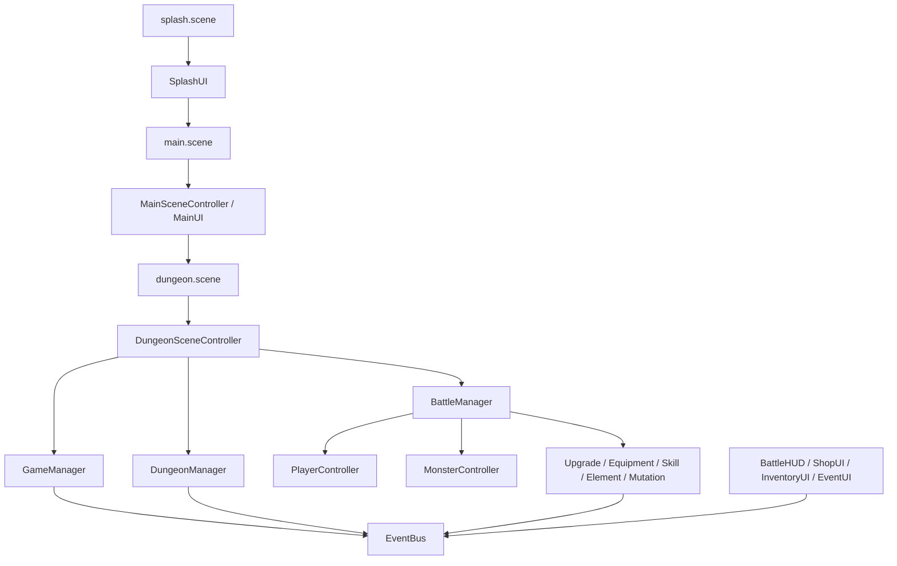
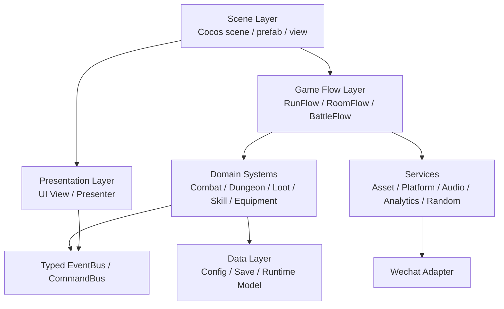

# 项目整体架构审查与优化方案

> 项目：回到地面  
> 引擎：Cocos Creator 3.8.8  
> 平台：微信小游戏  
> 审查范围：工程目录、运行架构、场景、脚本、配置、资源、构建发布、微信能力、性能、存档、UI、测试与文档。

---

## 1. 总体结论

当前项目已经具备完整玩法雏形：主界面、地牢、战斗、怪物、装备、技能、突变、商店、死亡结算、微信广告适配、配置文件和美术资源目录都已存在。但整体架构仍处在“功能堆叠型原型”阶段，主要风险集中在四个方面：

1. **运行时架构耦合偏高**：`DungeonSceneController`、`MonsterController`、`UpgradeManager`、`EquipmentSystem` 等类承担职责过多，系统间通过字符串事件和 `any` 互相通信，后续扩展容易牵一发动全身。
2. **配置与资源管线没有真正工程化**：`assets/resources/config` 下已有 JSON，但 `ConfigManager` 当前仍主要使用默认内置配置；大量图片、备份、raw 文件全部在 `resources` 里，微信小游戏包体风险很高。
3. **微信小游戏发布策略不足**：构建配置暂未启用清晰的 Asset Bundle / 分包 / MD5 缓存策略，而微信小游戏对主包、分包、首屏加载和缓存都很敏感。
4. **可维护性与可验证性不足**：缺少配置校验、资源审计、场景引用校验、包体预算、核心逻辑测试与发布前检查脚本，问题容易到浏览器或真机才暴露。

建议先做“低风险止血”，再做模块化重构：先修配置加载、资源清理、构建策略、事件暂停、广告兜底、场景引用校验；再逐步拆分玩法系统、UI、资源加载、存档和微信平台服务。

---

## 2. 当前架构概览

### 2.1 目录现状

```text
E:/game/回到地面
├─ assets/
│  ├─ scenes/                  # splash / main / dungeon 场景
│  ├─ scripts/                 # 主要 TypeScript 逻辑
│  │  ├─ core/                 # GameManager、ConfigManager、EventBus、PlayerData
│  │  ├─ battle/               # 战斗、怪物、装备、技能、元素、突变等
│  │  ├─ dungeon/              # 地牢生成、房间切换、网格
│  │  ├─ ui/                   # UI 组件
│  │  └─ utils/                # WXAdapter、MathUtils
│  └─ resources/               # 配置、纹理、占位图、运行时资源
├─ design/                     # 设计文档与美术需求
├─ docs/                       # 技术方案文档
├─ profiles/                   # Cocos 构建配置
├─ tools/                      # 工具脚本目录
├─ package.json
└─ tsconfig.json
```

### 2.2 运行链路推测



这条链路能跑通原型，但当前主要靠全局单例和字符串事件串联。短期开发快，长期会出现事件名漂移、参数不一致、系统间隐式依赖、暂停/恢复互相影响、难测试等问题。

---

## 3. 高优先级问题清单

### P0-1：配置 JSON 未成为运行时权威数据

证据位置：

- `assets/scripts/core/ConfigManager.ts:136`：`loadAll()` 里先使用默认内置配置。
- `assets/scripts/core/ConfigManager.ts:147`：调用 `_tryLoadJsonAsync()`。
- `assets/scripts/core/ConfigManager.ts:296`：`_tryLoadJsonAsync()` 目前只是注释，没有真正通过 `resources.load` 异步加载 JSON。
- `assets/scripts/core/ConfigManager.ts:84`、`assets/scripts/core/ConfigManager.ts:124`：存在 `DEFAULT_ZONES`，运行时容易继续使用旧的默认配置。

风险：

- 设计文档、JSON 配置和实际运行行为不一致。
- 新增区域、怪物、文本、掉落后，编辑 JSON 可能没有效果。
- 调试时会误判为资源、场景或逻辑错误。

建议方案：

1. 将 `assets/resources/config/*.json` 作为唯一权威配置源。
2. `ConfigManager` 改为异步初始化：
   - `await ConfigManager.instance.loadAllAsync()`
   - 只在 JSON 加载失败时使用默认配置。
3. 加入配置版本号与 schema 校验。
4. 启动时输出配置摘要：
   - 加载了几个区域。
   - 加载了多少怪物。
   - 当前文本语言。
   - 是否使用 fallback。

落地步骤：

```text
第 1 步：新增 ConfigLoader，封装 resources.load<JsonAsset>()。
第 2 步：ConfigManager.loadAll() 改成 loadAllAsync()。
第 3 步：GameManager / 启动场景等待配置完成后再进入主界面。
第 4 步：tools 增加 validate-config 脚本，发布前检查 JSON。
第 5 步：删除或弱化 DEFAULT_*，只保留最小灾备配置。
```

验收标准：

- 修改 `assets/resources/config/zones.json` 后，运行时区域数据实际变化。
- 配置缺字段时，编辑器或构建前脚本能报出明确路径。
- 控制台能看到配置加载来源和数量。

---

### P0-2：`resources` 目录过重，微信小游戏包体风险高

证据位置：

- `assets/resources` 当前包含约 493 个 PNG，总量约 49MB。
- `assets/resources/textures/ui/main/main_bg_raw.png`
- `assets/resources/textures/ui/main/main_bg.png.bak.20260626`
- `assets/resources/textures/ui/main/main_titledeco.png.bak.20260626`
- `assets/resources/textures/ui/shop/icon_coin.png.bak.20260626`
- `assets/resources/textures/ui/shop/shop_bg.png.bak.20260626`
- `assets/resources/textures/ui/shop/shop_slot.png.bak.20260626`
- `assets/resources/test_check/test.txt`

风险：

- 微信小游戏主包和总包大小受限，`resources` 放太多内容会导致首包膨胀、审核上传失败或首屏加载过慢。
- raw、bak、测试文件进入运行资源目录，会被误打包或增加导入扫描成本。
- 未来美术高清替换后，如果没有分包和预算，包体会快速失控。

建议方案：

1. 建立资源分层：

```text
assets/
├─ resources/
│  ├─ config/                  # 必须运行时动态加载的轻量配置
│  ├─ textures/common/         # 首屏或全局小图标
│  └─ audio/common/            # 首屏必要音频
├─ bundles/
│  ├─ common/                  # 通用 UI、字体、基础图集
│  ├─ scene_splash/            # 启动页
│  ├─ scene_main/              # 主界面
│  ├─ zone_forest/             # 森林区域资源
│  ├─ zone_ruins/              # 废墟区域资源
│  ├─ zone_cave/               # 洞穴区域资源
│  └─ zone_boss/               # Boss 与高体积资源
└─ asset_source/               # 不参与打包的源文件、AI 原图、PSD、raw、bak
```

2. `resources` 只保留必须通过 `resources.load` 访问的内容。
3. 备份、raw、AI 母版全部迁到 `asset_source` 或项目外部，不进入 `assets/resources`。
4. 区域资源按 Asset Bundle 拆分，并映射到微信小游戏分包。
5. 建立包体预算：

| 类别 | 建议预算 |
|---|---:|
| 首包 JS + 引擎 + splash + main 基础资源 | 3.5MB 以内 |
| common bundle | 1.5MB 以内 |
| 单区域 bundle | 2MB - 5MB |
| 单张 UI 背景运行图 | 300KB - 800KB |
| 单角色运行帧图集 | 200KB - 1MB |

验收标准：

- `assets/resources` 不再包含 `.bak`、`raw`、测试文件。
- 构建后首包大小有明确数字记录。
- 每个 bundle 有独立大小报告。

---

### P0-3：微信小游戏构建配置缺少分包与缓存策略

证据位置：

- `profiles/v2/packages/builder.json:39`：`md5Cache` 为 `false`。
- `profiles/v2/packages/builder.json:57`：`startSceneAssetBundle` 为 `false`。
- `profiles/v2/packages/builder.json:58`：`bundleConfigs` 为空数组。
- `profiles/v2/packages/wechatgame.json:20`：`separateEngine` 为 `false`。
- `profiles/v2/packages/wechatgame.json:21`：`highPerformanceMode` 为 `false`。

风险：

- 没有分包，高清资源替换后很容易超过微信小游戏包体限制。
- 不启用 MD5 缓存，资源更新和缓存命中不可控。
- 首场景、主界面、地牢资源混在一起，会拖慢首次进入。

建议方案：

1. 构建配置目标：
   - 启用 MD5 Cache。
   - 启动场景单独控制资源。
   - 使用 Asset Bundle 拆分资源。
   - 微信侧按 bundle 配置分包。
2. 资源加载顺序：

```text
启动页最小资源
→ 加载 common bundle
→ 进入主界面
→ 玩家点击开始
→ 预加载当前区域 bundle
→ 进入 dungeon.scene
→ 过关时预加载下一区域 bundle
→ 离开区域后释放非公共资源
```

3. 参考约束：
   - Cocos Creator 微信小游戏分包文档：`https://docs.cocos.com/creator/3.8/manual/zh/editor/publish/subpackage.html`
   - 微信小游戏常见限制：主包需要严格控制，资源应通过分包、远程资源和缓存策略管理。

验收标准：

- 构建报告中能看到 bundle 拆分。
- 首包不包含所有地牢区域大图。
- 真机首次打开速度稳定，切区域时有可控加载 UI。

---

### P0-4：全局 `EventBus.pause()` 会暂停所有事件

证据位置：

- `assets/scripts/battle/BattleManager.ts:183`：`setPaused(paused: boolean)`。
- `assets/scripts/battle/BattleManager.ts:186`：暂停时调用 `eventBus.pause()`。
- `assets/scripts/battle/BattleManager.ts:188`：恢复时调用 `eventBus.resume()`。

风险：

- 战斗暂停时，UI、复活、广告回调、结算、房间事件也可能被吞掉。
- 某个弹窗暂停战斗，可能让其他系统事件全部失效。
- 难以区分“游戏逻辑暂停”和“事件系统暂停”。

建议方案：

1. 禁止业务系统直接暂停全局事件总线。
2. 用 `GameState` 或 `BattleState` 控制战斗更新。
3. 事件总线只负责派发事件，不承担全局暂停语义。
4. 如确实需要暂停，改为 channel 级别：

```ts
eventBus.pauseChannel('battle');
eventBus.emit('ui:show_pause_panel');
eventBus.emit('ad:rewarded_closed');
```

验收标准：

- 打开事件房间、商店、死亡界面时，战斗停止，但 UI 和广告回调仍可正常派发。
- `EventBus.pause()` 不再被业务代码直接调用，或只用于极少数调试场景。

---

### P0-5：场景引用和启动页资源存在黑屏隐患

证据位置：

- `assets/scenes/splash.scene` 中存在 Canvas 相机引用。
- 当前 splash 场景曾出现浏览器黑屏和 `cameraPriority` 相关错误。
- `SplashImage` 曾显示 `_spriteFrame` 为空的风险。

风险：

- Canvas 绑定相机、节点层级、相机 visibility、UI_2D layer 不一致时，浏览器预览可能黑屏。
- SpriteFrame 丢失时，编辑器里看到节点，但运行时没有图。
- Cocos 自动生成 meta 或 SpriteFrame 异常时，会出现“编辑器有资源，运行时找不到”的问题。

建议方案：

1. 增加场景引用校验脚本：
   - 检查所有 `.scene` 中关键组件引用是否为 `null`。
   - 检查 Canvas 是否绑定有效 Camera。
   - 检查 UI 节点是否在 `UI_2D` layer。
   - 检查 Sprite 组件 `_spriteFrame` 是否为空。
2. 启动页资源固定为小图集或纯色 + Logo，不依赖大图。
3. 预览前清理 Cocos 缓存并重新导入异常资源。

验收标准：

- `splash.scene`、`main.scene`、`dungeon.scene` 发布前校验通过。
- 浏览器预览、微信开发者工具、真机三端都能看到启动页。

---

### P0-6：广告失败兜底直接发奖励，不适合生产环境

证据位置：

- `assets/scripts/utils/WXAdapter.ts:50`：`playRewardedAd()`。
- `assets/scripts/utils/WXAdapter.ts:67`、`:96`、`:101`：广告失败时调用 `_fallbackReward()`。
- `assets/scripts/utils/WXAdapter.ts:106`：`_fallbackReward()`。

风险：

- 真机生产环境广告加载失败时，玩家可能无广告获得奖励。
- IAA 经济系统会被破坏，数据分析也会失真。
- 可能影响广告平台合规和收益判断。

建议方案：

1. 加入环境开关：

```ts
const ENABLE_AD_REWARD_FALLBACK = DEBUG || BUILD_ENV === 'dev';
```

2. 生产环境逻辑：
   - 广告不可用：提示“广告暂不可用，请稍后再试”。
   - 广告未完整观看：不发奖励。
   - 只有完整观看关闭才发奖励。
3. 统计事件区分：
   - `ad_request`
   - `ad_show_success`
   - `ad_show_fail`
   - `ad_completed`
   - `ad_skipped`
   - `ad_reward_granted`

验收标准：

- dev 环境可以兜底发奖，便于测试。
- prod 环境广告失败不发奖。
- 广告奖励链路有完整日志。

---

## 4. 中高优先级架构问题

### P1-1：核心控制器职责过多

重点文件：

- `assets/scripts/DungeonSceneController.ts`
- `assets/scripts/battle/MonsterController.ts`
- `assets/scripts/battle/UpgradeManager.ts`
- `assets/scripts/battle/EquipmentSystem.ts`
- `assets/scripts/battle/ElementSystem.ts`

现状：

- `DungeonSceneController` 同时负责系统初始化、场景流程、房间事件、商店/治疗/宝箱、Boss 进度、突变、广告埋点和 UI 创建。
- `MonsterController` 同时负责 AI、移动、攻击、Boss 阶段、召唤、自爆、状态效果、表现动画、死亡销毁。
- `UpgradeManager` 同时负责升级选项、遗物、技能增强、事件监听和特效事件。

建议拆分：

```text
DungeonSceneController
├─ DungeonBootstrap            # 场景依赖绑定、启动顺序
├─ RunFlowController           # 楼层、房间、区域、胜利/失败流程
├─ RoomInteractionController   # 商店、宝箱、治疗、事件房
├─ DungeonPresentation         # HUD、提示、地图、过场
└─ DungeonTelemetry            # 广告、埋点、进度日志

MonsterController
├─ MonsterModel                # 属性、配置、状态
├─ MonsterAI                  # 行为决策
├─ MonsterMovement            # 网格移动
├─ MonsterCombat              # 攻击/受伤/死亡
├─ MonsterStatusController    # 冰冻、中毒、沉默等
└─ MonsterView                # Sprite、动画、特效
```

改造原则：

- 先抽纯逻辑类，不急着大规模搬节点。
- 每次只拆一个方向，例如先拆 `MonsterAI` 和 `MonsterMovement`。
- 保持原公共接口不变，避免一次性改崩场景绑定。

---

### P1-2：事件总线字符串化、无类型、无参数约束

证据位置：

- `assets/scripts/core/EventBus.ts:7`：`EventCallback = (...args: any[]) => void`。
- `assets/scripts/core/EventBus.ts:86`：`emit(event: string, ...args: any[])`。
- 脚本中大量 `eventBus.emit('xxx', ...)` 和 `eventBus.on('xxx', ...)`。

风险：

- 事件名拼错不会编译报错。
- 参数顺序和类型不一致时，运行时才出问题。
- 难以查找事件所有生产者和消费者。

建议方案：

```ts
type GameEvents = {
  'battle:started': { totalMonsters: number };
  'battle:victory': void;
  'player:damaged': { damage: number; crit: boolean };
  'room:entered': { roomId: string; roomType: string };
};
```

逐步改造：

1. 新增 `GameEvents.ts`，先登记高频事件。
2. 新增 `TypedEventBus`，兼容旧 `EventBus`。
3. 新代码只能用 typed event。
4. 老事件按模块逐步迁移。

验收标准：

- `battle`、`dungeon`、`ui` 三大域的关键事件有类型定义。
- 拼错事件名会触发 TypeScript 报错。

---

### P1-3：随机数不可复现，削弱地牢种子价值

证据位置：

- `assets/scripts/DungeonSceneController.ts:163`：使用 `Math.random()` 生成 seed。
- `assets/scripts/core/ConfigManager.ts:233`、`:281`：区域选择和洗牌使用 `Math.random()`。
- `assets/scripts/utils/MathUtils.ts` 多处使用 `Math.random()`。
- 装备、事件、突变、死亡奖励等系统也直接使用 `Math.random()`。

风险：

- 同一个地牢种子不能复现同一局。
- Bug 难复盘。
- 未来做每日挑战、排行榜、公平性校验会困难。

建议方案：

1. 建立 `RandomService`：

```ts
class RandomService {
  constructor(seed: number) {}
  next(): number {}
  rangeInt(min: number, max: number): number {}
  chance(p: number): boolean {}
  pickWeighted<T>(items: T[], getWeight: (item: T) => number): T {}
  shuffle<T>(items: T[]): T[] {}
}
```

2. 随机域拆分：
   - `runRng`：地牢结构、房间。
   - `combatRng`：攻击、暴击、闪避。
   - `lootRng`：装备、掉落。
   - `eventRng`：事件选项和结果。
3. 存档记录：
   - run seed
   - floor seed
   - rng step 或子 seed

验收标准：

- 输入相同 seed，地牢结构、房间顺序、怪物波次可复现。
- 关键随机都不再直接调用 `Math.random()`。

---

### P1-4：UI 大量运行时手写节点，难适配和维护

证据位置：

- `assets/scripts/ui/EquipmentUI.ts`、`InventoryUI.ts`、`ShopUI.ts`、`EventUI.ts`、`MarqueeUI.ts` 中大量 `new Node()`。
- 多处使用 `(node as any)._label`、`(node as any)._index` 保存 UI 引用。
- 多处绝对坐标和固定尺寸。

风险：

- 适配不同手机屏幕困难。
- UI 结构看不见，策划/美术无法在编辑器里调整。
- `any` 字段缺少类型保护，重构时容易丢引用。
- 文本、按钮、布局不统一。

建议方案：

1. 高频 UI 改为 prefab：
   - `ShopPanel.prefab`
   - `InventoryPanel.prefab`
   - `EquipmentPanel.prefab`
   - `EventPanel.prefab`
   - `SkillSlot.prefab`
   - `ItemSlot.prefab`
2. 每个 prefab 配一个 View 组件，只保留节点引用。
3. 业务逻辑下沉到 Presenter/ViewModel。
4. 使用 `Widget`、`Layout`、`SafeArea` 适配竖屏。
5. 所有文字走 `TextManager` 或统一文案表。

推荐结构：

```text
ui/
├─ view/
│  ├─ ShopView.ts
│  ├─ InventoryView.ts
│  └─ BattleHUDView.ts
├─ presenter/
│  ├─ ShopPresenter.ts
│  └─ InventoryPresenter.ts
└─ prefab/
   ├─ ShopPanel.prefab
   └─ ItemSlot.prefab
```

验收标准：

- 新 UI 不再通过 `(node as any)._label` 存引用。
- 主 UI 在 750x1334、1080x1920、iPhone 刘海屏比例下不遮挡。
- UI 结构可在 Cocos 编辑器中直接预览和调整。

---

### P1-5：资源生命周期释放不完整

证据位置：

- 代码中几乎没有 `assetManager.releaseAsset`、`bundle.releaseAll`、引用计数管理。
- 只有少量节点 `destroy()`。

风险：

- 长时间游玩或多次进出地牢后内存持续上涨。
- 微信小游戏低端机容易白屏、闪退或杀进程。
- 分包后如果不释放区域资源，拆包收益会下降。

建议方案：

1. 新增 `AssetService`：

```text
AssetService
├─ loadBundle(name)
├─ preloadSceneAssets(sceneName)
├─ loadSpriteFrame(path, bundle)
├─ releaseSceneAssets(sceneName)
├─ releaseZoneAssets(zoneId)
└─ printMemorySummary()
```

2. 按场景管理资源生命周期：
   - splash 进入 main 后释放 splash 独占资源。
   - main 进入 dungeon 前预加载 dungeon 公共资源。
   - zone 切换后释放上一区域独占资源。
3. 使用对象池管理怪物、伤害数字、掉落、特效。

验收标准：

- 连续进入/退出地牢 10 次，内存无明显持续增长。
- 区域切换后旧区域 bundle 可释放。

---

## 5. 微信小游戏专项优化

### 5.1 首屏策略

目标：启动快、首包小、黑屏少。

建议：

- `splash.scene` 只包含：
  - Camera
  - Canvas
  - 纯色/小背景
  - Logo 小图
  - 进度条
  - SplashUI
- 启动页不要引用完整大图集、地牢资源、战斗资源。
- 首屏完成后再加载 `common` 和 `main` bundle。

### 5.2 分包策略

建议分包：

| Bundle | 内容 | 加载时机 |
|---|---|---|
| `common` | 通用字体、按钮、通用图标、基础音效 | splash 后 |
| `main` | 主界面背景、商店、角色选择 | 进入主界面前 |
| `dungeon_common` | 网格、HUD、通用怪物框架、通用特效 | 开始游戏前 |
| `zone_forest` | 森林怪物、背景、特效 | 当前区域前 |
| `zone_ruins` | 废墟区域资源 | 进入废墟前 |
| `zone_cave` | 洞穴区域资源 | 进入洞穴前 |
| `boss` | Boss 图集、Boss 音效、胜利资源 | Boss 前预加载 |

### 5.3 广告与平台服务

现状 `WXAdapter` 已经有平台封装方向，但还不够严格。

建议拆分：

```text
PlatformService
├─ WXRuntime              # 是否微信、系统信息、安全区
├─ AdService              # 激励视频、banner、插屏
├─ StorageService         # 本地存档、云存档预留
├─ AnalyticsService       # 埋点、缓存、重试
└─ ShareService           # 分享、邀请、转发
```

关键要求：

- 生产环境广告失败不发奖励。
- 广告位 ID 从配置读取，不写死。
- 埋点缓存不能被 500 字节硬限制阻断。
- 平台 API 调用全部在 adapter 内部，业务层不直接访问 `wx`。

### 5.4 存储策略

证据位置：

- `assets/scripts/core/PlayerDataManager.ts` 直接处理本地存储。
- `assets/scripts/utils/WXAdapter.ts:166` 的 `setData` 有 500 字节限制。

建议：

1. 建立统一 `StorageService`。
2. 存档字段带版本：

```json
{
  "version": 3,
  "updatedAt": 1782520000000,
  "player": {},
  "progress": {},
  "inventory": {},
  "settings": {}
}
```

3. 增加 migration：

```text
v1 -> v2：补角色解锁字段
v2 -> v3：补装备背包字段
```

4. 增加校验：
   - JSON parse 失败恢复默认。
   - 关键字段缺失时 migration。
   - 可选 checksum 防止脏数据。

---

## 6. 美术与资源工程方案

本项目已经另有专项文档：`docs/AI美术资源高清替换方案.md`。这里补充整体架构视角。

### 6.1 资源目录原则

```text
asset_source/                 # 不打包
├─ ai_master/                 # AI 原图、高清母版
├─ psd/                       # 分层源文件
├─ raw/                       # 未压缩导出
└─ backup/                    # 替换前备份

assets/bundles/               # 可打包 Asset Bundle
├─ common/
├─ main/
├─ dungeon_common/
└─ zone_xxx/

assets/resources/             # 少量必须动态加载资源
├─ config/
└─ textures/common/
```

### 6.2 PNG 模式要求

新发现的问题必须纳入流水线：

```text
AI 生成 PNG
→ PIL 默认可能保存为 P 模式索引色
→ Cocos Creator 不识别为可用 SpriteFrame
→ meta 可能生成 type=texture
→ 代码搜索 SpriteFrame 失败
```

强制规范：

- PNG 必须是 `RGBA` 或 `RGB`。
- 禁止 `P` 模式索引色作为运行时 Sprite。
- 导入 Cocos 前统一转换：

```python
from PIL import Image

img = Image.open(src)
if img.mode not in ("RGBA", "RGB"):
    img = img.convert("RGBA")
img.save(dst, "PNG", optimize=False)
```

### 6.3 清晰度策略

AI 生成时不要让最终运行图等于设计显示尺寸的低倍图。推荐：

| 类型 | AI 母版 | 运行导出 |
|---|---:|---:|
| 小角色单帧 | 256x256 或 512x512 | 96/128/192 px 档 |
| Boss | 512x512 或 1024x1024 | 256/384/512 px 档 |
| UI 图标 | 256x256 | 64/96/128 px 档 |
| 竖屏背景 | 1536x2732 或更高 | 750x1334 / 1080x1920 |
| 横向装饰条 | 2x 或 4x 母版 | 按实际 UI 尺寸导出 |

运行时尽量避免把 48px 原图直接拉伸到 96px、128px、192px。像素风资源如需放大，应该使用最近邻采样；非像素风资源则使用高分辨率母版降采样。

### 6.4 自动审计脚本

建议在 `tools/asset_audit` 下建立：

```text
check_png_mode.py             # 检查 P 模式、透明通道、损坏 PNG
check_resource_budget.py      # 检查 resources 体积、单图体积、bundle 体积
check_meta_spriteframe.py     # 检查 PNG 是否生成 SpriteFrame
check_forbidden_files.py      # 检查 raw、bak、tmp、test 文件是否进入 assets
```

发布前硬性失败条件：

- `assets/resources` 中存在 `.bak`、`raw`、`test`。
- PNG 是 `P` 模式。
- 单张运行 PNG 超过预算且未在白名单。
- Sprite 组件引用为空。

---

## 7. 性能优化方案

### 7.1 CPU 与逻辑更新

当前风险：

- 怪物 AI 每帧判断并可能启动 tween。
- 怪物、特效、伤害数字、UI 提示存在频繁创建/销毁节点。
- 事件派发大量字符串和 `any` 参数，调试成本高。

建议：

1. 战斗逻辑固定 tick：

```text
视觉 update：每帧
战斗 AI tick：每 0.1s 或 0.2s
状态 DOT tick：每 0.5s 或 1s
地牢流程：事件驱动
```

2. 对怪物移动加锁：
   - `_isMoving`
   - `_moveTween`
   - 死亡/冰冻时停止 tween。
3. 对象池：
   - 怪物节点池
   - 伤害数字池
   - 掉落物池
   - 子弹/特效池
4. 避免每帧分配数组。

### 7.2 渲染与纹理

建议：

- UI 小图合并图集。
- 同一界面尽量减少材质切换。
- 大背景不要放进通用图集。
- 怪物动画按区域图集拆分。
- 避免半透明全屏叠层过多。

### 7.3 微信真机性能预算

| 指标 | 建议目标 |
|---|---:|
| 首屏可交互 | 3 秒以内 |
| 战斗帧率 | 中端机 50-60 FPS |
| 低端机帧率 | 30 FPS 稳定 |
| 单屏活跃怪物 | 10-20，超过需分批/LOD |
| 单次房间加载 | 1 秒以内 |
| 连续 30 分钟内存 | 无明显持续上涨 |

---

## 8. 目标架构建议

### 8.1 分层架构



### 8.2 推荐代码目录

```text
assets/scripts/
├─ app/
│  ├─ GameApp.ts              # 全局启动与服务注册
│  ├─ GameContext.ts          # 当前运行上下文
│  └─ ServiceRegistry.ts
├─ core/
│  ├─ events/
│  │  ├─ GameEvents.ts
│  │  └─ TypedEventBus.ts
│  ├─ config/
│  │  ├─ ConfigManager.ts
│  │  ├─ ConfigLoader.ts
│  │  └─ ConfigTypes.ts
│  ├─ random/
│  │  └─ RandomService.ts
│  └─ storage/
│     ├─ StorageService.ts
│     └─ SaveMigrator.ts
├─ platform/
│  ├─ PlatformService.ts
│  ├─ WechatPlatform.ts
│  ├─ AdService.ts
│  └─ AnalyticsService.ts
├─ asset/
│  ├─ AssetService.ts
│  └─ BundleManifest.ts
├─ dungeon/
│  ├─ DungeonManager.ts
│  ├─ RunFlowController.ts
│  ├─ RoomInteractionController.ts
│  └─ generation/
├─ battle/
│  ├─ BattleManager.ts
│  ├─ monster/
│  ├─ player/
│  ├─ skill/
│  ├─ equipment/
│  └─ element/
└─ ui/
   ├─ view/
   ├─ presenter/
   └─ components/
```

### 8.3 服务初始化顺序

```text
GameApp.start()
1. PlatformService.init()
2. StorageService.init()
3. ConfigManager.loadAllAsync()
4. AssetService.loadBundle("common")
5. TextManager.load()
6. GameManager.initFromSave()
7. Enter splash/main flow
```

---

## 9. 测试与质量门禁

### 9.1 必须补的自动检查

```text
npm run check:ts              # TypeScript 类型检查
npm run check:config          # JSON schema 校验
npm run check:assets          # PNG 模式、体积、非法文件
npm run check:scene           # 场景引用、SpriteFrame、Camera、Canvas
npm run check:package         # 构建后包体预算
```

### 9.2 建议脚本

```json
{
  "scripts": {
    "check:ts": "tsc --noEmit",
    "check:config": "node tools/check-config.js",
    "check:assets": "python tools/check_assets.py",
    "check:scene": "node tools/check-scenes.js",
    "check:package": "node tools/check-package-size.js",
    "prebuild": "npm run check:config && npm run check:assets && npm run check:scene"
  }
}
```

### 9.3 最小测试覆盖

优先补纯逻辑测试：

- `RandomService`：同 seed 输出一致。
- `DungeonManager`：同 seed 生成同 DAG。
- `ConfigManager`：缺字段、非法字段、fallback。
- `PlayerDataManager`：版本迁移。
- `EquipmentSystem`：掉落权重、套装概率。
- `EventBus`：监听、解绑、重复监听、派发中移除。

---

## 10. 分阶段改造路线

### Phase A：止血与发布风险控制（1-2 天）

目标：先解决最可能导致黑屏、包体、配置无效、广告发奖异常的问题。

任务：

1. 清理 `assets/resources`：
   - 移走 `.bak`、`raw`、`test_check`。
   - 输出资源体积报告。
2. 修复 `ConfigManager`：
   - 真正加载 `resources/config` JSON。
   - 启动日志输出配置摘要。
3. 修复 `EventBus.pause` 使用：
   - `BattleManager.setPaused` 不再暂停全局事件。
4. 修复 `WXAdapter`：
   - 广告 fallback 仅 dev 生效。
   - banner 创建后明确 `.show()`。
   - `setData` 的 500 字节限制改为 warning 或业务预算校验。
5. 增加资源审计：
   - PNG 色彩模式检查。
   - 禁止文件检查。
6. 增加场景审计：
   - Camera、Canvas、SpriteFrame、关键组件引用。

验收：

- 浏览器预览不黑屏。
- JSON 配置修改后生效。
- `resources` 无 raw/bak/test。
- 广告失败在生产不发奖励。

### Phase B：微信小游戏工程化（3-5 天）

目标：让项目适合微信小游戏上线和持续更新。

任务：

1. 设计 Asset Bundle：
   - `common`
   - `main`
   - `dungeon_common`
   - `zone_*`
2. 调整构建配置：
   - MD5 Cache。
   - 分包配置。
   - 首包资源最小化。
3. 新增 `AssetService`：
   - bundle 加载、预加载、释放。
4. 新增 `PlatformService`：
   - 广告、存储、埋点从业务代码中隔离。
5. 建立包体预算报告。

验收：

- 构建后能看到 bundle 和分包。
- 首包大小低于预算。
- 进入地牢前可预加载当前区域资源。
- 离开区域后能释放独占资源。

### Phase C：核心玩法模块化（1-2 周）

目标：降低玩法系统耦合，提升扩展速度。

任务：

1. 拆 `DungeonSceneController`：
   - `DungeonBootstrap`
   - `RunFlowController`
   - `RoomInteractionController`
2. 拆 `MonsterController`：
   - AI、移动、战斗、状态、表现。
3. 引入 `TypedEventBus`。
4. 引入 `RandomService`，替换关键 `Math.random()`。
5. 装备、技能、突变系统增加配置驱动。

验收：

- 新增一个房间类型不需要改 `DungeonSceneController` 大段逻辑。
- 新增一个怪物行为不需要改 MonsterController 主体。
- 关键事件有类型保护。
- 同 seed 的地牢结构可复现。

### Phase D：UI 与内容生产管线（1-2 周）

目标：让 UI、美术、配置进入稳定生产流程。

任务：

1. 高频 UI prefab 化。
2. 建立 UI View / Presenter。
3. 文本统一走 `TextManager`。
4. 完善 AI 美术生成、转换、压缩、导入、替换流程。
5. 自动生成资源清单和缺失资源报告。

验收：

- 商店、背包、装备、事件 UI 可在编辑器调整。
- 资源替换有固定流程和审计结果。
- 文案替换不需要改代码。

### Phase E：上线质量与运营能力（持续）

目标：面向真实用户稳定运行。

任务：

1. 真机性能基准测试。
2. 崩溃和异常日志收集。
3. 广告漏斗数据。
4. 新手流程数据。
5. 存档迁移和兼容策略。
6. 远程资源和热更新策略评估。

验收：

- 每次版本发布有包体、性能、资源、配置、场景检查报告。
- 广告、留存、失败率、卡关点有数据可查。

---

## 11. 优先级总表

| 优先级 | 问题 | 建议动作 |
|---|---|---|
| P0 | 配置 JSON 未真正加载 | 改 `ConfigManager.loadAllAsync()` |
| P0 | resources 目录过重 | 清理 raw/bak/test，拆 bundle |
| P0 | 微信构建无分包/MD5 | 调整 builder/wechatgame 配置 |
| P0 | 全局 EventBus 暂停 | 改为 BattleState 或 channel pause |
| P0 | 场景引用/启动页黑屏隐患 | 增加 scene audit |
| P0 | 广告失败发奖励 | dev/prod 分环境控制 |
| P1 | 控制器职责过多 | 分阶段拆控制器 |
| P1 | 字符串事件无类型 | TypedEventBus |
| P1 | 随机不可复现 | RandomService |
| P1 | UI 手写节点 | prefab + View/Presenter |
| P1 | 资源不释放 | AssetService 生命周期 |
| P2 | 文档多但源头不统一 | 建立 ADR 和索引 |
| P2 | 缺自动测试 | 先补纯逻辑测试 |

---

## 12. 建议先动的 10 个具体改动

1. 移除 `assets/resources` 下所有 `.bak`、`raw`、`test_check`。
2. 给 `tools` 增加 `check_assets.py`，检查 PNG 模式、非法文件、单图体积。
3. 给 `tools` 增加 `check-scenes.js`，检查 Camera、Canvas、SpriteFrame、关键组件引用。
4. 把 `ConfigManager._tryLoadJsonAsync()` 改成真实异步加载。
5. 启动流程等待配置加载完成后再进入主界面。
6. `BattleManager.setPaused()` 改为只暂停战斗状态，不暂停全局 EventBus。
7. `WXAdapter._fallbackReward()` 只允许 dev 环境使用。
8. 构建配置启用 MD5 Cache，并规划 `common/main/dungeon_common/zone_*` bundle。
9. 新增 `RandomService`，优先替换地牢生成和掉落随机。
10. 选择一个 UI，例如 `InventoryUI`，试点 prefab 化和 Presenter 化。

---

## 13. 推荐完成顺序

```text
第 1 天：
资源清理 + PNG/非法文件审计 + 配置加载修复

第 2 天：
场景审计 + EventBus pause 修复 + WXAdapter 广告/存储修复

第 3-5 天：
Asset Bundle 规划 + 微信分包构建 + AssetService 初版

第 6-10 天：
TypedEventBus + RandomService + DungeonSceneController 拆分

第 11-15 天：
MonsterController 拆分 + UI prefab 化 + 逻辑测试补齐
```

---

## 14. 最终目标

项目最终应从“可运行原型”升级为“可持续开发、可上线、可扩内容”的微信小游戏工程：

- 配置是权威数据源，不靠代码硬写。
- 资源有母版、运行图、分包、预算、审计。
- 场景启动稳定，不靠手动猜错。
- 核心系统职责清楚，事件有类型。
- 同 seed 可复现，Bug 可回放。
- UI 可编辑、可适配、可换皮。
- 广告、存档、埋点与微信平台隔离。
- 每次发布前有自动检查，而不是靠人工记忆。

